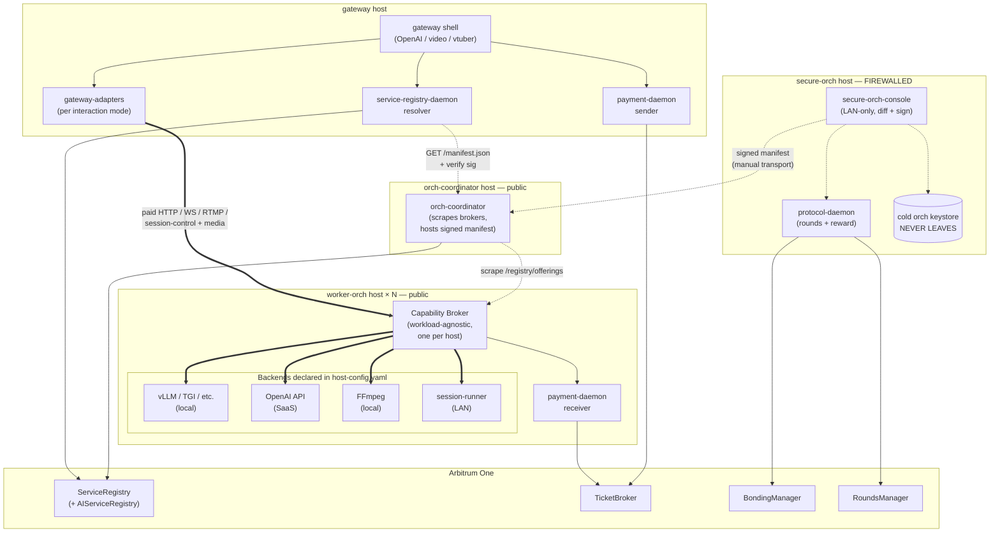
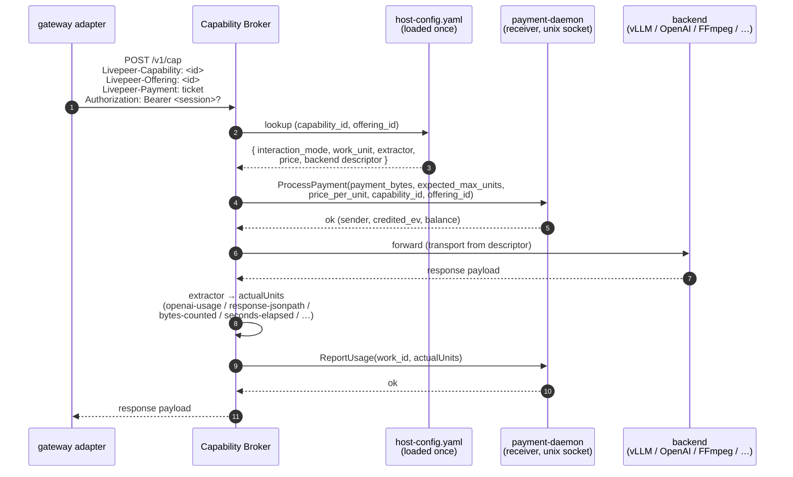
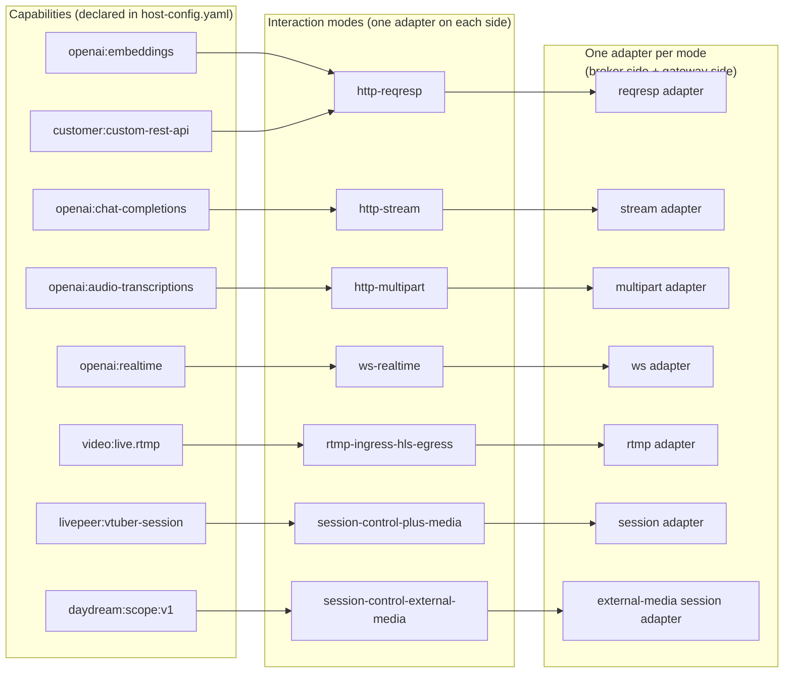
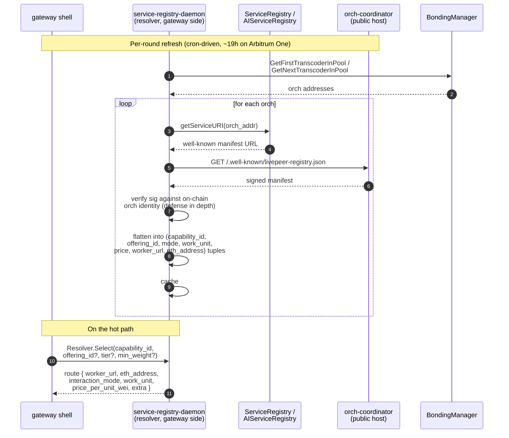
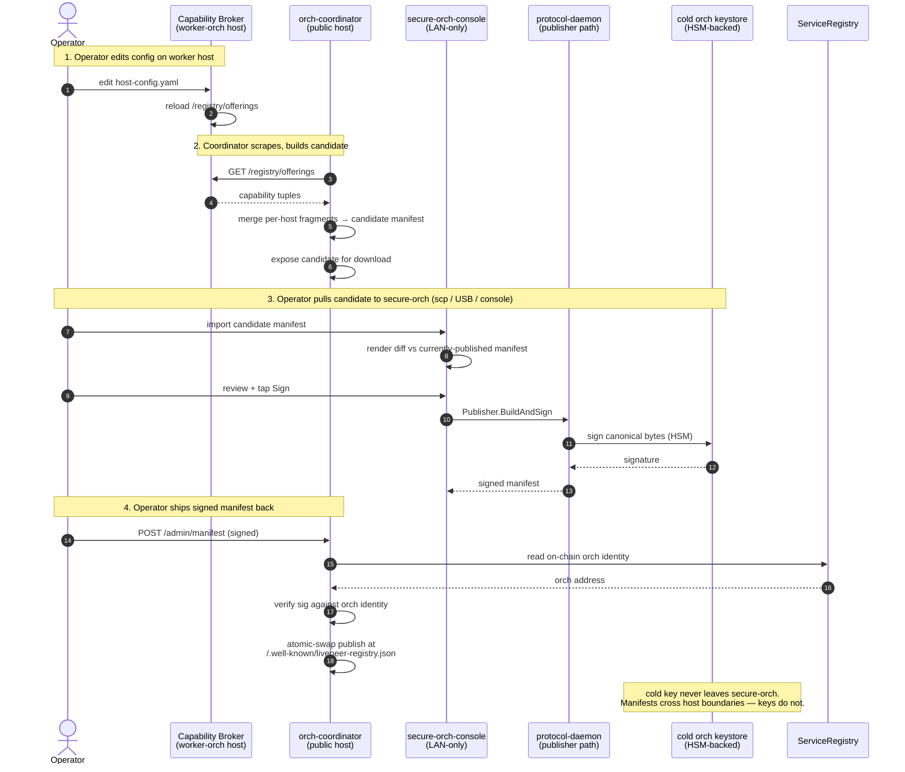
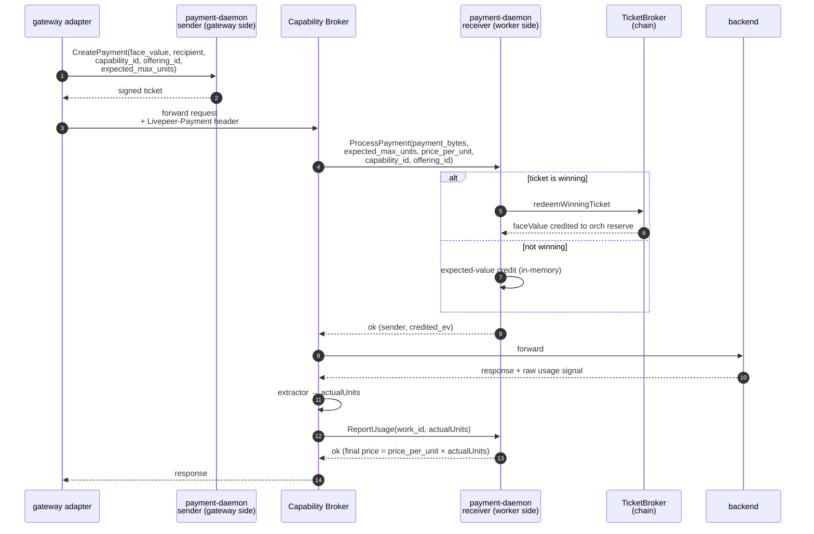
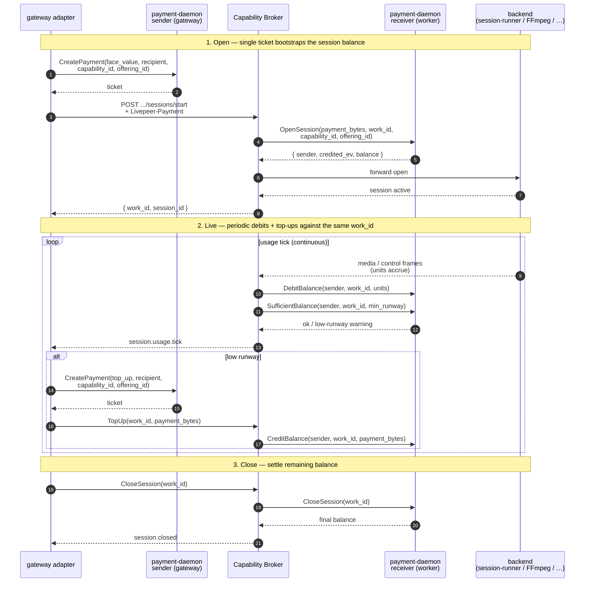
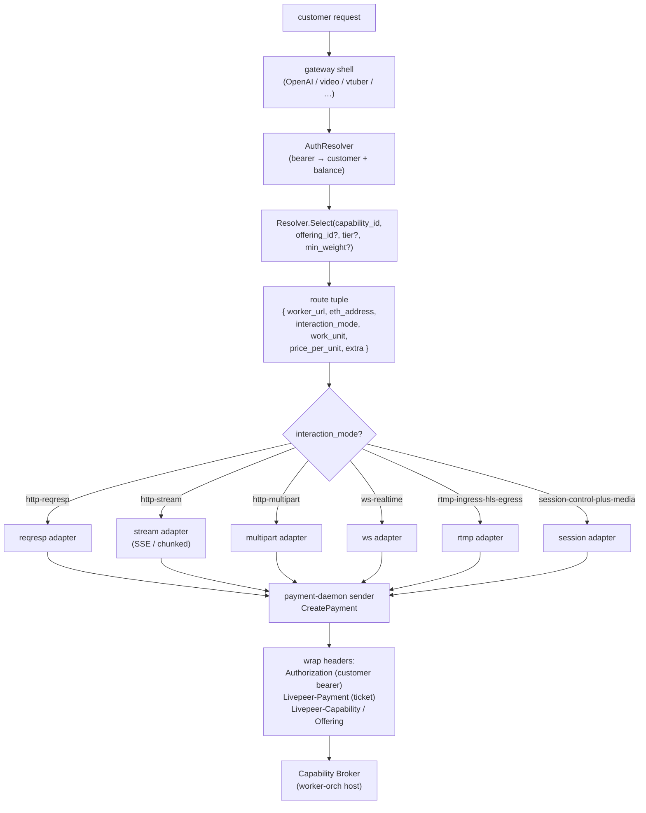
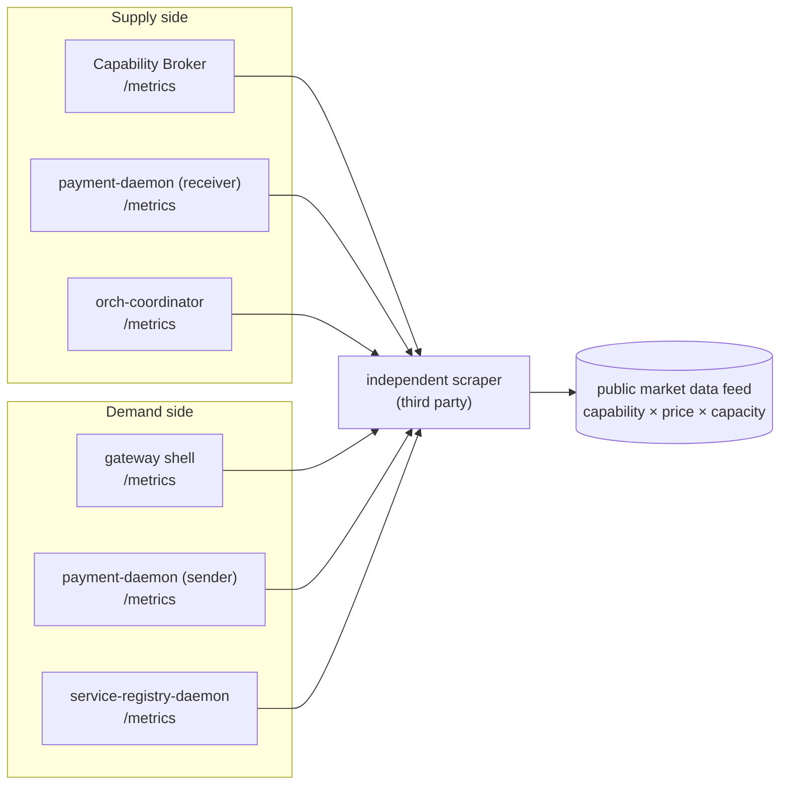

# Architecture overview

The eight-layer sketch. This is the **at-a-glance** view; deep dives go in their own
design-docs. Full provenance lives in
[`../references/2026-05-06-architecture-conversation.md`](../references/2026-05-06-architecture-conversation.md).

## Shape in one sentence

A single workload-agnostic process per orch host — the **capability broker** — that owns
`/registry/offerings`, dispatches paid requests over a small fixed typology of *interaction
modes* to arbitrary backends declared in YAML, with the trust spine preserved by an
operator-driven, cold-key-signed manifest publication cycle.

## Top-level component diagram

Four host archetypes (`secure-orch`, `orch-coordinator`, `worker-orch`, gateway)
plus the chain. Solid arrows are runtime data flow; dotted arrows are control /
configuration paths. Sub-diagrams later in this file zoom into specific flows.



The five logical layers, top to bottom:

- **Chain (Arbitrum One)** — `ServiceRegistry` / `AIServiceRegistry` point at
  the orch's signed manifest URL; `TicketBroker` settles payments;
  `BondingManager` + `RoundsManager` drive the round cadence.
- **Trust spine (secure-orch)** — the cold key never leaves. Operator-driven
  sign cycle produces signed manifests that the coordinator hosts.
- **Public orch surface (orch-coordinator)** — no keys, no daemon sockets.
  Scrapes brokers for offerings, builds candidate manifests, hosts the signed
  manifest at the on-chain `serviceURI`.
- **Worker hosts (capability broker + backends)** — one broker per host, fully
  workload-agnostic. Backends are arbitrary (local containers, LAN services,
  third-party APIs). Co-located `payment-daemon` (receiver) validates tickets.
- **Gateway** — resolver + sender + per-mode adapter. Talks to the broker over
  whichever interaction mode the resolved tuple declares.

## Layer 1 — Capability broker

**One process per host, workload-agnostic.** No per-capability Go code. Core jobs:

1. Read a single `host-config.yaml`.
2. Expose `GET /registry/offerings`, `GET /registry/health`, `GET /healthz`,
   `GET /metrics`, plus one canonical path per mode (e.g. `POST /v1/cap` for
   `http-reqresp` — see [`../../livepeer-network-protocol/modes/`](../../livepeer-network-protocol/modes/)).
3. Route inbound requests by **`Livepeer-Capability` header** → look up the
   **backend descriptor** → wrap in the declared **interaction mode** → forward →
   return the response.
4. Report `actualUnits` to co-located `payment-daemon` (receiver) over unix socket — same
   socket regardless of capability.
5. Execute broker-local health probes on cadence and publish normalized
   per-tuple snapshots on `GET /registry/health`.

**The broker contains zero routing semantics upstream of normalized health.**
Capability-specific readiness logic is allowed inside probe recipes, but it
must stop at the broker boundary and publish only the shared outward states
`ready`, `draining`, `degraded`, `unreachable`, and `stale`.

Replaces: `openai-worker-node`, `vtuber-worker-node`, `video-worker-node`.

### Request lifecycle inside the broker

A single `http-reqresp` request, from inbound TLS to settled payment. Streaming
modes (`http-stream`, `ws-realtime`, `session-control-plus-media`,
`rtmp-ingress-hls-egress`) follow the same shape but the "forward + collect
units" step is long-lived — see the streaming-pattern doc for the full picture.



**Key invariants:**

- The broker resolves `(capability_id, offering_id)` from the inbound headers
  before doing anything else — mismatched routing fails closed.
- Payment validation happens **before** the backend call; the only thing the
  broker knows about money is "did the daemon say yes."
- `actualUnits` is whatever the declared extractor returns; the broker doesn't
  know what a "token" or "pixel-second" is.

## Layer 2 — Interaction-mode typology

The fixed wire contracts. Capabilities pick one. Initial set:

| Mode | Wire shape | Examples |
|---|---|---|
| `http-reqresp` | one HTTP req → one HTTP resp | `openai:embeddings`, custom REST |
| `http-stream` | request → SSE / chunked stream | `openai:chat-completions` (stream) |
| `http-multipart` | multipart upload → response | `openai:audio-transcriptions` |
| `ws-realtime` | bidirectional WebSocket | `openai:realtime`, vtuber `/control` |
| `rtmp-ingress-hls-egress` | RTMP in → HLS manifest+segments out | `video:live.rtmp` |
| `session-control-plus-media` | HTTP session-open → broker-managed long-lived media/runtime plane | `livepeer:vtuber-session` |
| `session-control-external-media` | HTTP session-open → external long-lived media plane | `daydream:scope:v1` |

Each mode is implemented once in the broker, once in the gateway. **New capability
under an existing mode = zero code.** New mode = one adapter on each side.

**Modes are specifications, not libraries.** Living in the
`livepeer-network-protocol` spec repo (working name) — not a code dependency.



**Adding a brand-new capability under an existing mode is a YAML edit** —
no broker, gateway, or daemon release. Adding a new mode is the rare case
where code lands in both `capability-broker/` and `gateway-adapters/`.

See [`./interaction-modes.md`](./interaction-modes.md).

## Layer 3 — Declarative capability config

`host-config.yaml`. Three concerns: identity, capabilities, backends.

```yaml
identity:
  orch_eth_address: 0xabc...

capabilities:
  - id: "openai:chat-completions"
    interaction_mode: "http-stream"
    work_unit:
      name: "tokens"
      extractor: { type: "openai-usage" }
    health:
      probe:
        type: "http-openai-model-ready"
        path: "/healthz"
        expect_model: "llama-3-70b"
        timeout_ms: 1500
        interval_ms: 5000
        unhealthy_after: 2
    price:
      amount_wei: 1500000
      per_units: 1
    backend:
      transport: "http"
      url: "http://10.0.0.5:8000/v1/chat/completions"
      auth: "none"
    extra:
      openai:
        model: "llama-3-70b"
      provider: "vllm"
      region: "us-west-2"
      gpu_class: "h100"
```

The `extractor` library is a small fixed set of recipes (`openai-usage`,
`response-jsonpath`, `request-formula`, `bytes-counted`, `seconds-elapsed`,
`ffmpeg-progress`). Adding an extractor is a broker change but extremely rare.

### OpenAI-compatible `extra` shape

For OpenAI-compatible offerings, the canonical `capability_id` stays at the
base endpoint family (`openai:chat-completions`, `openai:embeddings`,
`openai:audio-transcriptions`, `openai:audio-speech`,
`openai:images-generations`, `openai:realtime`). Model identity does **not**
live in `capability_id`; it lives in `extra.openai.model`.

The standardized shape is:

```yaml
extra:
  openai:
    model: "Qwen3.6-27B"
  provider: "vllm"
  served_model_name: "Qwen3.6-27B"
  backend_model: "sakamakismile/Qwen3.6-27B-Text-NVFP4-MTP"
  features:
    streaming: true
    tools: true
    embeddings: false
    json_mode: true
```

Rules:

- `extra.openai.model` is required for current `openai:*` offerings.
- `extra.provider` is required for current `openai:*` offerings.
- `served_model_name`, `backend_model`, and `features.*` are optional stable
  enrichment fields.
- `features.*`, when present, are booleans.
- Operator-owned deployment labels such as `region`, `gpu_class`, and
  `latency_tier` may also live in `extra`.
- For `provider: "vllm"` and `provider: "ollama"` on HTTP backends, the broker
  may probe `GET /v1/models` at startup and fill missing
  `served_model_name`, `backend_model`, and stable `features.*` fields when the
  configured `extra.openai.model` is found upstream.
- For runner families with stable options or presets surfaces, the broker may
  fill missing `extra.audio.*`, `extra.video.*`, or `extra.vtuber.*` fields
  from those family-specific endpoints using the same fill-only merge policy.
- The broker refreshes this metadata on a bounded cadence while running.
  Discovery freshness, provider, last result, and last error are exposed via
  `GET /registry/health`; they do not change the tuple's market identity.
- Prometheus also exposes
  `livepeer_metadata_refresh_total{family,provider,result}` so discovery drift
  and probe failures are visible without polling per-offering health.
- It also exposes refresh latency and freshness signals via
  `livepeer_metadata_refresh_duration_seconds{family,provider,result}`,
  `livepeer_metadata_refresh_last_attempt_timestamp_seconds{family,capability,offering,provider}`,
  and
  `livepeer_metadata_refresh_last_success_timestamp_seconds{family,capability,offering,provider}`.
- For alerting on the current discovery state, it also exposes
  `livepeer_metadata_refresh_current_result{family,capability,offering,provider,result}`,
  where the active result label is `1` and previous results are reset to `0`
  when the offering transitions.
- To surface sustained discovery breakage, it also exposes
  `livepeer_metadata_refresh_consecutive_failures{family,capability,offering,provider}`,
  and the same `consecutive_failures` value appears in
  `GET /registry/health` metadata for each applicable offering.
- `last_result` is family-aware rather than a single generic status. For
  example, OpenAI-compatible offerings may report `model_not_found` or
  `models_probe_failed`, while runner families may report
  `audio_options_probe_failed`, `video_presets_empty`, or
  `vtuber_options_probe_failed`.

Boundary:

- `host-config.yaml` owns operator intent: capability family, offering ID,
  interaction mode, price, metering, backend URL, and routing constraints.
- Runtime discovery may validate and enrich an offering, but it does not invent
  or rewrite its market identity. The broker must not rewrite
  `extra.openai.model`, `offering_id`, `price`, or `constraints`.
- Volatile runtime facts such as full model inventories, queue depth,
  throughput, utilization, or context window belong in live health, metrics,
  or diagnostics, not in the signed manifest.

### Family-specific stable `extra` contracts

The same pattern applies across every runner family in the rewrite:

- `host-config.yaml` defines the offering's market identity.
- Family-specific discovery validates and enriches only stable metadata.
- Volatile runtime state belongs in `GET /registry/health` or metrics, not in
  the signed manifest.

Every family should expose a small stable namespace under `extra`:

- `extra.openai.*`
- `extra.audio.*`
- `extra.video.*`
- `extra.vtuber.*`

with a shared top-level `provider` field naming the backend or runner family.

#### Audio

For audio capabilities, the stable contract separates workload type from
runner-specific live state:

```yaml
extra:
  openai:
    model: "whisper-large-v3"
  provider: "openai-audio-runner"
  served_model_name: "whisper-large-v3"
  backend_model: "openai/whisper-large-v3"
  audio:
    task: "transcription"
    formats:
      input: ["mp3", "wav", "m4a", "flac"]
      output: ["json", "text", "srt", "verbose_json", "vtt"]
```

```yaml
extra:
  openai:
    model: "kokoro"
  provider: "openai-tts-runner"
  served_model_name: "kokoro"
  backend_model: "hexgrad/Kokoro-82M"
  audio:
    task: "speech"
    voices:
      default: "af_bella"
      native: ["af_bella", "am_michael"]
      aliases:
        alloy: "af_bella"
        echo: "am_michael"
    formats:
      output: ["mp3", "wav", "pcm"]
```

Stable:

- model identity
- voice/options catalog
- supported input/output formats
- backend family

Live only:

- model warm state
- queue depth
- GPU readiness
- transient inference failures

#### Video

Video capabilities should publish the stable pipeline shape, not current load:

```yaml
extra:
  provider: "abr-runner"
  video:
    task: "abr-transcode"
    presets: ["abr-standard", "abr-premium"]
    codecs: ["h264", "hevc"]
    packaging: ["hls"]
    hardware:
      gpu_vendor: "nvidia"
```

```yaml
extra:
  provider: "transcode-runner"
  video:
    task: "transcode"
    presets: ["h264-1080p", "hevc-1080p"]
    codecs: ["h264", "hevc"]
    packaging: ["mp4"]
    hardware:
      gpu_vendor: "intel"
```

Stable:

- task shape (`transcode`, `abr-transcode`, etc.)
- supported preset names
- supported video codecs
- packaging outputs
- hardware vendor hints

Live only:

- encoder availability
- scratch-disk pressure
- concurrent job count
- GPU load
- temporary backpressure

#### VTuber

Session-style VTuber workloads should publish stable runtime capabilities and
schema versions, not live session availability:

```yaml
extra:
  provider: "vtuber-runner"
  vtuber:
    task: "session"
    control_schema: "vtuber-control/v1"
    media_schema: "trickle-segment-stream/v1"
    features:
      renderer_control: true
      status_polling: true
      trickle_publish: true
      youtube_egress: true
```

Stable:

- control/media schema identifiers
- supported session features
- runner family

Live only:

- available session slots
- media-plane readiness
- reconnect window state
- renderer warm/cold state

#### New families

Any new runner family should define four things before implementation:

1. the base `capability_id`
2. the minimal stable `extra.<family>` schema
3. the discovery source that fills stable enrichment fields
4. the live-health source for volatile runtime state

This keeps new workloads consistent with the broker's publication boundary:
stable capability facts in `/registry/offerings`, live availability facts in
`/registry/health`, and no direct runner-owned manifest identity.

Live health follows the same pattern: the broker owns a small fixed
library of **probe recipes** and `host-config.yaml` selects one per tuple.
Examples might include:

- `http-status` — shallow HTTP reachability
- `http-jsonpath` — response field must match an expected value
- `http-openai-model-ready` — backend is up and a specific model is loaded
- `tcp-connect` — port accepts connections
- `command-exit-0` — local process or sidecar probe
- `runner-options-match` — backend reports the expected offering or mode
- `manual-drain` — operator intent overrides automatic readiness

The important boundary is:

- **capabilities choose a probe recipe**
- **the broker executes the probe**
- **the broker normalizes the result to generic outward states**

That lets the core modules support specialized health behavior without
teaching the coordinator, resolver, or gateways what "model loaded",
"pipeline warmed", or "TURN path ready" mean for any specific workload.

Just like extractors, new probe recipe types are broker changes and
should be rare. Day-to-day operator work is selecting and tuning existing
recipes in YAML, not writing new code.

This is the operator's entire day-to-day surface.

## Layer 4 — Discovery (workload-agnostic registry)

- **Manifest data model**: a flat list of
  `(capability_id, offering_id, interaction_mode, work_unit_name, price_per_unit_wei, worker_url, eth_address, extra, constraints)`
  tuples. **Host is not a registration unit.**
- **Coordinator UI**: roster is per-capability-tuple, not per-host. Multi-binary-per-host
  vanishes (no separate binaries); multi-broker-per-orch is N more entries.
- Resolver semantics keep their existing shape but the response now carries
  `interaction_mode`.

The current `service-registry-daemon` resolver/publisher split keeps working; what
changes is the manifest schema and the coordinator UX.

**Two on-chain registries point at the same well-known URL.** Livepeer mainnet
(Arbitrum One) has two distinct contracts that name a `serviceURI` per orch:
the legacy `ServiceRegistry` for transcoding workers and the newer
`AIServiceRegistry` for AI workers. The rewrite consolidates the manifest:
one orch publishes one signed manifest at `/.well-known/livepeer-registry.json`,
mixes transcoding and AI tuples in the same `capabilities[]` list, and
registers the same URL with whichever contract address(es) the operator
participates in. The resolver / gateway side is configured with which contract
address(es) to query for a given orch's `serviceURI`; the orch may register
the same URL in both. The on-chain pointer fetch is per-contract, but the
manifest URL it points at is unified. See
[`../../livepeer-network-protocol/manifest/README.md`](../../livepeer-network-protocol/manifest/README.md)
for the manifest-side write-up.

### Resolver fetch flow

What happens when the gateway needs to know "who serves
`openai:chat-completions` with `extra.openai.model=llama-3-70b` right now?" The resolver verifies the
signature on every fetch — the coordinator host is not trusted.



**Two verifications, intentionally.** The coordinator verifies on upload; every
gateway resolver verifies again on fetch. If the coordinator host is ever
compromised, tampered manifests still don't propagate.

**`interaction_mode` is in the resolver response** — the gateway picks the
adapter from this, not from any per-capability lookup table.

## Layer 5 — Trust spine: operator-driven sign cycle

**Hard rule:** secure-orch never accepts inbound connections.

**Operator-driven cycle:**

1. Operator edits `host-config.yaml` on broker host(s).
2. Broker re-advertises locally; orch-coordinator scrapes; coordinator builds candidate
   manifest and exposes it for download.
3. Operator pulls candidate to secure-orch (download via console, scp, USB — operator's
   choice).
4. `secure-orch-console` shows a **diff** of candidate vs. currently-published manifest.
   Operator inspects, taps to sign. Cold key (HSM-backed, never moves) signs.
5. Operator pushes signed manifest back to coordinator.
6. Coordinator atomic-swap publishes.

Friction reduction lives in console UX (diff, one-click sign, clear status). Hand-carry
stays. Revisit automation in v2.



**Hard invariants** the sign cycle preserves:

- `secure-orch` accepts **zero** inbound connections from outside the LAN.
- The cold key signs canonical manifest bytes only — never naked transactions.
- Both the coordinator and every downstream resolver verify the signature
  against on-chain orch identity. Trust nothing the coordinator says alone.

See [`./trust-model.md`](./trust-model.md).

## Layer 6 — Payment

`payment-daemon` keeps its sender/receiver shape. **The one decoupling**: the daemon
stops enforcing a closed enum of capability/work-unit names. Both become opaque strings;
the daemon does the arithmetic `price_wei = price_per_unit_wei × actualUnits`. Custom
capabilities with custom work units (`barks`, `pixel-seconds`, anything) work without
trunk changes.

The `Livepeer-Payment` header gains `(capability_id, offering_id, expected_max_units)`
so the receiver can refuse mismatched routing.

### Per-request payment (`http-reqresp` / `http-stream` / `http-multipart`)

One ticket per inbound request. Settles on-chain only if the ticket is winning;
otherwise it's expected-value credit. `actualUnits` is reported after the
backend response so over- and under-spend are both true-ups, not gambles.



### Streaming / session payment (`ws-realtime` / `session-control-plus-media` / `rtmp-…`)

Amortized billing: one `OpenSession` at attach, periodic `Debit` ticks during
the session, `CloseSession` on teardown. The cross-workload rules live in
[`streaming-workload-pattern.md`](./streaming-workload-pattern.md) — this is the
canonical shape.



**Worker meters, gateway ledgers.** The worker-side receiver is the runtime
enforcement point (cuts the session when balance hits zero); the gateway-side
ledger is the commercial record. Usage ticks are idempotent so a retry never
double-charges.

See [`./payment-decoupling.md`](./payment-decoupling.md).

## Layer 7 — Routing (gateway side)

- `service-registry-daemon` applies Layer 1 + Layer 2 before the gateway sees
  a route: signed-manifest validity plus broker live health.
- Gateway resolves a route → gets the tuple including `interaction_mode`.
- Picks the matching mode adapter (req/resp, stream, ws, RTMP, session) — generic across
  capabilities.
- Wraps with `Authorization` (customer's bearer), `Livepeer-Payment` (ticket from sender
  daemon), `Livepeer-Capability: <id>`, `Livepeer-Offering: <id>`, opens transport,
  forwards.
- Gateway applies Layer 3 locally: recent request outcomes can temporarily
  cool a route even when manifest + live health are still green.
- For session/stream/realtime: payment is amortized
  (`OpenSession + periodic Debit + CloseSession`).

**Gateway code is per-mode, not per-capability.** New capability under an existing mode
lights up automatically once the manifest carries it.

**Gateway health policy is shared, not forked.** The gateways reuse the
workspace package
[`../../gateway-route-health/`](../../gateway-route-health/) for cooldown
tracking, cumulative counters, summary generation, and Prometheus-style
rendering so OpenAI, video, VTuber, and Daydream all apply the same Layer 3
policy shape.



The shell, the resolver, the sender daemon, and the wrap step are
capability-agnostic. The only per-workload code is the customer-facing surface
(OpenAI-shaped routes, Mux-inspired video routes, vtuber session API) — and
those exist to match the customer contract, not to express anything about how
the network works underneath.

## Layer 8 — Demand visibility

- Every component exposes Prometheus on a documented schema.
- Counters: `livepeer_routes_total{capability,offering,outcome}`
- Histograms: `livepeer_price_paid_wei{capability}`
- Gauges: `livepeer_capacity_available{capability}`
- `service-registry-daemon` also exposes Layer 2 route-admission counters for
  decisions like `allowed_ready`, `excluded_unhealthy`, `excluded_stale`,
  `live_health_missing`, and `live_health_fetch_error`.
- Gateways expose Layer 3 route-health counters and summaries through both
  debug/admin JSON and Prometheus text endpoints.
- Independent third party scrapes both sides → public market data feed.

Architecture provides surfaces; aggregation is third-party.



**The architecture's job is to expose comparable surfaces on both sides** —
same metric names, same labels (`capability`, `offering`, `outcome`),
documented in the protocol repo. Aggregation, sanity-checking, and
publication are deliberately out-of-band so no operator can rewrite the
market's view of itself.

## What this kills / changes / preserves

### Kills

- The three workload-shaped worker binaries (`openai-worker-node`, `vtuber-worker-node`,
  `video-worker-node`) — replaced by one capability broker.
- Per-capability Go `Module` impls in `worker-runtime`.
- Hardcoded work-unit enums in `livepeer-modules-project`.
- The dead `livepeer-modules-conventions` reference (replaced by
  `livepeer-network-protocol`).
- The "host is the registration unit" assumption in coordinator UX.
- Capacity declarations in the manifest (replaced by 503 + backoff hint).

### Changes

- Manifest schema: flat list of capability tuples; `interaction_mode` in resolver
  response.
- `payment-daemon`: opaque capability/work-unit names; arithmetic only.
- Coordinator UX: capability-as-roster-entry.
- `Livepeer-Payment` header: includes `(capability_id, offering_id, expected_max_units)`.

### Preserves (sacred)

- Cold orch keystore on firewalled secure-orch. Never moves.
- Cold-key signature on every manifest publication.
- Double-verification of signed manifest (coordinator on upload, resolver on fetch).
- On-chain orch identity (`ServiceRegistry`).
- `payment-daemon`'s ticket validation against chain.
- Mainnet-only deployment, image-tags-not-bumped, the rest of the suite's core beliefs.
