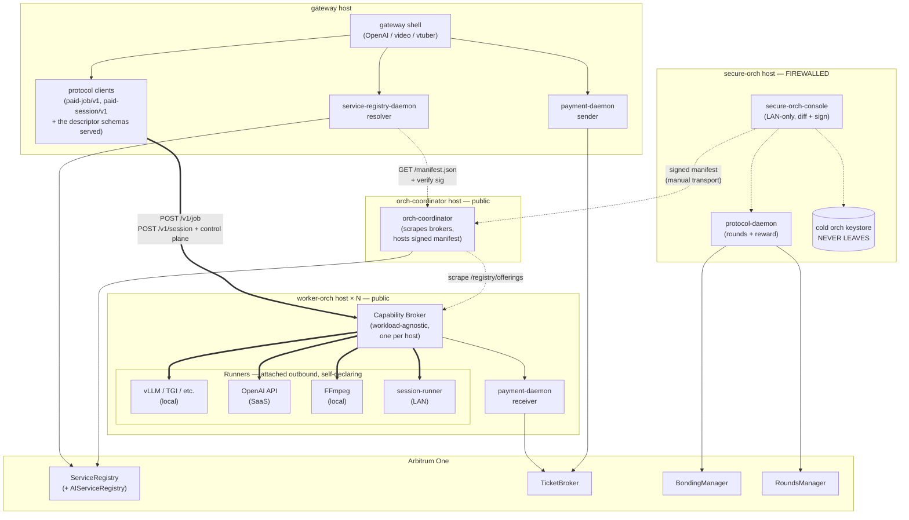
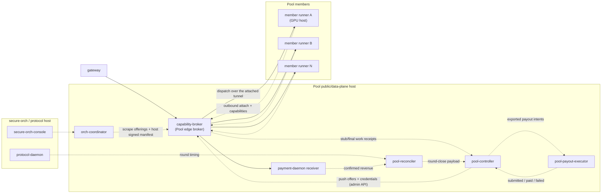
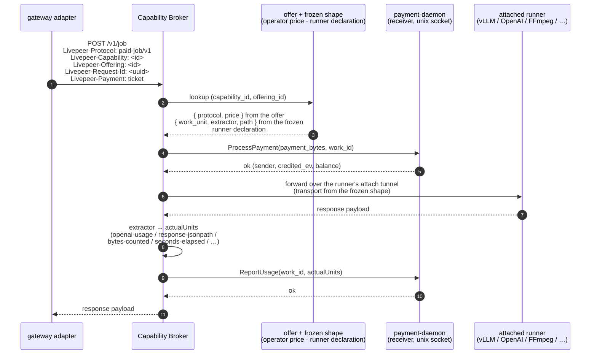
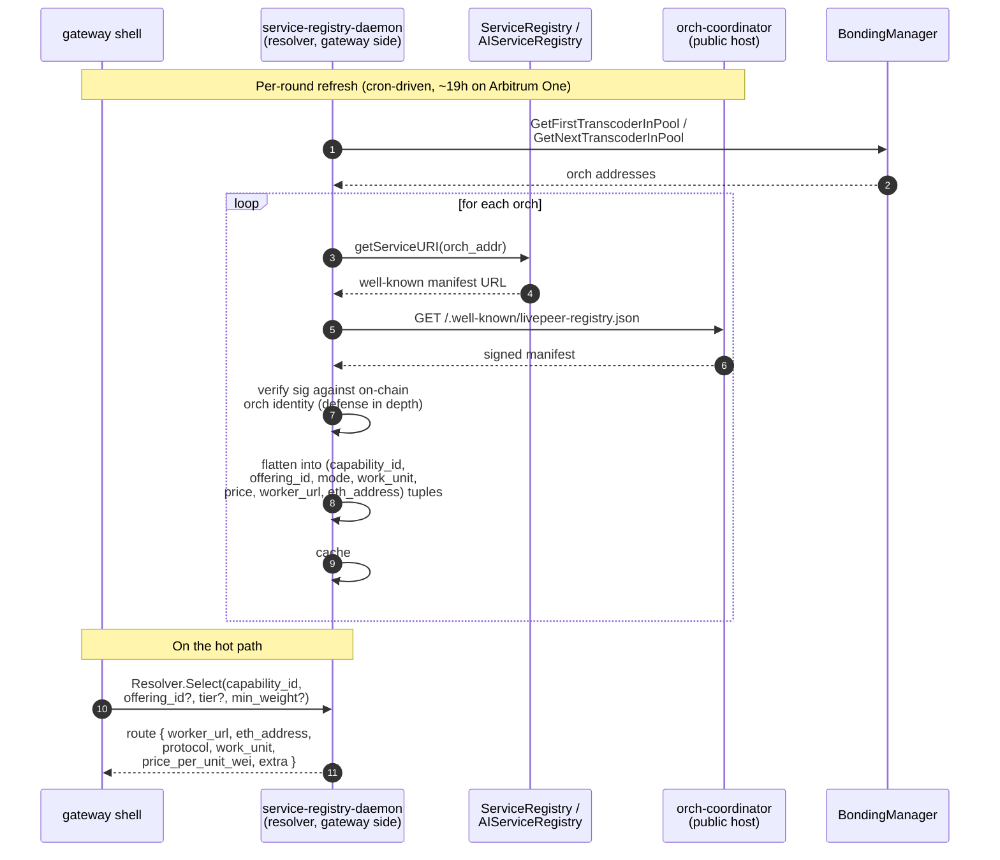
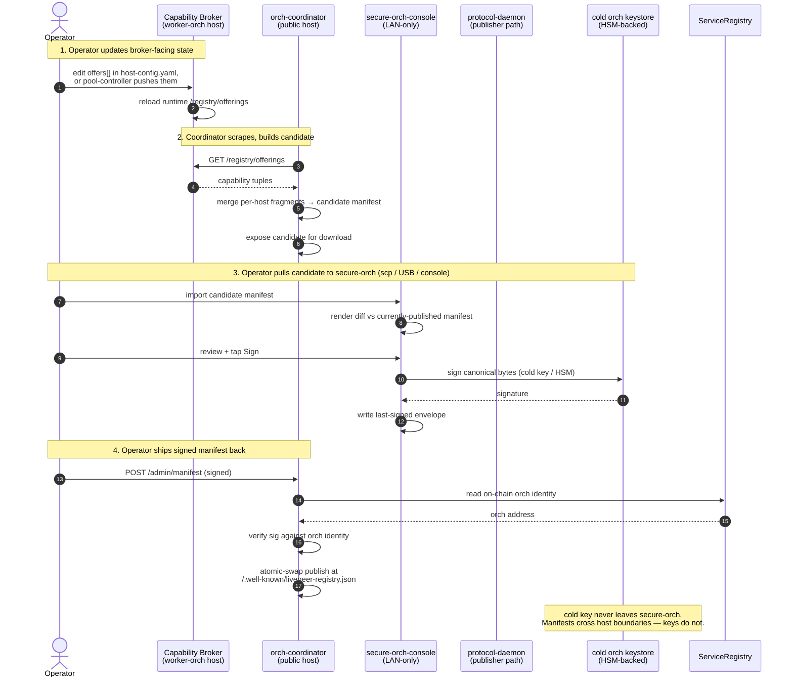
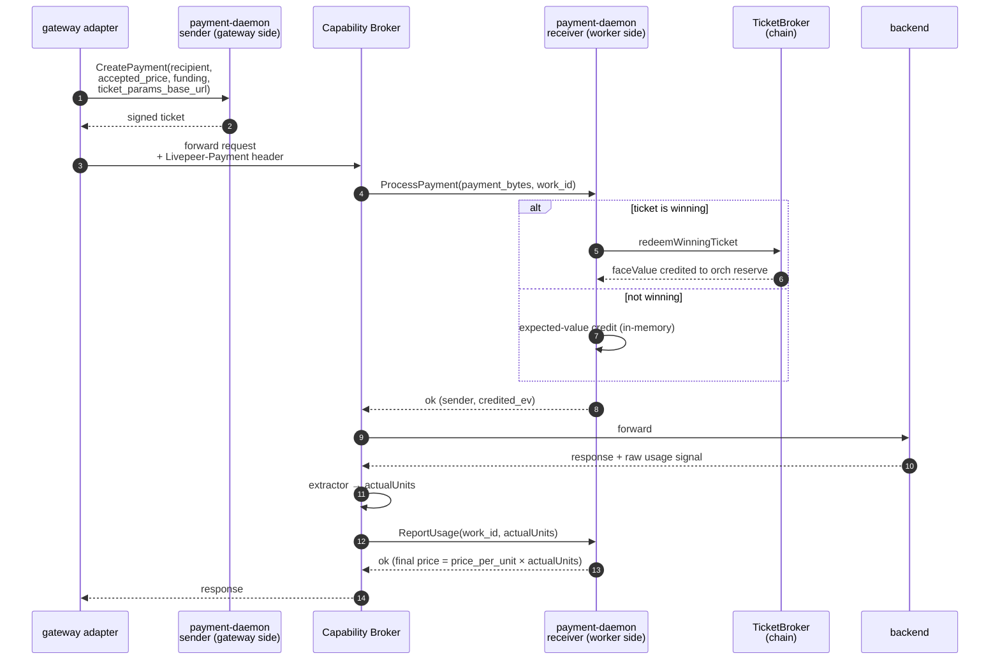
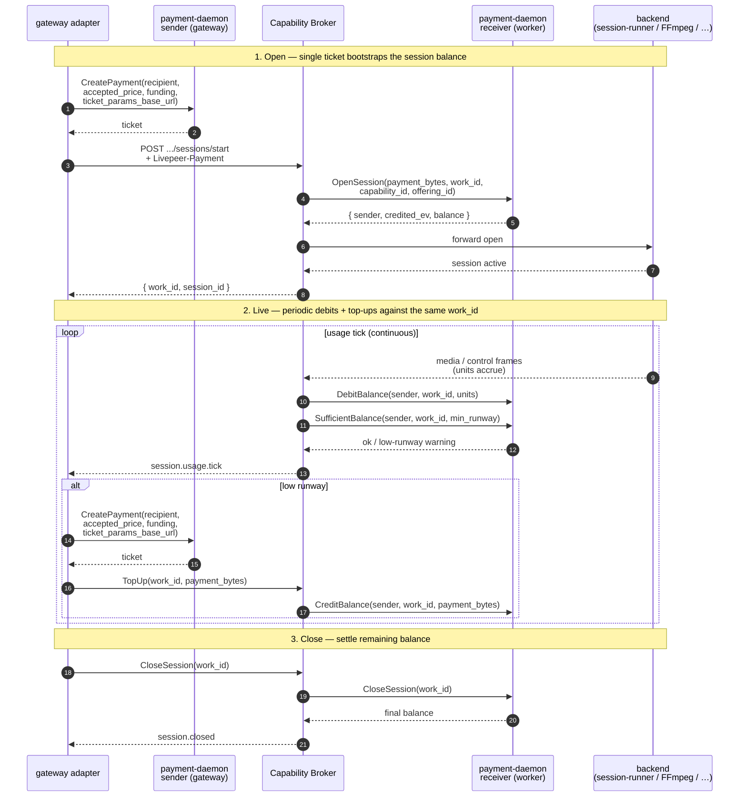
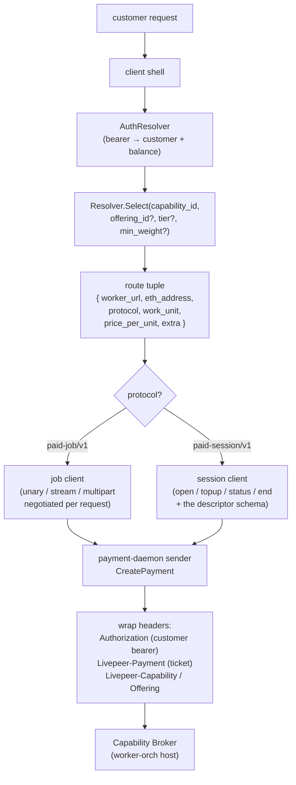
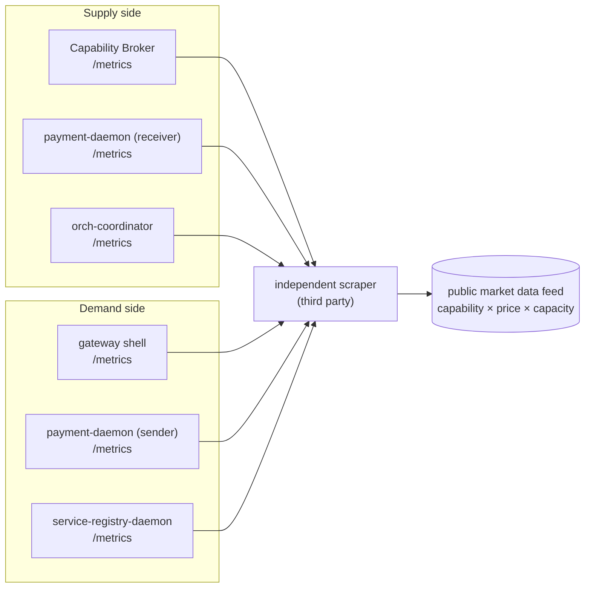

# Architecture overview

The eight-layer sketch. This is the **at-a-glance** view; deep dives go in their own
design-docs. Full provenance lives in
[`../references/2026-05-06-architecture-conversation.md`](../references/2026-05-06-architecture-conversation.md).

> **Removal note (2026-05-20).** The named gateway and runner product
> families that originally instantiated some examples in this document have
> been removed from the working tree. The mode contracts, broker/payment
> relationships, and `sessionrunner` protocol described here remain part of
> the repo; specific backend family examples are historical.

## Shape in one sentence

A single workload-agnostic process per orch host — the **capability broker** — that owns
`/registry/offerings`, dispatches paid requests over a small fixed typology of *interaction
modes* to arbitrary backends declared in YAML, with the trust spine preserved by an
operator-driven, cold-key-signed manifest publication cycle.

## Top-level component diagram

Four host archetypes (`secure-orch`, `orch-coordinator`, `worker-orch`, gateway)
plus the chain. Solid arrows are runtime data flow; dotted arrows are control /
configuration paths. Sub-diagrams later in this file zoom into specific flows.


```mermaid
flowchart TD
    subgraph chain["Arbitrum One"]
        direction LR
        SREG["ServiceRegistry<br/>(+ AIServiceRegistry)"]
        TB["TicketBroker"]
        BM["BondingManager"]
        RM["RoundsManager"]
    end

    subgraph secure_host["secure-orch host — FIREWALLED"]
        direction TB
        SOC["secure-orch-console<br/>(LAN-only, diff + sign)"]
        PRD["protocol-daemon<br/>(rounds + reward)"]
        COLD[("cold orch keystore<br/>NEVER LEAVES")]
    end

    subgraph coord_host["orch-coordinator host — public"]
        OC["orch-coordinator<br/>(scrapes brokers,<br/>hosts signed manifest)"]
    end

    subgraph worker_host["worker-orch host × N — public"]
        direction TB
        CB["Capability Broker<br/>(workload-agnostic,<br/>one per host)"]
        WPD["payment-daemon<br/>receiver"]
        subgraph backends["Runners — attached outbound, self-declaring"]
            direction LR
            VLLM["vLLM / TGI / etc.<br/>(local)"]
            OAIAPI["OpenAI API<br/>(SaaS)"]
            FFMPEG["FFmpeg<br/>(local)"]
            RUNNER["session-runner<br/>(LAN)"]
        end
    end

    subgraph gateway_host["gateway host"]
        direction TB
        GW["gateway shell<br/>(OpenAI / video / vtuber)"]
        GPD["payment-daemon<br/>sender"]
        SRD["service-registry-daemon<br/>resolver"]
        PROTO["protocol clients<br/>(paid-job/v1, paid-session/v1<br/>+ the descriptor schemas served)"]
    end

    SOC -.-> PRD
    SOC -.-> COLD
    PRD --> RM
    PRD --> BM

    SOC -.->|"signed manifest<br/>(manual transport)"| OC
    OC -.->|"scrape /registry/offerings"| CB
    OC --> SREG

    SRD --> SREG
    SRD -.->|"GET /manifest.json<br/>+ verify sig"| OC

    GW --> PROTO
    GW --> SRD
    GW --> GPD
    GPD --> TB

    PROTO ==>|"POST /v1/job<br/>POST /v1/session + control plane"| CB
    CB --> WPD
    WPD --> TB

    CB ==> VLLM
    CB ==> OAIAPI
    CB ==> FFMPEG
    CB ==> RUNNER
```

The five logical layers, top to bottom:

- **Chain (Arbitrum One)** — `ServiceRegistry` / `AIServiceRegistry` point at
  the orch's signed manifest URL; `TicketBroker` settles payments;
  `BondingManager` + `RoundsManager` drive the round cadence.
- **Trust spine (secure-orch)** — the cold key never leaves. Operator-driven
  sign cycle produces signed manifests that the coordinator hosts.
- **Public orch surface (orch-coordinator)** — no keys, no daemon sockets.
  Scrapes brokers for offerings, builds candidate manifests, hosts the signed
  manifest at the on-chain `serviceURI`.
- **Worker hosts (capability broker + backends)** — one broker per host, fully
  workload-agnostic. Backends are arbitrary (local containers, LAN services,
  third-party APIs). Co-located `payment-daemon` (receiver) validates tickets.
- **Gateway** — resolver + sender + per-protocol client. Talks to the broker over
  whichever protocol the resolved tuple declares (`paid-job/v1` or
  `paid-session/v1`).

## Pool overlay

The base architecture stays unchanged for a Pool orch from the outside: the
gateway still sees one orch identity, one coordinator-published manifest, and
one broker endpoint. The Pool-specific machinery stays inside the Pool
operator's control plane and accounting workers.


```mermaid
flowchart LR
    subgraph secure_host["secure-orch / protocol host"]
        SOC["secure-orch-console"]
        PRD["protocol-daemon"]
    end

    subgraph public_host["Pool public/data-plane host"]
        direction TB
        OC["orch-coordinator"]
        PCB["capability-broker<br/>(Pool edge broker)"]
        PPD["payment-daemon receiver"]
        PCC["pool-controller"]
        PRC["pool-reconciler"]
        PPE["pool-payout-executor"]
    end

    subgraph members["Pool members"]
        direction LR
        MR1["member runner A<br/>(GPU host)"]
        MR2["member runner B"]
        MR3["member runner N"]
    end

    GW["gateway"] --> PCB
    PCB --> PPD
    MR1 -.->|"outbound attach + capabilities"| PCB
    MR2 -.-> PCB
    MR3 -.-> PCB
    PCB -->|"dispatch over the attached tunnel"| MR1
    PCB --> MR2
    PCB --> MR3

    PCC -.->|"push offers + credentials (admin API)"| PCB
    PCC -.->|"exported payout intents"| PPE
    PCB -.->|"stub/final work receipts"| PCC
    PRD -.->|"round timing"| PRC
    PPD -.->|"confirmed revenue"| PRC
    PRC -.->|"round-close payload"| PCC
    PPE -.->|"submitted / paid / failed"| PCC
    OC -.->|"scrape offerings + host signed manifest"| PCB
    SOC -.-> OC
```

Current Pool implementation boundaries:

- `pool-controller` owns member and host-enrolment records, the templates
  placed on member GPUs, receipt persistence, round receipts, payout intents,
  retry history, public summaries, and the offer set + attach credentials it
  pushes to the broker.
- `pool-reconciler` closes rounds from `protocol-daemon` timing,
  `payment-daemon` realized revenue, and `pool-controller` work receipts.
- `pool-payout-executor` executes native-`ETH` payouts on Arbitrum and writes
  back payout state.
- A full public/data-plane deployment example now lives under
  [`../../infra/scenarios/pool-orchestrator/`](../../infra/scenarios/pool-orchestrator/).

## Layer 1 — Capability broker

**One process per host, workload-agnostic.** No per-capability Go code. Core jobs:

1. Read a single `host-config.yaml` — which since plan 0043 carries
   **offers only**: what is sold, at what price, with what capacity,
   where, and gated by which certification steps. Runner facts
   (transports, work unit, extractor, paths, readiness, model identity)
   are not in it and never were the operator's to know.
2. Expose `GET /registry/offerings`, `GET /registry/health`, `GET /healthz`,
   `GET /metrics`, plus one canonical path set per protocol
   (`POST /v1/job` for `paid-job/v1`; `POST /v1/session` and
   `/v1/session/{id}/{status,topup,end,events,ws}` for `paid-session/v1` — see
   [`../../livepeer-network-protocol/protocols/`](../../livepeer-network-protocol/protocols/)).
3. Admit runners that attach outbound with a credential and declare
   themselves
   ([`runner-attach.md`](../../livepeer-network-protocol/protocols/runner-attach.md)),
   match them to offers, certify them, and freeze the first certified
   runner's declared shape into the offer. A later runner that disagrees
   is ineligible — never a manifest change.
4. Route inbound requests by **`Livepeer-Capability` header** → select an
   eligible attached runner → run the declared **protocol** → forward
   over that runner's own connection → return the response.
5. Report `actualUnits` to co-located `payment-daemon` (receiver) over unix socket — same
   socket regardless of capability.
6. Publish normalized per-tuple availability on `GET /registry/health`,
   derived from state the broker already holds: certification says whether
   a runner can serve an offer, the attach tunnel says whether it is
   reachable right now. There is no probe cadence and therefore no window
   in which a published verdict is stale.

**The broker contains no workload-specific knowledge.** It once polled
per-workload discovery endpoints to hydrate what an offering advertised,
which meant a new workload needed a broker release; a runner declares
that itself now, and describing a new workload is an adapter profile in
the agent.

**The broker contains zero routing semantics upstream of normalized health.**
Capability-specific readiness logic lives in the runner's own declared
readiness recipe and in the offer's certification steps, but it must stop at
the broker boundary and publish only the shared outward states `ready`,
`draining`, `degraded`, `unreachable`, and `stale`.

Replaces: `openai-worker-node`, `vtuber-worker-node`, `video-worker-node`.

### Request lifecycle inside the broker

A single `unary` `paid-job/v1` exchange, from inbound TLS to settled payment.
The `stream` transport follows the same shape but the "forward + collect units"
step is long-lived and the claim arrives as a trailer. `paid-session/v1` is a
different shape entirely — see
[`protocols/paid-session.md`](../../livepeer-network-protocol/protocols/paid-session.md).


```mermaid
sequenceDiagram
    autonumber
    participant GW as gateway adapter
    participant Broker as Capability Broker
    participant Offer as offer + frozen shape<br/>(operator price · runner declaration)
    participant PD as payment-daemon<br/>(receiver, unix socket)
    participant Runner as attached runner<br/>(vLLM / OpenAI / FFmpeg / …)

    GW->>Broker: POST /v1/job<br/>Livepeer-Protocol: paid-job/v1<br/>Livepeer-Capability: <id><br/>Livepeer-Offering: <id><br/>Livepeer-Request-Id: <uuid><br/>Livepeer-Payment: ticket
    Broker->>Offer: lookup (capability_id, offering_id)
    Offer-->>Broker: { protocol, price } from the offer<br/>{ work_unit, extractor, path } from the frozen<br/>runner declaration
    Broker->>PD: ProcessPayment(payment_bytes, work_id)
    PD-->>Broker: ok (sender, credited_ev, balance)

    Broker->>Runner: forward over the runner's attach tunnel<br/>(transport from the frozen shape)
    Runner-->>Broker: response payload

    Broker->>Broker: extractor → actualUnits<br/>(openai-usage / response-jsonpath /<br/>bytes-counted / seconds-elapsed / …)
    Broker->>PD: ReportUsage(work_id, actualUnits)
    PD-->>Broker: ok
    Broker-->>GW: response payload
```

**Key invariants:**

- The broker resolves `(capability_id, offering_id)` from the inbound headers
  before doing anything else — mismatched routing fails closed.
- Payment validation happens **before** the backend call; the only thing the
  broker knows about money is "did the daemon say yes."
- `actualUnits` is whatever the declared extractor returns; the broker doesn't
  know what a "token" or "pixel-second" is.

## Layer 2 — Interaction protocols

The fixed wire contracts, rebuilt 2026-08 as two protocols plus declared
axes (replacing the seven-mode typology):

| Protocol | Wire shape | Examples |
|---|---|---|
| `paid-job/v1` | one paid exchange, settled once; transport `unary` \| `stream` \| `multipart` negotiated per-request | `openai:embeddings`, `openai:chat-completions`, ABR transcode dispatch |
| `paid-session/v1` | durable paid session: descriptor-declared runtime, control plane, usage claims, lease | SFU meetings, live transcode, interactive generative runtimes |

Workload identity lives in **runtime-descriptor schemas**
(`sfu-room/v1`, `rtmp-hls/v1`, …), never in protocol names; every other
former mode distinction is a declared offering axis (transports, attachment,
metering source, refill policy). Specs:
[`protocols/`](../../livepeer-network-protocol/protocols/) and
[`descriptors/`](../../livepeer-network-protocol/descriptors/).

**Adding a brand-new capability is a YAML edit plus, at most, a descriptor
schema** — implemented only by the runner that emits it and the gateway that
consumes it. No broker, clearinghouse, or registry release.

See [`./interaction-modes.md`](./interaction-modes.md) and
[`./dual-meter-trust.md`](./dual-meter-trust.md).

## Layer 3 — Declarative offer config

`host-config.yaml`. Two concerns: identity, and offers.

An **offer** is a commercial fact and nothing else: what is sold, under
which capability, at what price, with what capacity, in what place, gated
by what certification. That is the operator's whole surface. The runner's
own facts — transports, descriptor schema, work unit and extractor,
endpoint paths, readiness recipe, model identity, GPU inventory — are not
here, because they are not the operator's to know. They arrive in the
runner's attach document
([`runner-attach.md`](../../livepeer-network-protocol/protocols/runner-attach.md)),
and the first runner to certify freezes them into the offer so the
published tuple cannot silently change under a gateway that already
routed to it.

```yaml
identity:
  orch_eth_address: 0xabc...

credential_store:
  path: /var/lib/livepeer/broker/credentials.db
  sealing_key_file: /etc/livepeer/broker-seal.key
offers_state_path: /var/lib/livepeer/broker/offers.db

offers:
  - offering_id: "llama-3-70b-shared"
    capability: "openai:chat-completions"
    protocol: "paid-job/v1"
    # Selects attached runners by the identity they declared — never a URL
    # the operator typed. Adding capacity is attaching another host.
    match:
      identity.openai.model: "llama-3-70b"
    price:
      amount_wei: "1500000"
      per_units: 1
    capacity:
      max_in_flight: 4
      queue_limit: 8
    extra:
      openai:
        model: "llama-3-70b"
      provider: "vllm"
      region: "us-west-2"
      gpu_class: "h100"
    # Proves a matched runner can actually serve and meter the offer
    # before it is advertised. `readiness` runs the runner's own declared
    # recipe, so it stays correct when the runner changes what "ready"
    # means for it.
    certification:
      - { name: ready, type: readiness }
      - { name: smoke, type: request, config: { transport: unary } }
      - { name: usage, type: usage, config: { min_units: 1 } }
```

There is no `capabilities[]` list, no `backend:` block, and no health
probe to configure: those were the places where an operator hand-copied a
fact the runner already knew, and a mistyped model name or extractor
produced an offering the manifest advertised and the backend could not
serve.

The `extractor` library is still a small fixed set of recipes
(`openai-usage`, `response-jsonpath`, `request-formula`, `bytes-counted`,
`seconds-elapsed`, `ffmpeg-progress`) — but the runner names which one it
is metered by, and a runner declaring an extractor the broker does not
implement is rejected at attach. Adding an extractor is a broker change
but extremely rare.

### OpenAI-compatible `extra` shape

For OpenAI-compatible offerings, the canonical `capability_id` stays at the
base endpoint family (`openai:chat-completions`, `openai:embeddings`,
`openai:audio-transcriptions`, `openai:audio-speech`,
`openai:images-generations`, `openai:realtime`). Model identity does **not**
live in `capability_id`; it lives in `extra.openai.model`.

The standardized shape is:

```yaml
extra:
  openai:
    model: "Qwen3.6-27B"
  provider: "vllm"
  served_model_name: "Qwen3.6-27B"
  backend_model: "sakamakismile/Qwen3.6-27B-Text-NVFP4-MTP"
  features:
    streaming: true
    tools: true
    embeddings: false
    json_mode: true
```

Rules:

- `extra.openai.model` is required on the offer for current `openai:*`
  offerings.
- `extra.provider` is required on the offer for current `openai:*` offerings.
- `served_model_name`, `backend_model`, and `features.*` are optional stable
  enrichment fields.
- `features.*`, when present, are booleans.
- Operator-owned deployment labels such as `region`, `gpu_class`, and
  `latency_tier` may also live in `extra`.
- The rest of this shape comes from the runner. Its declared `identity` is
  merged into the advertised `extra` at freeze time, and `x-*` extension
  keys the operator names in `extra_from_runner` are promoted alongside it;
  a collision between an operator key and a runner key is a load error, not
  a silent overwrite.

The broker used to fill these fields itself, by polling per-workload
discovery surfaces — `GET /v1/models` for vLLM and Ollama,
options/presets endpoints for the audio, video and vtuber families — on a
bounded cadence, and reporting the freshness of that polling through
`GET /registry/health` and a family of `livepeer_metadata_refresh_*`
metrics. That is gone. It meant the broker carried hardcoded knowledge of
every workload's discovery contract, so a new workload needed a broker
release; and it was an inference about the runner where the runner had the
fact outright. A runner now declares its own identity and extensions in
its attach document, and describing a new workload is an adapter profile
in the agent.

Boundary:

- In a standalone broker rollout, `host-config.yaml` owns operator intent
  and only operator intent: capability family, offering ID, protocol,
  price, capacity, commercial session policy, routing constraints, and the
  certification a runner must pass. In a pool-managed rollout, the analogous
  operator intent lives in `pool-controller` persisted control-plane state
  and is pushed over the broker admin API.
- The runner owns runner intent: how it is reached, what it can do, how it
  is metered, and what "ready" means for it. Neither side may author the
  other's half.
- Freezing is what keeps those two halves honest. The first certified
  runner's declared shape becomes the offer's shape; a later runner that
  disagrees is ineligible rather than a manifest change.
- Volatile runtime facts such as full model inventories, queue depth,
  throughput, utilization, or context window belong in live health, metrics,
  or diagnostics, not in the signed manifest.

### Family-specific stable `extra` contracts

The same pattern applies across every runner family in the rewrite:

- `host-config.yaml` defines the offering's market identity.
- The runner's attach declaration supplies the stable metadata that
  describes the runner itself; freezing pins it.
- Volatile runtime state belongs in `GET /registry/health` or metrics, not in
  the signed manifest.

Every family should expose a small stable namespace under `extra`:

- `extra.openai.*`
- `extra.audio.*`
- `extra.video.*`
- `extra.vtuber.*`

with a shared top-level `provider` field naming the backend or runner family.

#### Audio

For audio capabilities, the stable contract separates workload type from
runner-specific live state:

```yaml
extra:
  openai:
    model: "whisper-large-v3"
  provider: "openai-audio-runner"
  served_model_name: "whisper-large-v3"
  backend_model: "openai/whisper-large-v3"
  audio:
    task: "transcription"
    formats:
      input: ["mp3", "wav", "m4a", "flac"]
      output: ["json", "text", "srt", "verbose_json", "vtt"]
```

```yaml
extra:
  openai:
    model: "kokoro"
  provider: "openai-tts-runner"
  served_model_name: "kokoro"
  backend_model: "hexgrad/Kokoro-82M"
  audio:
    task: "speech"
    voices:
      default: "af_bella"
      native: ["af_bella", "am_michael"]
      aliases:
        alloy: "af_bella"
        echo: "am_michael"
    formats:
      output: ["mp3", "wav", "pcm"]
```

Stable:

- model identity
- voice/options catalog
- supported input/output formats
- backend family

Live only:

- model warm state
- queue depth
- GPU readiness
- transient inference failures

#### Video

Video capabilities should publish the stable pipeline shape, not current load:

```yaml
extra:
  provider: "abr-runner"
  video:
    task: "abr-transcode"
    presets: ["abr-standard", "abr-premium"]
    codecs: ["h264", "hevc"]
    packaging: ["hls"]
    hardware:
      gpu_vendor: "nvidia"
```

```yaml
extra:
  provider: "video-transcode-backend"
  video:
    task: "transcode"
    presets: ["h264-1080p", "hevc-1080p"]
    codecs: ["h264", "hevc"]
    packaging: ["mp4"]
    hardware:
      gpu_vendor: "intel"
```

Stable:

- task shape (`transcode`, `abr-transcode`, etc.)
- supported preset names
- supported video codecs
- packaging outputs
- hardware vendor hints

Live only:

- encoder availability
- scratch-disk pressure
- concurrent job count
- GPU load
- temporary backpressure

#### VTuber

Session-style VTuber workloads should publish stable runtime capabilities and
schema versions, not live session availability:

```yaml
extra:
  provider: "session-backend"
  vtuber:
    task: "session"
    control_schema: "vtuber-control/v1"
    media_schema: "trickle-segment-stream/v1"
    features:
      renderer_control: true
      status_polling: true
      trickle_publish: true
      youtube_egress: true
```

Stable:

- control/media schema identifiers
- supported session features
- backend family

Live only:

- available session slots
- media-plane readiness
- reconnect window state
- renderer warm/cold state

#### New families

Any new backend family should define four things before implementation:

1. the base `capability_id`
2. the minimal stable `extra.<family>` schema the operator authors
3. the adapter profile that lets a runner declare itself for this family —
   endpoint paths, transports, work unit, extractor, readiness recipe
4. the certification steps that prove a runner of this family actually
   serves and meters the work

This keeps new workloads consistent with the broker's publication boundary:
stable capability facts in `/registry/offerings`, live availability facts in
`/registry/health`, and no direct runner-owned manifest identity.

Live health follows the same pattern, but the recipe is the **runner's**,
not the operator's. The broker owns a small fixed library of readiness
recipes and the runner names the one that describes it:

- `http-status` — shallow HTTP reachability
- `http-jsonpath` — response field must match an expected value
- `http-openai-model-ready` — backend is up and a specific model is loaded
- `tcp-connect` — port accepts connections

The broker no longer polls any of these on a cadence. A readiness recipe
runs as a **certification** step, to decide whether a runner may serve an
offer at all; after that, the offer's live availability is read off two
facts the broker already holds — certification state, and whether the
runner's attach tunnel is up. An operator can still force a tuple down by
disabling the offer.

The important boundary is:

- **the runner declares which readiness recipe describes it**
- **the broker executes it, as a certification step**
- **the broker normalizes the result to generic outward states**

That lets the core modules support specialized health behavior without
teaching the coordinator, resolver, or gateways what "model loaded",
"pipeline warmed", or "TURN path ready" mean for any specific workload.

Just like extractors, new readiness recipe types are broker changes and
should be rare. Day-to-day operator work is authoring offers and their
certification steps, not writing new code.

For a standalone broker rollout, this YAML is the operator's day-to-day
surface. In a pool-managed rollout, the analogous operator surface is the
`pool-controller` control plane that derives broker runtime from persisted
state.

## Layer 4 — Discovery (workload-agnostic registry)

- **Manifest data model**: a flat list of
  `(capability_id, offering_id, protocol, work_unit_name, price_per_unit_wei, worker_url, eth_address, extra, constraints)`
  tuples. **Host is not a registration unit.**
- **Coordinator UI**: roster is per-capability-tuple, not per-host. Multi-binary-per-host
  vanishes (no separate binaries); multi-broker-per-orch is N more entries.
- Resolver semantics keep their existing shape but the response now carries
  `protocol`.

The current `service-registry-daemon` resolver/publisher split keeps working; what
changes is the manifest schema and the coordinator UX.

**Two on-chain registries point at the same well-known URL.** Livepeer mainnet
(Arbitrum One) has two distinct contracts that name a `serviceURI` per orch:
the legacy `ServiceRegistry` for transcoding workers and the newer
`AIServiceRegistry` for AI workers. The rewrite consolidates the manifest:
one orch publishes one signed manifest at `/.well-known/livepeer-registry.json`,
mixes transcoding and AI tuples in the same `capabilities[]` list, and
registers the same URL with whichever contract address(es) the operator
participates in. The resolver / gateway side is configured with which contract
address(es) to query for a given orch's `serviceURI`; the orch may register
the same URL in both. The on-chain pointer fetch is per-contract, but the
manifest URL it points at is unified. See
[`../../livepeer-network-protocol/manifest/README.md`](../../livepeer-network-protocol/manifest/README.md)
for the manifest-side write-up.

### Resolver fetch flow

What happens when the gateway needs to know "who serves
`openai:chat-completions` with `extra.openai.model=llama-3-70b` right now?" The resolver verifies the
signature on every fetch — the coordinator host is not trusted.


```mermaid
sequenceDiagram
    autonumber
    participant GW as gateway shell
    participant SRD as service-registry-daemon<br/>(resolver, gateway side)
    participant Chain as ServiceRegistry /<br/>AIServiceRegistry
    participant Coord as orch-coordinator<br/>(public host)
    participant BM as BondingManager

    Note over GW,Coord: Per-round refresh (cron-driven, ~19h on Arbitrum One)
    SRD->>BM: GetFirstTranscoderInPool /<br/>GetNextTranscoderInPool
    BM-->>SRD: orch addresses
    loop for each orch
        SRD->>Chain: getServiceURI(orch_addr)
        Chain-->>SRD: well-known manifest URL
        SRD->>Coord: GET /.well-known/livepeer-registry.json
        Coord-->>SRD: signed manifest
        SRD->>SRD: verify sig against on-chain<br/>orch identity (defense in depth)
        SRD->>SRD: flatten into (capability_id,<br/>offering_id, mode, work_unit,<br/>price, worker_url, eth_address) tuples
        SRD->>SRD: cache
    end

    Note over GW,SRD: On the hot path
    GW->>SRD: Resolver.Select(capability_id,<br/>offering_id?, tier?, min_weight?)
    SRD-->>GW: route { worker_url, eth_address,<br/>protocol, work_unit,<br/>price_per_unit_wei, extra }
```

**Two verifications, intentionally.** The coordinator verifies on upload; every
gateway resolver verifies again on fetch. If the coordinator host is ever
compromised, tampered manifests still don't propagate.

**`protocol` is in the resolver response** — the gateway picks the
adapter from this, not from any per-capability lookup table.

## Layer 5 — Trust spine: operator-driven sign cycle

**Hard rule:** secure-orch never accepts inbound connections.

**Operator-driven cycle:**

1. Operator updates the broker-facing operator surface:
   - standalone rollout: edit `offers[]` in `host-config.yaml` on broker host(s)
   - pool-managed rollout: mutate `pool-controller` state; the controller
     pushes the offer set over `PUT /admin/v1/offers`
2. Broker re-advertises locally; orch-coordinator scrapes; coordinator builds
   candidate manifest and exposes it for download.
3. Operator pulls candidate to secure-orch (download via console, scp, USB — operator's
   choice).
4. `secure-orch-console` shows a **diff** of candidate vs. currently-published manifest.
   Operator inspects, taps to sign. Cold key (HSM-backed, never moves) signs.
5. Operator pushes signed manifest back to coordinator.
6. Coordinator atomic-swap publishes.

Friction reduction lives in console UX (diff, one-click sign, clear status). Hand-carry
stays. Revisit automation in v2.


```mermaid
sequenceDiagram
    autonumber
    actor Op as Operator
    participant Broker as Capability Broker<br/>(worker-orch host)
    participant Coord as orch-coordinator<br/>(public host)
    participant SOC as secure-orch-console<br/>(LAN-only)
    participant PRD as protocol-daemon<br/>(publisher path)
    participant Cold as cold orch keystore<br/>(HSM-backed)
    participant Chain as ServiceRegistry

    Note over Op,Broker: 1. Operator updates broker-facing state
    Op->>Broker: edit offers[] in host-config.yaml,<br/>or pool-controller pushes them
    Broker->>Broker: reload runtime /registry/offerings

    Note over Coord,Broker: 2. Coordinator scrapes, builds candidate
    Coord->>Broker: GET /registry/offerings
    Broker-->>Coord: capability tuples
    Coord->>Coord: merge per-host fragments → candidate manifest
    Coord->>Coord: expose candidate for download

    Note over Op,Cold: 3. Operator pulls candidate to secure-orch (scp / USB / console)
    Op->>SOC: import candidate manifest
    SOC->>SOC: render diff vs currently-published manifest
    Op->>SOC: review + tap Sign
    SOC->>Cold: sign canonical bytes (cold key / HSM)
    Cold-->>SOC: signature
    SOC->>SOC: write last-signed envelope

    Note over Op,Coord: 4. Operator ships signed manifest back
    Op->>Coord: POST /admin/manifest (signed)
    Coord->>Chain: read on-chain orch identity
    Chain-->>Coord: orch address
    Coord->>Coord: verify sig against orch identity
    Coord->>Coord: atomic-swap publish at<br/>/.well-known/livepeer-registry.json

    Note over Cold: cold key never leaves secure-orch.<br/>Manifests cross host boundaries — keys do not.
```

**Hard invariants** the sign cycle preserves:

- `secure-orch` accepts **zero** inbound connections from outside the LAN.
- The cold key signs canonical manifest bytes only — never naked transactions.
- Both the coordinator and every downstream resolver verify the signature
  against on-chain orch identity. Trust nothing the coordinator says alone.

See [`./trust-model.md`](./trust-model.md).

## Layer 6 — Payment

`payment-daemon` keeps its sender/receiver shape. **The one decoupling**: the daemon
stops enforcing a closed enum of capability/work-unit names. Both become opaque strings;
the daemon does the arithmetic `price_wei = price_per_unit_wei × actualUnits`. Custom
capabilities with custom work units (`barks`, `pixel-seconds`, anything) work without
trunk changes.

The `Livepeer-Payment` header remains the wire-format payment envelope while
`Livepeer-Capability` and `Livepeer-Offering` carry the routed tuple so the
broker can refuse mismatched routing.

### Per-exchange payment (`paid-job/v1`)

One ticket per inbound request. Settles on-chain only if the ticket is winning;
otherwise it's expected-value credit. `actualUnits` is reported after the
backend response so over- and under-spend are both true-ups, not gambles.


```mermaid
sequenceDiagram
    autonumber
    participant GW as gateway adapter
    participant Sender as payment-daemon<br/>sender (gateway side)
    participant Broker as Capability Broker
    participant Receiver as payment-daemon<br/>receiver (worker side)
    participant TB as TicketBroker<br/>(chain)
    participant Backend as backend

    GW->>Sender: CreatePayment(recipient,<br/>accepted_price, funding,<br/>ticket_params_base_url)
    Sender-->>GW: signed ticket
    GW->>Broker: forward request<br/>+ Livepeer-Payment header
    Broker->>Receiver: ProcessPayment(payment_bytes, work_id)
    alt ticket is winning
        Receiver->>TB: redeemWinningTicket
        TB-->>Receiver: faceValue credited to orch reserve
    else not winning
        Receiver->>Receiver: expected-value credit (in-memory)
    end
    Receiver-->>Broker: ok (sender, credited_ev)

    Broker->>Backend: forward
    Backend-->>Broker: response + raw usage signal
    Broker->>Broker: extractor → actualUnits
    Broker->>Receiver: ReportUsage(work_id, actualUnits)
    Receiver-->>Broker: ok (final price = price_per_unit × actualUnits)
    Broker-->>GW: response
```

### Session payment (`paid-session/v1`)

Amortized billing: one `OpenSession` at open, `Debit` driven by the runner's
cumulative usage claims, `CloseSession` on winddown. The normative contract is
[`protocols/paid-session.md`](../../livepeer-network-protocol/protocols/paid-session.md)
§7/§9 and the trust framing is [`dual-meter-trust.md`](./dual-meter-trust.md).
(The older [`streaming-workload-pattern.md`](./streaming-workload-pattern.md) is
superseded and kept only as provenance.)


```mermaid
sequenceDiagram
    autonumber
    participant GW as gateway adapter
    participant Sender as payment-daemon<br/>sender (gateway)
    participant Broker as Capability Broker
    participant Receiver as payment-daemon<br/>receiver (worker)
    participant Backend as backend<br/>(session-runner / FFmpeg / …)

    Note over GW,Backend: 1. Open — single ticket bootstraps the session balance
    GW->>Sender: CreatePayment(recipient,<br/>accepted_price, funding,<br/>ticket_params_base_url)
    Sender-->>GW: ticket
    GW->>Broker: POST .../sessions/start<br/>+ Livepeer-Payment
    Broker->>Receiver: OpenSession(payment_bytes, work_id,<br/>capability_id, offering_id)
    Receiver-->>Broker: { sender, credited_ev, balance }
    Broker->>Backend: forward open
    Backend-->>Broker: session active
    Broker-->>GW: { work_id, session_id }

    Note over GW,Backend: 2. Live — periodic debits + top-ups against the same work_id
    loop usage tick (continuous)
        Backend-->>Broker: media / control frames<br/>(units accrue)
        Broker->>Receiver: DebitBalance(sender, work_id, units)
        Broker->>Receiver: SufficientBalance(sender, work_id, min_runway)
        Receiver-->>Broker: ok / low-runway warning
        Broker-->>GW: session.usage.tick
        alt low runway
            GW->>Sender: CreatePayment(recipient,<br/>accepted_price, funding,<br/>ticket_params_base_url)
            Sender-->>GW: ticket
            GW->>Broker: TopUp(work_id, payment_bytes)
            Broker->>Receiver: CreditBalance(sender, work_id, payment_bytes)
        end
    end

    Note over GW,Backend: 3. Close — settle remaining balance
    GW->>Broker: CloseSession(work_id)
    Broker->>Receiver: CloseSession(work_id)
    Receiver-->>Broker: final balance
    Broker-->>GW: session.closed
```

**Worker meters, gateway ledgers.** The worker-side receiver is the runtime
enforcement point (cuts the session when balance hits zero); the gateway-side
ledger is the commercial record. Usage ticks are idempotent so a retry never
double-charges.

See [`./payment-decoupling.md`](./payment-decoupling.md).

## Layer 7 — Routing (gateway side)

- `service-registry-daemon` applies Layer 1 + Layer 2 before the gateway sees
  a route: signed-manifest validity plus broker live health.
- Gateway resolves a route → gets the tuple including `protocol`.
- Picks the matching mode adapter (req/resp, stream, ws, RTMP, session) — generic across
  capabilities.
- Wraps with `Authorization` (customer's bearer), `Livepeer-Payment` (ticket from sender
  daemon), `Livepeer-Capability: <id>`, `Livepeer-Offering: <id>`, opens transport,
  forwards.
- Gateway applies Layer 3 locally: recent request outcomes can temporarily
  cool a route even when manifest + live health are still green.
- For session/stream/realtime: payment is amortized
  (`OpenSession + periodic Debit + CloseSession`).

**Gateway code is per-protocol, not per-capability.** New capability under an existing protocol
lights up automatically once the manifest carries it.

**Client-side health policy is shared, not forked.** Client implementations
should reuse one cooldown-tracking policy surface so Layer 3 health stays
consistent across products.


```mermaid
flowchart TD
    Cust["customer request"] --> Shell["client shell"]
    Shell --> Auth["AuthResolver<br/>(bearer → customer + balance)"]
    Auth --> Resolve["Resolver.Select(capability_id,<br/>offering_id?, tier?, min_weight?)"]
    Resolve --> Tuple["route tuple<br/>{ worker_url, eth_address,<br/>protocol, work_unit,<br/>price_per_unit, extra }"]
    Tuple --> ProtoSwitch{protocol?}

    ProtoSwitch -->|paid-job/v1| A1["job client<br/>(unary / stream / multipart<br/>negotiated per request)"]
    ProtoSwitch -->|paid-session/v1| A2["session client<br/>(open / topup / status / end<br/>+ the descriptor schema)"]

    A1 --> Sender["payment-daemon sender<br/>CreatePayment"]
    A2 --> Sender

    Sender --> Wrap["wrap headers:<br/>Authorization (customer bearer)<br/>Livepeer-Payment (ticket)<br/>Livepeer-Capability / Offering"]
    Wrap --> Broker["Capability Broker<br/>(worker-orch host)"]
```

The shell, the resolver, the sender daemon, and the wrap step are
capability-agnostic. The only per-workload code is the customer-facing surface
(OpenAI-shaped routes, Mux-inspired video routes, vtuber session API) — and
those exist to match the customer contract, not to express anything about how
the network works underneath.

## Layer 8 — Demand visibility

- Every component exposes Prometheus on a documented schema.
- Counters: `livepeer_routes_total{capability,offering,outcome}`
- Histograms: `livepeer_price_paid_wei{capability}`
- Gauges: `livepeer_capacity_available{capability}`
- `service-registry-daemon` also exposes Layer 2 route-admission counters for
  decisions like `allowed_ready`, `excluded_unhealthy`, `excluded_stale`,
  `live_health_missing`, and `live_health_fetch_error`.
- Gateways expose Layer 3 route-health counters and summaries through both
  debug/admin JSON and Prometheus text endpoints.
- Independent third party scrapes both sides → public market data feed.

Architecture provides surfaces; aggregation is third-party.


```mermaid
flowchart LR
    subgraph supply["Supply side"]
        direction TB
        CB["Capability Broker<br/>/metrics"]
        WPD["payment-daemon (receiver)<br/>/metrics"]
        OC["orch-coordinator<br/>/metrics"]
    end

    subgraph demand["Demand side"]
        direction TB
        GW["gateway shell<br/>/metrics"]
        GPD["payment-daemon (sender)<br/>/metrics"]
        SRD["service-registry-daemon<br/>/metrics"]
    end

    Scraper["independent scraper<br/>(third party)"]
    Feed[("public market data feed<br/>capability × price × capacity")]

    CB --> Scraper
    WPD --> Scraper
    OC --> Scraper
    GW --> Scraper
    GPD --> Scraper
    SRD --> Scraper
    Scraper --> Feed
```

**The architecture's job is to expose comparable surfaces on both sides** —
same metric names, same labels (`capability`, `offering`, `outcome`),
documented in the protocol repo. Aggregation, sanity-checking, and
publication are deliberately out-of-band so no operator can rewrite the
market's view of itself.

## What this kills / changes / preserves

### Kills

- The three workload-shaped worker binaries (`openai-worker-node`, `vtuber-worker-node`,
  `video-worker-node`) — replaced by one capability broker.
- Per-capability Go `Module` impls in `worker-runtime`.
- Hardcoded work-unit enums in `livepeer-modules-project`.
- The dead `livepeer-modules-conventions` reference (replaced by
  `livepeer-network-protocol`).
- The "host is the registration unit" assumption in coordinator UX.
- Capacity declarations in the manifest (replaced by 503 + backoff hint).

### Changes

- Manifest schema: flat list of capability tuples; `protocol` in resolver
  response.
- `payment-daemon`: opaque capability/work-unit names; arithmetic only.
- Coordinator UX: capability-as-roster-entry.
- `Livepeer-Payment` header stays wire-compat; routed capability/offering live in
  sibling Livepeer headers.

### Preserves (sacred)

- Cold orch keystore on firewalled secure-orch. Never moves.
- Cold-key signature on every manifest publication.
- Double-verification of signed manifest (coordinator on upload, resolver on fetch).
- On-chain orch identity (`ServiceRegistry`).
- `payment-daemon`'s ticket validation against chain.
- Mainnet-only deployment, image-tags-not-bumped, the rest of the suite's core beliefs.
