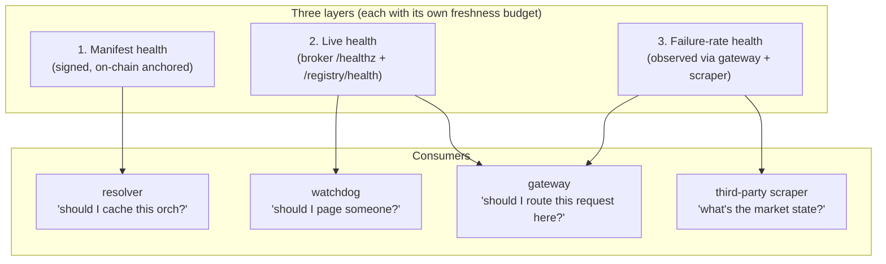
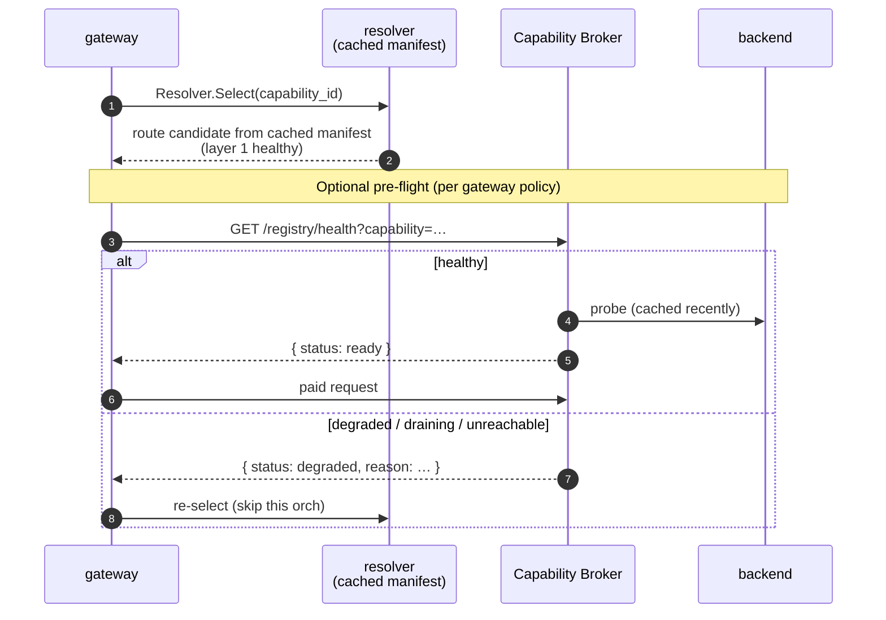
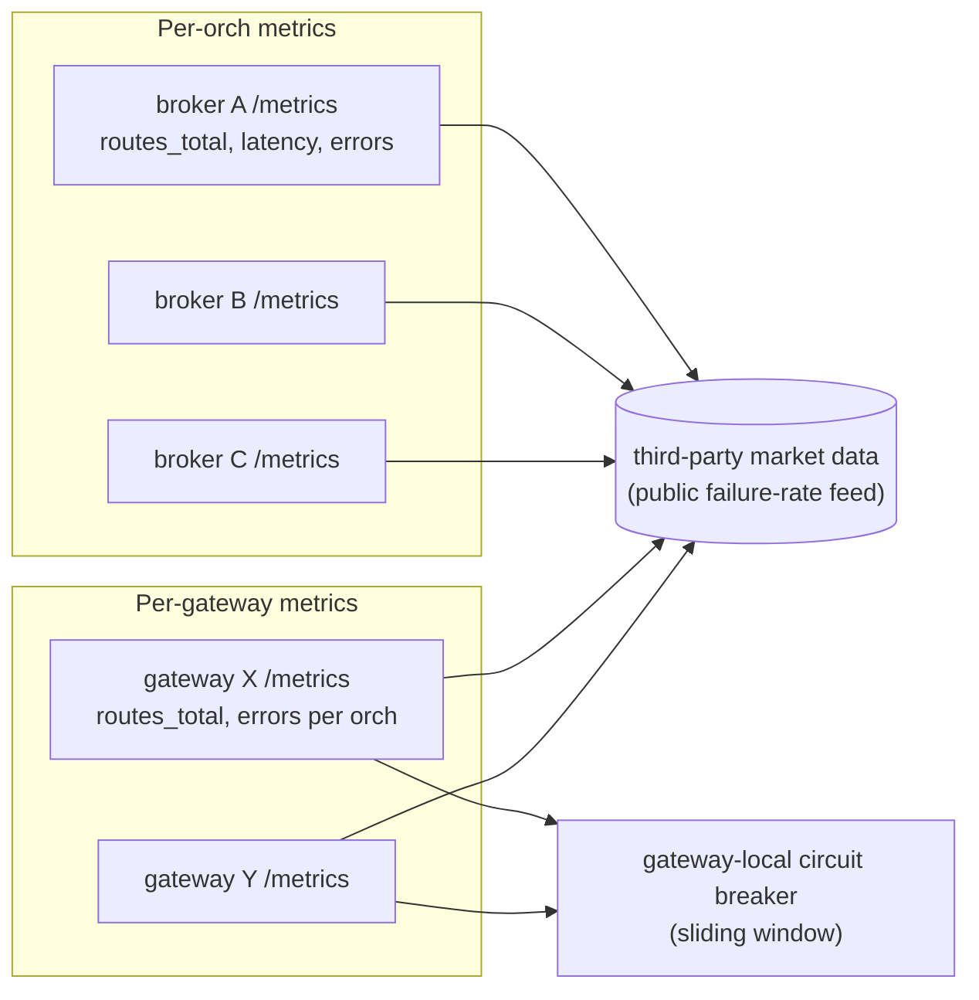

# Backend health

Three layers of "is this capability available right now?" — used by three
different consumers, with three different freshness budgets. Conflating them
is the most common source of routing bugs.

## Why three layers

A capability can fail in three independent ways:

1. **Manifest health** — the operator never declared it (or stopped declaring
   it). Static, signed, slow to change.
2. **Live health** — the broker process is up and the backend is reachable
   right now. Dynamic, unsigned, fast-changing.
3. **Failure-rate health** — the broker accepts requests but a meaningful
   fraction of them fail (5xx, timeouts, backend errors). Observational,
   measured over a window.

Each layer is consumed by a different actor and answers a different question.
The architecture exposes each layer **separately** so consumers can mix them
on their own terms.



## Layer 1 — Manifest health

**Question:** does the orch publicly claim this capability exists right now?

**Source of truth:** the signed manifest hosted at the orch's on-chain
`serviceURI`. The capability is healthy at this layer iff a valid signed
manifest currently lists `(capability_id, offering_id, worker_url)` with a
non-zero price.

**Freshness budget:** minutes to hours. Manifest changes go through the
operator-driven sign cycle (see [`trust-model.md`](./trust-model.md)) —
they're never instantaneous and they shouldn't be.

**Who consumes it:**

- the resolver (`service-registry-daemon`) on its per-round refresh
- the orch-coordinator when building / verifying candidates
- third-party scrapers building market-data feeds

**Failure modes:**

- manifest signature invalid → resolver refuses, route disappears
- on-chain `serviceURI` points at a 404 → resolver refuses, route disappears
- manifest doesn't list the requested capability → not a "failure," just
  "not offered"

**Key invariant:** manifest health is **signed**. A capability the operator
hasn't cold-signed for is not visible at this layer no matter what the
broker or backend say.

## Layer 2 — Live health

**Question:** is the broker process up, and can it reach its declared
backends right now?

**Source of truth:** the broker's own health endpoints.

| Endpoint | Scope | Used by |
|---|---|---|
| `GET /healthz` | the broker process itself | watchdogs, container orchestrators |
| `GET /registry/health` | per-capability backend reachability | gateways, coordinators |

`/registry/health` returns a per-capability health snapshot. Example shape:

```json
{
  "capabilities": [
    {
      "id": "openai:chat-completions:llama-3-70b",
      "offering_id": "tier-a",
      "status": "ready",
      "last_probe_ms": 1450,
      "backend": "reachable"
    },
    {
      "id": "video:live.rtmp",
      "offering_id": "default",
      "status": "draining",
      "reason": "operator_marked_drain"
    }
  ]
}
```

The broker may use specialized backend checks internally. That is
expected. The architectural requirement is not "every capability uses
the same probe"; it is "every capability publishes the same normalized
health surface."

In practice:

- each tuple in `host-config.yaml` may choose a broker-side probe recipe
- the probe recipe may be shallow or specialized depending on workload
- the broker maps the result onto generic outward states:
  `ready`, `draining`, `degraded`, `unreachable`, `stale`

Examples of legitimate specialized checks:

- OpenAI-compatible backend: model-specific readiness, not just port-open
- RTMP pipeline: ingest path healthy and encoder initialized
- realtime session backend: control plane healthy and required media
  dependency reachable
- third-party SaaS backend: credentials valid and upstream quota not
  exhausted

The coordinator, resolver, and gateways should not need to understand
those semantics. They consume only the broker's normalized result.

**Freshness budget:** seconds. Backend reachability is probed on cadence
(periodic + on-demand) and cached briefly.

**Who consumes it:**

- gateways doing pre-flight checks before forwarding a paid request
- the orch-coordinator deciding whether to scrape new offerings or keep
  serving cached ones
- LAN-side watchdogs

**Failure modes:**

- broker process is dead → `/healthz` is unreachable; the orch-coordinator
  stops scraping and falls back to last-known manifest fragment
- broker is up but a backend has gone dark → `/registry/health` reports the
  affected capabilities as `degraded` or `unreachable`; gateways should
  route elsewhere
- broker is draining (operator intent) → `status: draining`; sessions in
  flight continue but new opens are rejected with a clear reason

**Key invariant:** live health is **unsigned**. It cannot be aggregated
into a market-wide claim without out-of-band validation — anyone can serve
a green `/healthz`.

### Probe extensibility

This stack is expected to serve capabilities with different definitions
of "ready". The extensibility point belongs in the broker:

- **operator-facing choice:** `host-config.yaml` selects the probe recipe
  and thresholds per tuple
- **core-module implementation:** capability-broker ships the probe
  recipe library and executes probes on cadence
- **cross-stack contract:** `/registry/health` exposes only normalized
  status, freshness, and reason

That keeps custom health behavior compatible with the workload-agnostic
architecture:

- custom behavior lives at the edge, next to the backend
- shared modules stay generic
- gateways and resolvers route on normalized status, not on
  capability-specific heuristics



## Layer 3 — Failure-rate health

**Question:** when we routed traffic here recently, what fraction succeeded?

**Source of truth:** observed outcomes over a sliding window — counted on
both sides of the wire.

**Where the data lives:**

- gateway-side: `livepeer_routes_total{capability, offering, outcome="…"}` —
  per-route success / 4xx / 5xx / timeout outcomes
- broker-side: `livepeer_routes_total` with the same label schema, exposed
  on the broker's `/metrics`
- third-party scrapers aggregate both sides into independent market data

**Freshness budget:** minutes. Failure-rate is a moving average — too
short a window is noisy, too long a window is stale.

**Who consumes it:**

- the gateway deciding to **skip** an orch that's currently failing, even
  though manifest + live health both look fine ("circuit breaker on
  observed quality")
- third-party market-data feeds publishing public reliability scores
- the operator's own dashboards

**Failure modes:**

- a specific capability is failing inside an otherwise-healthy broker —
  e.g., backend started returning 500s for one model but the
  `/registry/health` probe to that backend is cosmetic enough to still pass
- intermittent timeouts that exceed the gateway's request budget but
  pass the broker's probe
- correlated failures across multiple orchs (chain RPC outage, common
  cloud-provider incident) — visible only at this layer

**Key invariant:** failure-rate health is **observational and decentralized**.
There is no signed market-wide answer to "what's the current 5xx rate";
each consumer computes their own from raw metrics. Aggregation is third-party
on purpose (Layer 8 of the architecture overview).



## Composing the three layers

A gateway routing decision composes all three, in order:

1. Layer 1 narrows the candidate set to orchs that **claim** to offer the
   capability.
2. Layer 2 narrows further to candidates that **report ready** right now.
3. Layer 3 deprioritizes candidates that have **recently failed** the
   gateway in question.

A capability is only routable when all three layers say yes for the same
`(orch, capability_id, offering_id)` tuple. Skipping a layer is a footgun:

- **Skip Layer 1** → routing to a host that hasn't been cold-signed for the
  capability. Breaks the trust model.
- **Skip Layer 2** → routing to a dead broker. Inflates 5xx rate and wastes
  payment tickets.
- **Skip Layer 3** → repeatedly routing to a known-bad orch because the
  manifest still claims health.

## Operator surfaces

Each layer corresponds to a different operator surface:

| Layer | Operator action | Surface |
|---|---|---|
| 1 | edit `host-config.yaml` + sign cycle | secure-orch-console |
| 2 | restart broker, mark drain, fix backend | broker `/admin` + container orchestration |
| 3 | inspect dashboards, declare incident | metrics / alerting stack |

## Execution placement

The three-layer model is only useful if the implementation split stays
clean. The practical rule is:

- **coordinator builds and hosts claims**
- **resolver composes claims + live readiness**
- **gateway makes the final routing choice**
- **broker is the source of truth for runtime reachability**

Anything else tends to smear trust and liveness together.

### Which component runs which check

| Check | Source of truth | Implemented in | Cached by | Consumed by | Must not do |
|---|---|---|---|---|---|
| "Did the operator declare this tuple?" | cold-signed manifest | `orch-coordinator` hosts; `service-registry-daemon` verifies | `service-registry-daemon` | gateways, scrapers, operators | infer live health |
| "Is the broker process alive?" | `GET /healthz` | capability broker | orch-coordinator, `service-registry-daemon`, watchdogs | coordinator UX, resolver, ops | create or remove manifest entries |
| "Is this `(capability, offering)` backend ready right now?" | `GET /registry/health` | capability broker | orch-coordinator, `service-registry-daemon` | gateway route selection, coordinator UX | override signed manifest |
| "Has this route been failing under real traffic?" | request outcomes over time | gateway + broker metrics | gateway-local policy, third-party scrapers | gateway retry / weighting, dashboards | become a signed market claim |

### Orch-coordinator responsibilities

The coordinator has two separate jobs and they must stay separate:

1. **Candidate-manifest pipeline**
   - scrape `GET /registry/offerings`
   - build candidate manifest bytes
   - host the signed manifest after upload
2. **Operational visibility**
   - poll `GET /healthz` and `GET /registry/health`
   - show per-broker / per-capability freshness and readiness in the UI
   - expose metrics and alerts for stale or unreachable brokers

The coordinator may use live health to explain what is happening on the
LAN, but it must **not** auto-edit the signed manifest because a broker
went red for a short time. Broker outages are Layer 2; manifest changes
are Layer 1.

### Service-registry-daemon responsibilities

The resolver is where Layer 1 and Layer 2 get composed for routing:

1. verify and cache signed manifests from the orch `serviceURI`
2. maintain a short-TTL cache of broker live health
3. return only tuples that pass both checks:
   - present in a valid signed manifest
   - currently `ready` in broker live health

If live-health data is stale past policy TTL, the resolver should treat
that route as unavailable for hot-path selection rather than silently
assuming green.

### Gateway responsibilities

The gateway should not re-implement chain or manifest verification logic.
Its job is:

1. ask `service-registry-daemon` for candidates that already passed
   Layer 1 and Layer 2
2. apply gateway-local policy for Layer 3:
   - recent success / failure rate
   - timeout history
   - optional latency or backoff weighting
3. retry or skip bad routes based on observed outcomes

This is why the gateway is the right place for circuit breaking and
failure-rate weighting, but the wrong place for deciding whether an orch
is entitled to advertise a capability at all.

### Capability-broker responsibilities

The broker owns the live health answers because it is the component that
actually knows whether the backend can serve work now.

- `GET /healthz` answers: "is the broker process up?"
- `GET /registry/health` answers: "is this advertised tuple ready,
  draining, degraded, unreachable, or stale?"

Probe recipes may differ by backend type, but the broker must normalize
them into workload-agnostic states. Neither the coordinator nor the
resolver should learn capability-specific semantics just to answer a
health question.

### OpenAI gateway example

For `POST /v1/chat/completions` targeting
`openai:chat-completions:llama-3-70b`:

1. broker advertises the tuple in `/registry/offerings`
2. coordinator includes it in the next candidate manifest
3. operator signs; coordinator publishes
4. resolver verifies the signed manifest and caches the tuple
5. resolver polls broker `/registry/health`
6. OpenAI gateway asks resolver for candidates
7. resolver returns only routes that are both:
   - signed in the manifest
   - currently live-healthy
8. gateway applies recent failure history before choosing the final route

If the model backend dies but the signed manifest still lists it, the
route should disappear from resolver selection without forcing a new sign
cycle. If the operator permanently removes the model, that change goes
through the manifest path and survives even if the broker would otherwise
report green health.

If a capability looks unhealthy and you don't know why, ask: **which layer
is failing?** That's a faster path to the right fix than starting from the
symptom.

## See also

- [`./architecture-overview.md`](./architecture-overview.md) — Layer 8
  (demand visibility) for the metrics surface that feeds Layer 3
- [`./trust-model.md`](./trust-model.md) — the sign-cycle that gates Layer 1
- [`../../capability-broker/`](../../capability-broker/) — where `/healthz`
  and `/registry/health` are implemented
