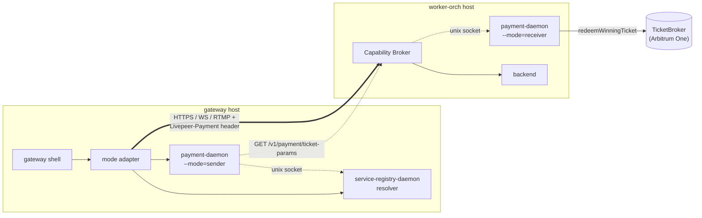
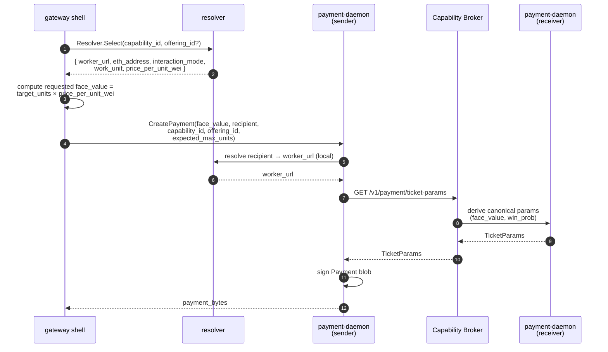
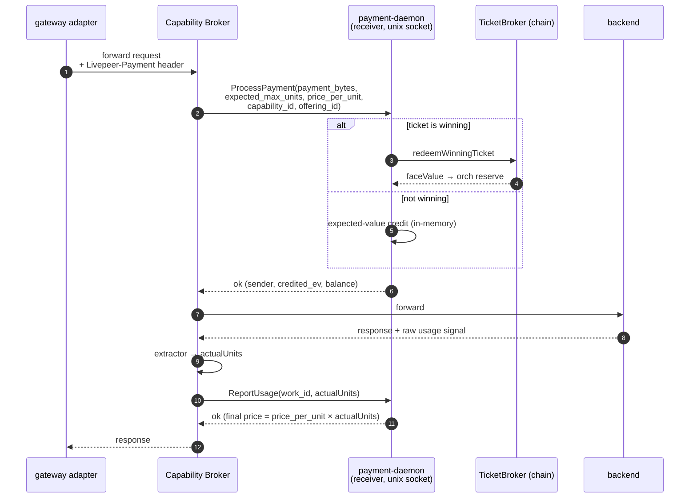

# Payment-daemon interactions

Cross-cutting guide to how this repo uses `payment-daemon` and
`service-registry-daemon` together. New backend authors should read this
before inventing any payment flow of their own.

The goal is to make three things explicit:

- what the gateway sends
- what the capability broker / receiver actually validates and credits
- which config knobs affect retail price vs ticket redeemability

## Scope

This doc applies to both interaction-model families:

- **request/response** modes (`http-reqresp`, `http-stream`, `http-multipart`)
- **streaming** modes (`ws-realtime`, `rtmp-ingress-hls-egress`,
  `session-control-plus-media`) using the worker-metered / gateway-ledger
  split defined in [`streaming-workload-pattern.md`](./streaming-workload-pattern.md)

The payment primitives are shared. What changes between the two model families
is who owns the long-lived session meter and when customer-ledger commits
happen.

> **Important rewrite-specific change.** In the rewrite, the daemon no longer
> enforces a closed enum of capability or work-unit names. Both are opaque
> strings on the wire; the daemon does the arithmetic `final_price_wei =
> price_per_unit_wei × actualUnits`. See
> [`payment-decoupling.md`](./payment-decoupling.md).

## The two daemon roles

### Sender mode

The gateway runs `payment-daemon` in `--mode=sender`.

Its job is to:

- accept `CreatePayment(face_value, recipient, capability, offering, expected_max_units)`
- resolve the recipient to a worker URL via the local `service-registry-daemon`
- fetch canonical ticket params from the worker-side
  `/v1/payment/ticket-params` path
- sign a wire-format `Payment` blob

The sender daemon is not a pricing engine. It does not decide retail price. It
turns a gateway pricing decision into a valid ticket.

### Receiver mode

The capability broker host runs `payment-daemon` in `--mode=receiver`. The
broker and the daemon talk over a unix socket — same socket regardless of
capability.

Its job is to:

- publish capability / offering prices from `host-config.yaml`
- synthesize truthful ticket params for the incoming payment request
- validate `Payment` blobs with `ProcessPayment`
- credit and debit per-session balance (for streaming modes)
- redeem winning tickets on-chain

The receiver daemon is both:

- the cryptographic authority for payee-issued ticket params, and
- the runtime allowance store for receiver-side balances



## End-to-end quote-free flow

This is the canonical flow used across all interaction modes.

### 1. Resolve route and retail price

The gateway resolves through `service-registry-daemon`:

- worker URL
- recipient ETH address
- `capability_id`
- `offering_id`
- `interaction_mode`
- `price_per_work_unit_wei`
- `work_unit` (opaque string)

The resolver result tells the gateway **what the host advertises for retail
charging**, and which adapter to use.

### 2. Compute the requested spend

The gateway computes a wei-denominated request amount from the resolved price:

```
requested_face_value_wei = target_units * price_per_work_unit_wei
```

For request/response modes, `target_units` is usually the gateway's best
estimate of the single request cost. For streaming modes, `target_units` is
the amount of runway the gateway wants to pre-credit or top up.

> **Naming note.** In the current quote-free protocol, the sender-side field
> is still named `face_value`, but semantically it is the gateway's **target
> spend request** or **requested expected value**, not necessarily the final
> winning-ticket face value the receiver will choose.

### 3. `CreatePayment` does not mean "final face value is fixed"

The gateway calls:

```
CreatePayment(face_value, recipient, capability_id, offering_id, expected_max_units)
```

The sender daemon then:

1. resolves the recipient to a worker URL via the local resolver
2. calls the worker-side ticket-params endpoint
3. receives receiver-chosen `TicketParams`
4. signs a `Payment`

This is why the service registry matters to payment correctness: sender mode
needs a route to the worker so it can fetch canonical ticket params for that
exact payee.



### 4. Requested spend vs actual winning-ticket face value

These terms are **not** interchangeable.

| Term | Chosen by | Meaning |
|---|---|---|
| `price_per_work_unit_wei` | host config (`host-config.yaml`) | published retail price for one work unit |
| requested `face_value` in `CreatePayment(...)` | gateway | target spend / requested EV for this payment |
| actual ticket `FaceValue` inside returned `TicketParams` | receiver daemon | winning-ticket size chosen so redemption remains truthful |
| `win_prob` | receiver daemon | probability chosen so `FaceValue × win_prob` matches the requested spend |
| credited EV from `ProcessPayment` | receiver daemon | expected value actually credited to the `(sender, work_id)` balance |

The load-bearing semantic shift: **the gateway requests a target spend; the
receiver chooses redeemable ticket economics that match it in expectation.**

- the gateway may request a small spend amount
- the receiver may return a **larger** winning-ticket face value
- the receiver lowers `win_prob` so expected spend still matches the
  gateway's request

That lets small retail requests succeed **without lying** about redemption
economics.

## Why this exists

An individually redeemable winning ticket must still clear runtime economics:

- receiver EV target
- redemption gas assumptions
- gas price multiplier
- sender `MaxFloat` / reserve availability

So a host may publish a correct retail price and still refuse some requests if
the sender cannot support the redeemable winning-ticket size the receiver
needs.

## What changes retail price vs what changes acceptance floor

This is the most important operator distinction.

### Retail price

Retail charge comes from `host-config.yaml`:

- `capabilities[].id`
- `capabilities[].work_unit.name`
- `capabilities[].price.amount_wei`
- `capabilities[].price.per_units`

Changing these changes what gateways should charge for work.

### Acceptance floor / redeemability

Ticket acceptability comes from receiver runtime economics, especially:

- `--receiver-ev`
- `--redeem-gas`
- gas price and `--gas-price-multiplier-pct`
- `--receiver-tx-cost-multiplier`
- sender reserve / `MaxFloat`

Changing these affects whether a small requested spend can be turned into a
truthful redeemable ticket.

This is why "make the YAML price lower" is usually the wrong fix when small
requests fail. Lowering published price changes customer billing; it does not
necessarily make the resulting ticket redeemable.

## The sender / receiver success path

### Gateway / sender side

For a workload author, the required sequence is:

1. resolve worker + offering
2. compute requested spend from resolved price
3. call `CreatePayment(face_value, recipient, capability_id, offering_id, expected_max_units)`
4. attach returned `payment_bytes` to the broker request
5. fail closed if the daemon cannot mint payment

### Broker / receiver side

The capability broker accepts the payment alongside the inbound request and
hands it to the receiver daemon. For streaming modes the long-lived state
machine then owns balance debits.



Streaming modes follow the same shape but split into `OpenSession` /
`DebitBalance` / `SufficientBalance` / `CloseSession` — see
[`streaming-workload-pattern.md`](./streaming-workload-pattern.md).

## Service-registry interaction

`service-registry-daemon` and `payment-daemon` are coupled at one crucial
point:

- the resolver is the sender daemon's route-to-worker source of truth

The gateway does not hand the sender daemon a worker URL directly in the
normal production path. It hands over:

- recipient ETH address
- `capability_id`
- `offering_id`

Sender mode then uses the local resolver to map recipient → worker URL and
fetch `/v1/payment/ticket-params` there.

Implications:

- route / offering correctness matters to payment correctness
- recipient address drift breaks payment minting even if HTTP routing still
  looks superficially healthy
- service-registry pricing and payment-daemon pricing assumptions must stay
  aligned

## Hot / cold identity split

Receiver-side redemption commonly uses:

- hot signer wallet for gas and tx signing
- cold orchestrator address as the ticket recipient

This is safe because `TicketBroker` pays `faceValue` to `ticket.Recipient` and
does not require the recipient itself to sign redemption.

Repo docs therefore keep these roles distinct:

- **signer wallet** = operational key the receiver daemon uses
- **recipient / orch identity** = on-chain identity that receives payouts

## Backend-author checklist

A new backend integration is not ready until its docs and host-config example
answer all of these clearly:

1. What `capability_id` string does it advertise?
2. What `offering_id` does it route on?
3. What `work_unit` does it meter in?
4. What `interaction_mode` from the protocol typology applies?
5. Which extractor produces `actualUnits` from the backend response?
6. How does the gateway compute requested spend from that unit price?
7. For streaming: which side owns the live meter — gateway or broker?
8. For streaming: what `work_id` is used for receiver-side balance correlation?
9. For streaming: how does topup reuse the same `work_id`?
10. What operator knobs affect retail pricing?
11. What operator knobs affect redeemability / minimum truthful ticket size?
12. What should the operator inspect first when `CreatePayment` or
    `ProcessPayment` fails?

## Practical debugging map

If the host advertises the right price but minting still fails, inspect:

1. `host-config.yaml` published `price.amount_wei` / `price.per_units`
2. gateway-computed requested spend
3. receiver runtime economics: `--receiver-ev`, `--redeem-gas`,
   `--receiver-tx-cost-multiplier`, gas-price multiplier
4. sender reserve / `MaxFloat`
5. resolver route correctness for the target recipient
6. broker `/v1/payment/ticket-params` reachability

If the ticket mints but runtime charging behaves incorrectly, inspect:

1. broker / receiver `ProcessPayment(...)` result and credited EV
2. extractor output (does `actualUnits` match what the backend actually did?)
3. `work_id` reuse across session open and topup (streaming only)
4. `DebitBalance(...)` units emitted by the broker
5. `SufficientBalance(...)` watermark policy
6. gateway-side customer-ledger reconciliation

## Relationship to other docs

This is a cross-cutting translation layer, not the authoritative daemon
operator reference.

For the primary source material, see:

- [`../../payment-daemon/`](../../payment-daemon/) — the daemon itself
- [`../../livepeer-network-protocol/headers/`](../../livepeer-network-protocol/headers/)
  — the `Livepeer-Payment` and related wire headers
- [`./payment-decoupling.md`](./payment-decoupling.md) — what changed vs the
  suite's payment daemon
- [`./streaming-workload-pattern.md`](./streaming-workload-pattern.md) — the
  long-lived-session shape
