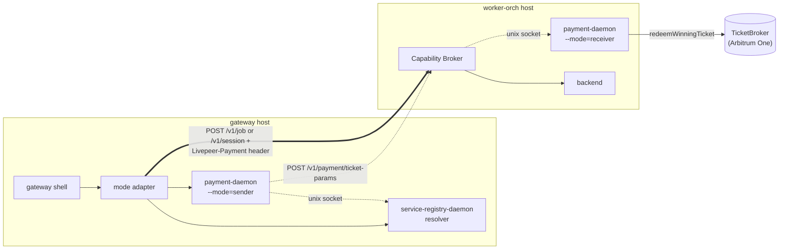
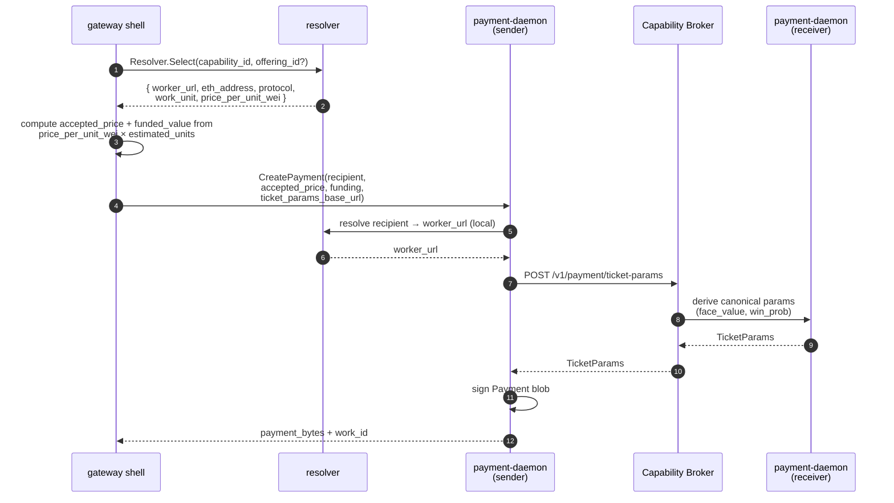
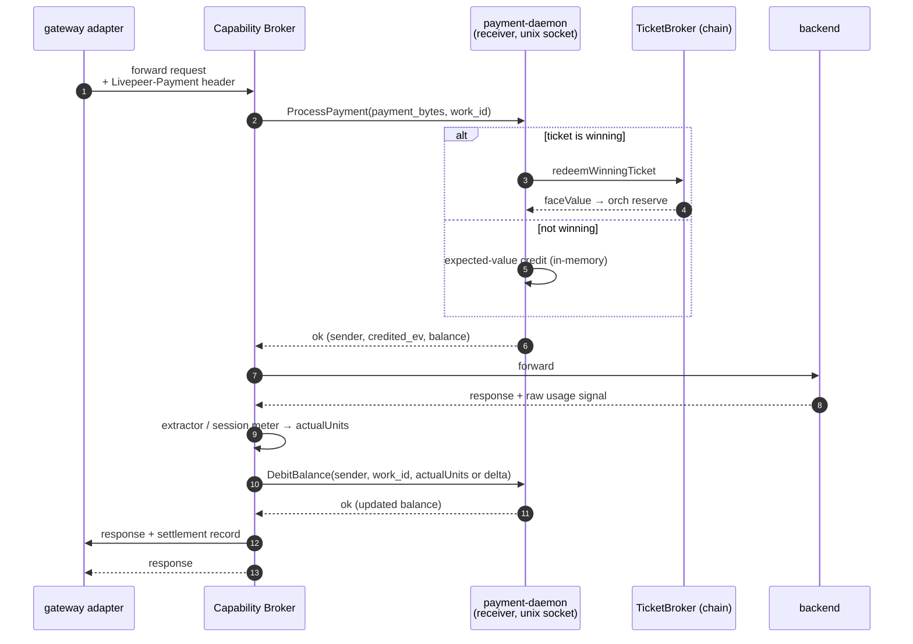

# Payment-daemon interactions

Cross-cutting guide to how this repo uses `payment-daemon` and
`service-registry-daemon` together. New backend authors should read this
before inventing any payment flow of their own.

The goal is to make three things explicit:

- what the gateway sends
- what the capability broker / receiver actually validates and credits
- which config knobs affect retail price vs ticket redeemability

## Scope

This doc applies to both v1 protocols
([`interaction-modes.md`](./interaction-modes.md)):

- **[`paid-job/v1`](../../livepeer-network-protocol/protocols/paid-job.md)** —
  one paid exchange, one envelope, one `ReportUsage`, settled once. Transport
  (`unary` / `stream` / `multipart`) is a per-request HTTP negotiation and does
  not change the payment shape.
- **[`paid-session/v1`](../../livepeer-network-protocol/protocols/paid-session.md)** —
  one `OpenSession` at open, debits driven by the runner's cumulative usage
  claims, top-ups crediting the same `work_id`, `CloseSession` at winddown.

The payment primitives are shared. What changes between the two is who owns the
long-lived session meter and when customer-ledger commits happen; the trust
framing for both is [`dual-meter-trust.md`](./dual-meter-trust.md).

> **Important rewrite-specific change.** In the rewrite, the daemon no longer
> enforces a closed enum of capability or work-unit names. Both are opaque
> strings on the wire; the daemon does the arithmetic `final_price_wei =
> price_per_unit_wei × actualUnits`. See
> [`payment-decoupling.md`](./payment-decoupling.md).

## The two daemon roles

### Sender mode

The gateway runs `payment-daemon` in `--mode=sender`.

Its job is to:

- accept `CreatePayment(recipient, accepted_price, funding, ticket_params_base_url)`
- resolve the recipient to a worker URL via the local `service-registry-daemon`
- fetch canonical ticket params from the worker-side
  `/v1/payment/ticket-params` path
- sign a wire-format `Payment` blob whose `expected_price` reflects the
  gateway-accepted quote basis
- return the minted `work_id` (`hex(recipient_rand_hash)`) so callers can
  key their own session state explicitly
- accept payee-side rejection feedback via `ReportPaymentResult` and
  invalidate stale cached sessions on `INVALID_RECIPIENT_RAND`

The sender daemon is not a pricing engine. It does not decide retail price. It
turns a gateway pricing decision into a valid ticket.

### Receiver mode

The capability broker host runs `payment-daemon` in `--mode=receiver`. The
broker and the daemon talk over a unix socket — same socket regardless of
capability.

Its job is to:

- publish capability / offering prices from `host-config.yaml`
- synthesize truthful ticket params for the incoming payment request
- validate `Payment` blobs with `ProcessPayment`
- report structured per-ticket rejection status from `ProcessPayment`
- credit and debit per-session balance (for streaming modes)
- redeem winning tickets on-chain
- expose operator-only `PayeeAdmin.ResetSession` for deliberate session
  rotation

The receiver daemon is both:

- the cryptographic authority for payee-issued ticket params, and
- the runtime allowance store for receiver-side balances

For an open `(sender, recipient, capability, offering)` session,
repeated `GetTicketParams` calls reuse the same `recipient_rand_hash`,
including across receiver restarts. Rotation happens only after an
explicit close/reset.


```mermaid
flowchart LR
    subgraph gateway_host["gateway host"]
        direction TB
        Shell["gateway shell"]
        Adapter["mode adapter"]
        SRDg["service-registry-daemon<br/>resolver"]
        Sender["payment-daemon<br/>--mode=sender"]
    end

    subgraph worker_host["worker-orch host"]
        direction TB
        Broker["Capability Broker"]
        Receiver["payment-daemon<br/>--mode=receiver"]
        Backend["backend"]
    end

    Chain[("TicketBroker<br/>(Arbitrum One)")]

    Shell --> Adapter
    Adapter --> SRDg
    Adapter --> Sender
    Sender -.->|"unix socket"| SRDg
    Sender -.->|"POST /v1/payment/ticket-params"| Broker
    Adapter ==>|"POST /v1/job or /v1/session +<br/>Livepeer-Payment header"| Broker
    Broker -.->|"unix socket"| Receiver
    Receiver -->|"redeemWinningTicket"| Chain
    Broker --> Backend
```

## End-to-end quote-free flow

This is the canonical flow, shared by both protocols.

### 1. Resolve route and retail price

The gateway resolves through `service-registry-daemon`:

- worker URL
- recipient ETH address
- `capability_id`
- `offering_id`
- `protocol`
- `price_per_work_unit_wei`
- `work_unit` (opaque string)

The resolver result tells the gateway **what the host advertises for retail
charging**, and which adapter to use.

### 2. Compute the requested budget and accepted price basis

The gateway computes both:

- the accepted unit price basis
- the initial funded budget

The funded budget is still commonly derived from:

```
requested_face_value_wei = target_units * price_per_work_unit_wei
```

For request/response modes, `target_units` is usually the gateway's best
estimate of the single request cost. For streaming modes, `target_units` is
the amount of runway the gateway wants to pre-credit or top up.

The important separation is:

- accepted price basis
- funded budget
- actual final usage

The old "face_value-only" API was too weak because it collapsed those into one
number.

### 3. `CreatePayment` does not mean "final bill is fixed"

The gateway calls:

```
CreatePayment(recipient, accepted_price, funding, ticket_params_base_url)
```

The sender daemon then:

1. validates the accepted quote/funding request
2. resolves the recipient to a worker URL via the local resolver
3. calls the worker-side ticket-params endpoint
4. receives receiver-chosen `TicketParams`
5. signs a `Payment`

This is why the service registry matters to payment correctness: sender mode
needs a route to the worker so it can fetch canonical ticket params for that
exact payee.


```mermaid
sequenceDiagram
    autonumber
    participant Shell as gateway shell
    participant SRD as resolver
    participant Sender as payment-daemon<br/>(sender)
    participant Broker as Capability Broker
    participant Receiver as payment-daemon<br/>(receiver)

    Shell->>SRD: Resolver.Select(capability_id, offering_id?)
    SRD-->>Shell: { worker_url, eth_address, protocol,<br/>work_unit, price_per_unit_wei }
    Shell->>Shell: compute accepted_price + funded_value from<br/>price_per_unit_wei × estimated_units
    Shell->>Sender: CreatePayment(recipient,<br/>accepted_price, funding,<br/>ticket_params_base_url)
    Sender->>SRD: resolve recipient → worker_url (local)
    SRD-->>Sender: worker_url
    Sender->>Broker: POST /v1/payment/ticket-params
    Broker->>Receiver: derive canonical params<br/>(face_value, win_prob)
    Receiver-->>Broker: TicketParams
    Broker-->>Sender: TicketParams
    Sender->>Sender: sign Payment blob
    Sender-->>Shell: payment_bytes + work_id
```

### 3.1 Rejection feedback loop

`CreatePayment` and `ProcessPayment` are separated by the caller and the
broker, so the sender daemon cannot directly observe a later payee-side
ticket rejection. The recovery loop is therefore explicit:

1. broker / caller submits the minted payment
2. receiver `ProcessPayment` returns structured `TicketStatus`
3. if the dominant reason is `INVALID_RECIPIENT_RAND`, the caller
   reports that outcome to `PayerDaemon.ReportPaymentResult`
4. sender invalidates the cached session and returns `codes.Aborted`
   with retry details
5. caller retries exactly once and receives a fresh `work_id`

This preserves `work_id` as explicit caller-visible state instead of
silently swapping session identity inside the daemon.

### 4. Accepted price vs funded budget vs actual winning-ticket face value

These terms are **not** interchangeable.

| Term | Chosen by | Meaning |
|---|---|---|
| `price_per_work_unit_wei` | host config (`offers[].price` in `host-config.yaml`) | published retail price for one work unit |
| accepted price basis in `CreatePayment(...)` | gateway | the unit price / quote identity the gateway accepted |
| funded budget in `CreatePayment(...)` | gateway | initial funded EV for this request or session window |
| actual ticket `FaceValue` inside returned `TicketParams` | receiver daemon | winning-ticket size chosen so redemption remains truthful |
| `win_prob` | receiver daemon | probability chosen so `FaceValue × win_prob` matches the requested spend |
| credited EV from `ProcessPayment` | receiver daemon | expected value actually credited to the `(sender, work_id)` balance |
| actual billed units | broker/backend | measured final usage after execution |
| final billed value | broker settlement | `accepted unit price × billed units` |

The load-bearing semantic shift: **the gateway funds a budget against an accepted
unit price; the receiver chooses redeemable ticket economics that match the funded
expected value; the broker later settles against actual measured usage.**

- the gateway may request a small spend amount
- the receiver may return a **larger** winning-ticket face value
- the receiver lowers `win_prob` so expected spend still matches the
  gateway's request

That lets small retail requests succeed **without lying** about redemption
economics.

## Why this exists

An individually redeemable winning ticket must still clear runtime economics:

- receiver EV target
- redemption gas assumptions
- gas price multiplier
- sender `MaxFloat` / reserve availability

So a host may publish a correct retail price and still refuse some requests if
the sender cannot support the redeemable winning-ticket size the receiver
needs.

## What changes retail price vs what changes acceptance floor

This is the most important operator distinction.

### Retail price

Retail charge comes from the offer in `host-config.yaml` — the operator's
half of the tuple:

- `offers[].capability`
- `offers[].offering_id`
- `offers[].price.amount_wei`
- `offers[].price.per_units`

Changing these changes what gateways should charge for work, and is an
ordinary config edit.

The work-unit *name* those wei are counted in is **not** here: the runner
declares it (with the extractor that produces it) at attach, and the first
runner to certify freezes it into the offer. So changing the unit is not a
price edit at all — it is a different runner shape, and a runner that
presents one the offer did not freeze is refused rather than silently
repricing the tuple.

### Acceptance floor / redeemability

Ticket acceptability comes from receiver runtime economics, especially:

- `--receiver-ev`
- `--redeem-gas`
- gas price and `--gas-price-multiplier-pct`
- `--receiver-tx-cost-multiplier`
- sender reserve / `MaxFloat`

Changing these affects whether a small requested spend can be turned into a
truthful redeemable ticket.

This is why "make the YAML price lower" is usually the wrong fix when small
requests fail. Lowering published price changes customer billing; it does not
necessarily make the resulting ticket redeemable.

## The sender / receiver success path

### Gateway / sender side

For a workload author, the required sequence is:

1. resolve worker + offering
2. compute accepted price basis + initial funded budget from the resolved price
3. call `CreatePayment(recipient, accepted_price, funding, ticket_params_base_url)`
4. attach returned `payment_bytes` to the broker request
5. fail closed if the daemon cannot mint payment

### Broker / receiver side

The capability broker accepts the payment alongside the inbound request and
hands it to the receiver daemon. For streaming modes the long-lived state
machine then owns balance debits.


```mermaid
sequenceDiagram
    autonumber
    participant GW as gateway adapter
    participant Broker as Capability Broker
    participant Receiver as payment-daemon<br/>(receiver, unix socket)
    participant TB as TicketBroker (chain)
    participant Backend as backend

    GW->>Broker: forward request<br/>+ Livepeer-Payment header
    Broker->>Receiver: ProcessPayment(payment_bytes, work_id)
    alt ticket is winning
        Receiver->>TB: redeemWinningTicket
        TB-->>Receiver: faceValue → orch reserve
    else not winning
        Receiver->>Receiver: expected-value credit (in-memory)
    end
    Receiver-->>Broker: ok (sender, credited_ev, balance)
    Broker->>Backend: forward
    Backend-->>Broker: response + raw usage signal
    Broker->>Broker: extractor / session meter → actualUnits
    Broker->>Receiver: DebitBalance(sender, work_id, actualUnits or delta)
    Receiver-->>Broker: ok (updated balance)
    Broker->>GW: response + settlement record
    Broker-->>GW: response
```

Streaming modes follow the same shape but split into `OpenSession` /
`DebitBalance` / `SufficientBalance` / `CloseSession` — see
[`streaming-workload-pattern.md`](./streaming-workload-pattern.md).

## Service-registry interaction

`service-registry-daemon` and `payment-daemon` are coupled at one crucial
point:

- the resolver is the sender daemon's route-to-worker source of truth

The gateway does not hand the sender daemon a worker URL directly in the
normal production path. It hands over:

- recipient ETH address
- `capability_id`
- `offering_id`

Sender mode then uses the local resolver to map recipient → worker URL and
fetch `/v1/payment/ticket-params` there.

Implications:

- route / offering correctness matters to payment correctness
- recipient address drift breaks payment minting even if HTTP routing still
  looks superficially healthy
- service-registry pricing and payment-daemon pricing assumptions must stay
  aligned

## Hot / cold identity split

Receiver-side redemption commonly uses:

- hot signer wallet for gas and tx signing
- cold orchestrator address as the ticket recipient

This is safe because `TicketBroker` pays `faceValue` to `ticket.Recipient` and
does not require the recipient itself to sign redemption.

Repo docs therefore keep these roles distinct:

- **signer wallet** = operational key the receiver daemon uses
- **recipient / orch identity** = on-chain identity that receives payouts

## Backend-author checklist

A new backend integration is not ready until its docs, its offer example and
its runner adapter profile answer all of these clearly. Note which side owns
each answer: 1–2 and 6–9 are the operator's, 3–5 are declared by the runner
and frozen into the offer.

1. What `capability_id` string does it advertise?
2. What `offering_id` does it route on?
3. What `work_unit` does it meter in?
4. Which protocol (`paid-job/v1` or `paid-session/v1`) applies, and for sessions, which descriptor schema?
5. Which extractor produces `actualUnits` from the backend response?
6. How does the gateway compute requested spend from that unit price?
7. For streaming: which side owns the live meter — gateway or broker?
8. For streaming: what `work_id` is used for receiver-side balance correlation?
9. For streaming: how does topup reuse the same `work_id`?
10. What operator knobs affect retail pricing?
11. What operator knobs affect redeemability / minimum truthful ticket size?
12. What should the operator inspect first when `CreatePayment` or
    `ProcessPayment` fails?

## Practical debugging map

If the host advertises the right price but minting still fails, inspect:

1. `host-config.yaml` published `price.amount_wei` / `price.per_units`
2. gateway-computed requested spend
3. receiver runtime economics: `--receiver-ev`, `--redeem-gas`,
   `--receiver-tx-cost-multiplier`, gas-price multiplier
4. sender reserve / `MaxFloat`
5. resolver route correctness for the target recipient
6. broker `/v1/payment/ticket-params` reachability

If the ticket mints but runtime charging behaves incorrectly, inspect:

1. broker / receiver `ProcessPayment(...)` result and credited EV
2. extractor output (does `actualUnits` match what the backend actually did?)
3. `work_id` reuse across session open and topup (streaming only)
4. `DebitBalance(...)` units emitted by the broker
5. `SufficientBalance(...)` watermark policy
6. gateway-side customer-ledger reconciliation

## Relationship to other docs

This is a cross-cutting translation layer, not the authoritative daemon
operator reference.

For the primary source material, see:

- [`../../payment-daemon/`](../../payment-daemon/) — the daemon itself
- [`../../livepeer-network-protocol/headers/`](../../livepeer-network-protocol/headers/)
  — the `Livepeer-Payment` and related wire headers
- [`./payment-decoupling.md`](./payment-decoupling.md) — what changed vs the
  suite's payment daemon
- [`./streaming-workload-pattern.md`](./streaming-workload-pattern.md) — the
  long-lived-session shape
