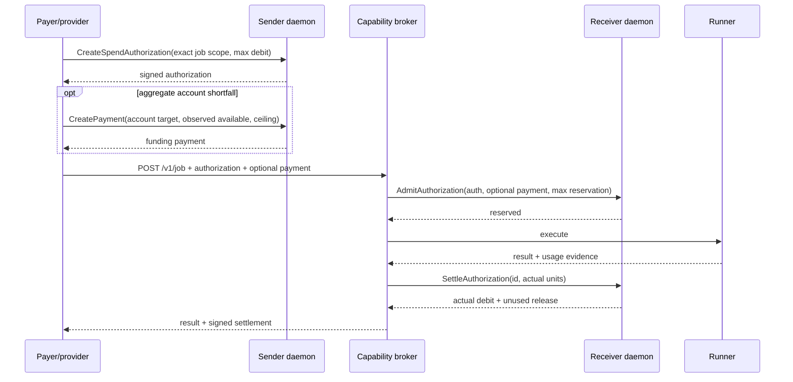

# Payment-daemon interactions

This is the operational map for gateway-shaped callers, the capability broker,
and the sender and receiver roles of `payment-daemon`. The economic design and
conservation rules are in
[`wholesale-credit-accounts.md`](./wholesale-credit-accounts.md); the wire
contracts are
[`paid-job/v1`](../../livepeer-network-protocol/protocols/paid-job.md),
[`paid-session/v1`](../../livepeer-network-protocol/protocols/paid-session.md),
and
[`wholesale-account`](../../livepeer-network-protocol/protocols/wholesale-account.md).

## The boundary

Livepeer is the wholesale rail. A provider or clearinghouse may maintain a
separate customer-facing USD ledger, but that retail ledger never becomes the
orchestrator's payment state.

```text
retail:    customer -> provider/clearinghouse -> USD usage and holds
wholesale: payer identity -> orchestrator payee -> wei account and reservations
```

The stable wholesale account is keyed by chain, payer, payee, and denomination.
Capability, offering, customer, request, session, quote, and ticket `work_id` do
not own the account. They scope authorizations and settlements.

## Invariants

1. Every paid workload carries `Livepeer-Authorization`.
2. A ticket can add expected-value credit to the wholesale account, but cannot
   authorize a workload.
3. An authorization binds one payee, broker, route, request or logical session,
   accepted quote, workload commitment, caller proof, validity window, and
   maximum debit.
4. Admission atomically reserves account value before backend execution.
5. Settlement charges actual delivered units and releases unused reservation.
6. The payer funds aggregate account float, not each workload's maximum.
7. Funding, admission, advance, and settlement are durable and idempotent.

## Sender-side flow

A gateway-shaped payer:

1. Resolves a signed route and pins payee, broker, capability, offering, unit
   price, work unit, and quote fingerprints.
2. Computes a workload maximum: a finite request ceiling or a session's bounded
   cumulative cap and initial runway.
3. Calls `CreateSpendAuthorization` for that single purpose.
4. Uses trusted wholesale-account state to choose a bounded aggregate float
   target.
5. Calls `CreatePayment` only for
   `max(0, target_available - observed_available)`. The request must carry
   `AccountFundingIntent`; `FundingIntent.funded_value_wei` is the hard mint
   ceiling.
6. Submits the authorization plus an optional shortfall payment. An out-of-path
   clearinghouse can fund first through `POST /v1/payment/account/fund` and
   give the end caller only the scoped authorization.

`CreatePayment` is neither the customer bill nor the workload maximum. It
maintains bounded reusable float at one payee.

## Finite jobs


```mermaid
sequenceDiagram
    participant P as Payer/provider
    participant S as Sender daemon
    participant B as Capability broker
    participant R as Receiver daemon
    participant W as Runner

    P->>S: CreateSpendAuthorization(exact job scope, max debit)
    S-->>P: signed authorization
    opt aggregate account shortfall
        P->>S: CreatePayment(account target, observed available, ceiling)
        S-->>P: funding payment
    end
    P->>B: POST /v1/job + authorization + optional payment
    B->>R: AdmitAuthorization(auth, optional payment, max reservation)
    R-->>B: reserved
    B->>W: execute
    W-->>B: result + usage evidence
    B->>R: SettleAuthorization(id, actual units)
    R-->>B: actual debit + unused release
    B-->>P: result + signed settlement
```

Payment-only jobs fail before ticket processing or runner effects. A terminal
response may be returned while a transient authorization-settlement RPC is
durably queued; the broker retries until the receiver records the same
idempotent settlement.

## Long-lived sessions

At open, the broker admits a session-scoped authorization and reserves bounded
runway. Verified cumulative usage calls `AdvanceAuthorization`, which converts
delivered units into a debit and restores configured runway without exceeding
the authorization cap.

An extensible session uses a successor authorization bound to the same logical
session and predecessor authorization. It does not mutate the prior cap or
rotate workload identity with ticket recipient randomness. Terminal winddown
calls `SettleAuthorization`; unused runway returns to the aggregate account.

If the account cannot restore runway, the broker extends no involuntary credit
and winds down according to paid-session policy. Recovery refuses pre-cutover
nonterminal records without a persisted authorization instead of inventing
authority.

## Receiver-side operations

The broker's workload path uses:

- `AdmitAuthorization` to verify, optionally fund, and reserve atomically;
- `AdvanceAuthorization` to apply cumulative session usage and target runway;
- `SettleAuthorization` to charge actual usage and release the remainder;
- `GetWholesaleAccount` and `GetSpendAuthorization` for status and recovery.

`FundWholesaleAccount` is funding-only. Older work-id session RPCs remain
implementation/wire compatibility for validating ticket funding; the broker
does not call them to admit, debit, or close workloads.

## Reconciliation

SDK callbacks improve latency but are not a correctness boundary. The payer
queries broker-authoritative state by its request or session identity, verifies
the signed settlement against the pinned quote and route, and then settles its
separate retail ledger. Raw HTTP callers may invoke work; they receive no
authority beyond the signed workload envelope.

Operators reconcile both ledgers independently:

- wholesale: credited EV, available, reserved, settled debits, account version;
- retail: customer holds, measured usage, configured USD rate, refunds, and
  provider margin.

## Debugging order

For authorization refusal, inspect the exact route, request/session binding,
quote fingerprints, caller proof, expiry, maximum debit, and signature before
the backend.

For insufficient funds, inspect account available/reserved values, aggregate
float target, observed version, declared shortfall, mint ceiling, and whether a
funding nonce was already accepted.

For incorrect charges, compare measured usage, authorization sequence and
cumulative units, receiver state, signed settlement, and retail reconciliation.

## Cutover

There is no `wholesale_accounts` offer or host-config flag. Protocol identity
implies authorization-only accounting. Before deploying this contract,
operators stop admissions and drain every legacy payment-only job/session.
Mixed versions fail closed. Rollback also requires a drain; no process may
synthesize an authorization for old durable state.
