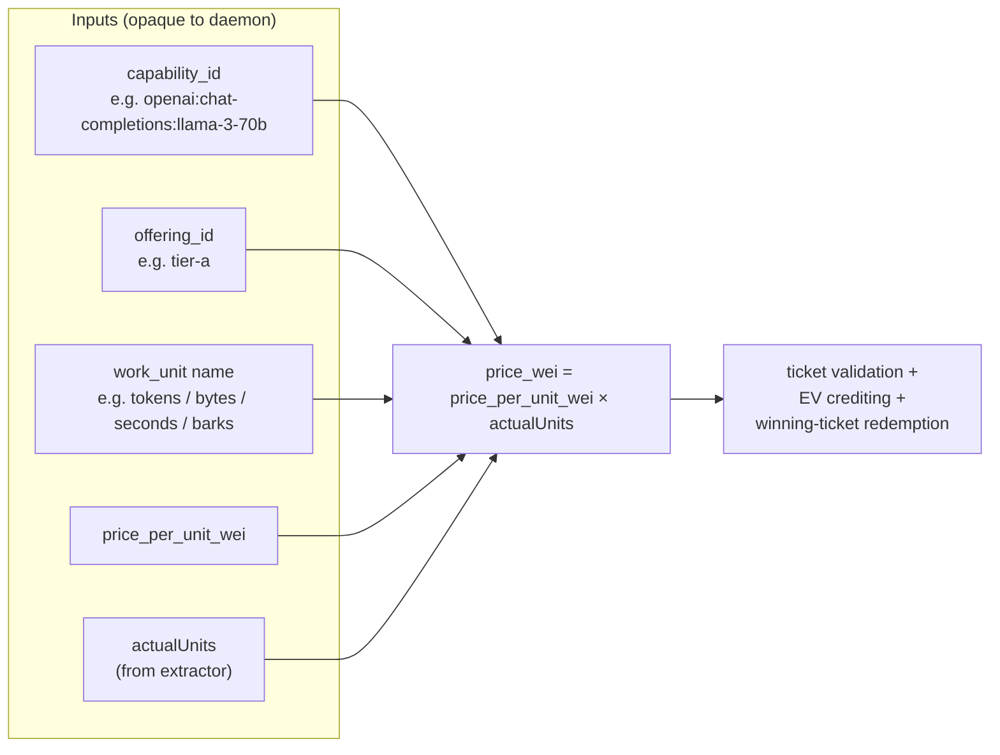

# Payment decoupling

What changed in `payment-daemon` for the rewrite vs the suite. Short version:
**the daemon stops enforcing a closed enum of capability or work-unit names.**

This is the one daemon-side change that the workload-agnostic broker depends
on. Everything else (sender / receiver split, ticket params, redemption,
hot/cold identity) is preserved.

## The problem this solves

In the suite, the daemon's protobuf surface enumerated capabilities and
work-unit names. Adding a new capability meant:

1. add the capability enum to `livepeer-modules-project/proto`
2. add the work-unit enum to the same proto
3. release a new daemon image
4. coordinate that release with every worker binary and every gateway shell

In a network whose whole point is "operators add new workloads," that's the
wrong trunk. The rewrite makes capability and work-unit identifiers **opaque
strings on the wire**; the daemon does arithmetic over them, nothing more.

## What the daemon does now



The daemon:

- treats `capability_id`, `offering_id`, and `work_unit.name` as opaque strings
- does arithmetic: `price_wei = price_per_unit_wei × actualUnits`
- validates ticket signatures and economics the same way as before
- redeems winning tickets on-chain the same way as before
- holds per-session balance keyed by `(sender, work_id)` the same way as
  before

The daemon **does not**:

- look up capability semantics in a table
- know what "tokens" or "pixel-seconds" mean
- decide what counts as a valid work-unit name
- gate behavior on enum membership

## What changed on the wire

### The `Livepeer-Payment` header

The header now carries the routing context the receiver needs to refuse
mismatched tickets:

```
Livepeer-Payment: <base64 payment blob>
Livepeer-Capability: openai:chat-completions:llama-3-70b
Livepeer-Offering: tier-a
```

The receiver checks that `(capability_id, offering_id)` in the inbound
request matches `(capability_id, offering_id)` declared in the
`CreatePayment` call. If they drift, the receiver refuses. This is the
"refuse mismatched routing" hard rule from the architecture overview.

The payment blob itself also gains `expected_max_units` so the receiver can
sanity-check that the sender at least believed the request could fit inside
the requested face value.

See [`../../livepeer-network-protocol/headers/livepeer-headers.md`](../../livepeer-network-protocol/headers/livepeer-headers.md)
for the wire-level spec.

### The `CreatePayment` / `ProcessPayment` API

Before (suite):

```
CreatePayment(face_value, recipient, Capability, Offering)
// Capability / Offering were proto enums
ProcessPayment(payment_bytes, work_id)
```

After (rewrite):

```
CreatePayment(face_value, recipient,
              capability_id /* string */,
              offering_id   /* string */,
              expected_max_units)
ProcessPayment(payment_bytes,
               expected_max_units,
               price_per_unit_wei,
               capability_id /* string */,
               offering_id   /* string */)
```

Anything that was an enum on the daemon API is now a string. Anything new is
load-bearing for the broker's routing-refusal check.

## Why this is safe

The thing the daemon cares about — ticket cryptography, EV math, on-chain
redemption — is unchanged. What was an enum was always just a label;
turning it into a string doesn't change what work is done. The daemon never
had a reason to interpret the capability name beyond "did the sender and
receiver agree on it?", and a string equality check answers that question
the same way an enum equality check did.

The runtime safety properties survive:

- **Tickets are still cryptographically validated** before any backend call.
- **Routing mismatches still fail closed** — now via string compare on
  `(capability_id, offering_id)` instead of enum compare.
- **Receiver-chosen ticket economics** (winning face value + `win_prob`) are
  unchanged. Small retail requests succeed without lying about redemption.
- **Hot / cold identity split** is unchanged. The recipient address still
  routes payouts; the signer wallet still pays gas.

## What this enables

The first-order win: **adding a brand-new capability under an existing
interaction mode is a `host-config.yaml` edit, with no broker, gateway, or
daemon release.**

The second-order wins:

- Custom work units (`barks`, `pixel-seconds`, `embeddings`, anything) require
  zero daemon changes — they're just strings paired with an extractor.
- New offerings on existing capabilities are pure YAML.
- Third-party extractors (e.g. a customer-supplied extractor for a custom
  REST API) can land without touching the daemon at all.

## What still requires a release

Some changes are still trunk changes — they're just much rarer:

- **A new interaction mode** (e.g. WebRTC). One adapter on each side of the
  wire (broker + gateway).
- **A new extractor recipe.** The broker ships a small fixed set
  (`openai-usage`, `response-jsonpath`, `request-formula`, `bytes-counted`,
  `seconds-elapsed`, `ffmpeg-progress`). Adding one is a broker change.
- **The receiver-side runtime economics** (`--receiver-ev`, `--redeem-gas`,
  gas-price multiplier, `MaxFloat`). These are operator knobs, not protocol
  changes, but they affect acceptance and redeemability — see
  [`payment-daemon-interactions.md`](./payment-daemon-interactions.md).

## Migration from the suite

Suite-era code that hard-codes capability or work-unit enums needs to:

1. Replace enum constants with string constants at the call sites.
2. Carry `capability_id` and `offering_id` through any code path that
   currently destructures the enum.
3. Add `expected_max_units` to every `CreatePayment` call site.
4. Update the `Livepeer-Payment` header construction to include the
   `Livepeer-Capability` and `Livepeer-Offering` siblings.
5. Update the receiver path to compare strings instead of enum values when
   refusing mismatched routing.

There is no shared schema migration: the daemon's storage layout doesn't
embed enum values for the keys that changed. The on-chain footprint is
unchanged.

## See also

- [`../../payment-daemon/`](../../payment-daemon/) — the daemon itself
- [`./payment-daemon-interactions.md`](./payment-daemon-interactions.md) —
  cross-cutting interaction guide
- [`./streaming-workload-pattern.md`](./streaming-workload-pattern.md) — the
  long-lived-session shape that exercises `OpenSession` / `DebitBalance` /
  `SufficientBalance` / `CloseSession`
- [`../../livepeer-network-protocol/headers/livepeer-headers.md`](../../livepeer-network-protocol/headers/livepeer-headers.md)
  — wire-level header spec
