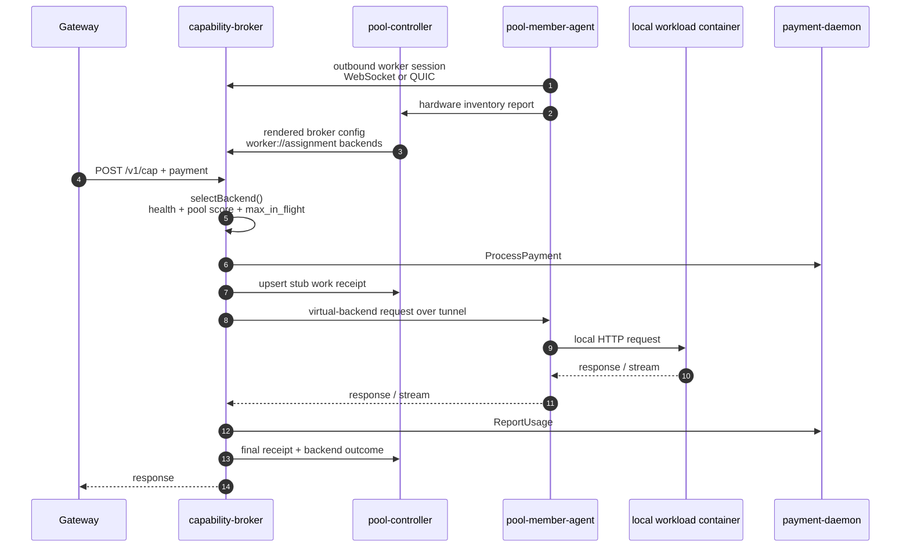

# Pool overlay flows

The pool overlay keeps the external Livepeer shape simple: gateways still see
one orch identity, one coordinator-published manifest, and one broker endpoint.
Internally, the Pool is now a connected-worker system. Pool members do not run a
broker or `payment-daemon`; they run a generated bundle containing
`pool-member-agent` plus operator-selected workload containers.

The replacement design and rollout plan lives in
[`../exec-plans/active/0040-pool-template-connected-worker-reset.md`](../exec-plans/active/0040-pool-template-connected-worker-reset.md).

## 1. Member signup and activation

Member signup is wallet-first and outbound-only:

1. The member requests a nonce from `POST /member/v1/auth/nonce`.
2. The member signs the nonce with EIP-191 `personal_sign` and verifies it with
   `POST /member/v1/auth/verify`.
3. The member creates a host enrollment with `POST /member/v1/enrollments`.
4. The controller returns a downloadable bundle from
   `GET /member/v1/enrollments/{id}/bundle`.
5. The member runs `docker compose up`; no DNS, TLS, broker, or
   `payment-daemon` setup is required on the member host.
6. `pool-member-agent` reports GPU inventory to
   `POST /member/v1/enrollments/{id}/hardware`.
7. The operator assigns templates to hardware units, runs certification via the
   broker tunnel, and promotes passing assignments to probationary/active.

GPU UUID uniqueness is enforced per ETH address boundary in the controller:
the same self-reported NVIDIA GPU UUID cannot be enrolled under multiple ETH
addresses without operator intervention. This is a deterrent and audit signal,
not a hardware-attestation guarantee.

## 2. Connected-worker routing

The broker remains the paid Livepeer edge. Pool workers connect outbound to the
broker and expose assigned local services through a virtual backend URL:
`worker://{template_assignment_id}`.

QUIC is the preferred worker tunnel because it gives independent streams,
per-stream flow control, cancellation, and avoids TCP head-of-line blocking.
The WebSocket transport remains as an egress-friendly fallback. HTTP
request/response, HTTP streaming, and HTTP multipart workloads use the same
virtual backend path. WebRTC media-plane workloads are a separate carve-out:
UDP/SRTP cannot be solved by the TCP/QUIC byte-stream tunnel alone and needs
ICE/TURN decisions before pool worker support.

Capacity is operator-controlled. Template defaults and assignment overrides
render to broker backend fields such as `max_in_flight`; the broker enforces
that cap before dispatch and holds it through long-lived remote-runner sessions.

## 3. Certification and scoring

Certification traffic routes through the broker's virtual-backend dial path,
because the controller cannot directly reach outbound-only worker services.
Basic health and smoke checks must pass before an assignment becomes
probationary. Passing certification starts with small-cap real work; real job
outcomes then drive the selection score.

Poor performers are throttled by scoring and can be excluded from selection.
No single member should dominate pool work as adoption grows; share caps,
assignment capacity, warmup, cooldowns, and score-weighted selection are the
control surfaces.

## 4. Settlement and payouts

Receipts are still idempotent and deterministic. The broker emits a stub receipt
before dispatch and a final receipt after usage is known. Final receipts include
member, host enrollment, hardware unit, GPU UUID, template assignment metadata,
accepted work units, and attributed revenue.

Payouts are based on attributed revenue from accepted final receipts, not raw
unit share. At window close, the controller reconciles receipt-attributed
revenue against `payment-daemon` confirmed revenue; confirmed revenue bounds the
distributable pot so the Pool cannot pay more than it actually earned.

Settlement remains round-aware:

1. The reconciler keeps closing individual Livepeer rounds as intermediate
   artifacts.
2. A payout window aggregates 14 Livepeer rounds.
3. `POST /admin/v1/settlement-windows/close` creates an auditable pending
   settlement window and payout batch.
4. The operator approves the batch with
   `POST /admin/v1/payout-batches/{id}/approve`.
5. Approval materializes executor-facing payout intents.
6. `pool-payout-executor` submits and confirms native ETH payouts using the
   existing intent lifecycle.

Approved payout batches are financially immutable: amount or recipient changes
must be represented as later adjustment rows. Technical retries of the same
amount and destination remain part of the payout intent/executor lifecycle.

## 5. Operator surfaces

The pool console exposes connected members, host enrollments, GPU inventory,
template catalog, template assignments, certification runs, settlement windows,
and payout batches. Member-facing signup and dashboard endpoints are under
`/member/v1/*`; operator APIs are under `/admin/v1/*`.

Code anchors:

- Member signup: `pool-controller/internal/server/member/`
- Enrollment and bundle generation:
  `pool-controller/internal/service/memberenrollment/`
- Connected pool persistence: `pool-controller/internal/repo/connected_pool.go`
- Broker config render: `pool-controller/internal/service/brokerrender/`
- Worker tunnel: `capability-broker/internal/workerconn/`
- QUIC listener: `capability-broker/internal/server/worker_quic.go`
- Host agent: `pool-member-agent/`
- Certification: `pool-controller/internal/service/certification/`
- Settlement: `pool-controller/internal/service/settlement/`
