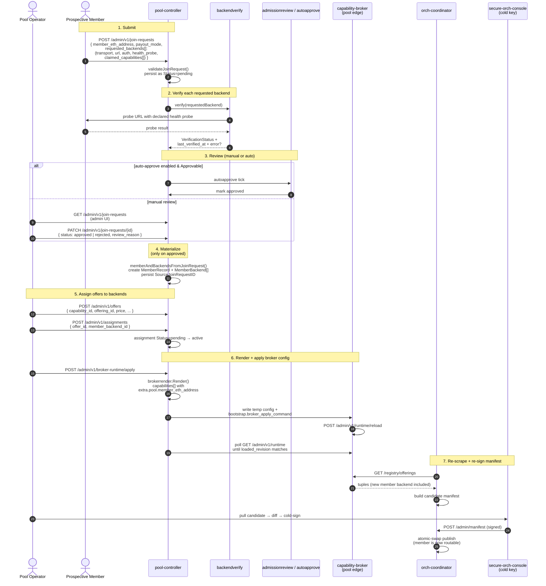
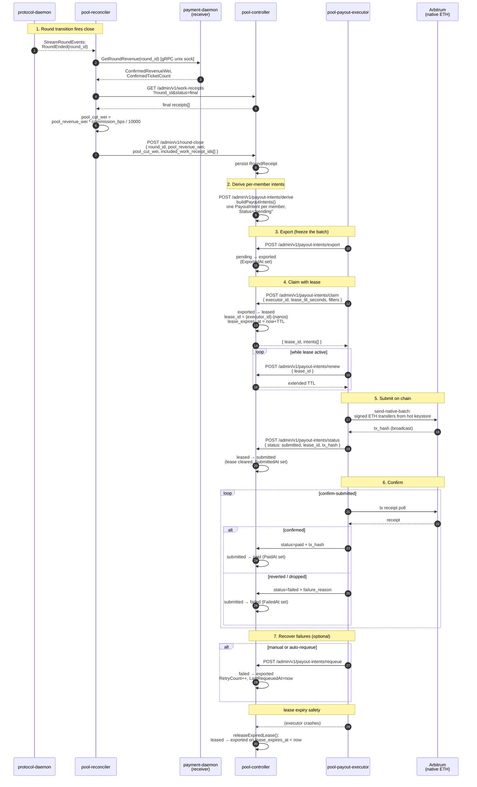
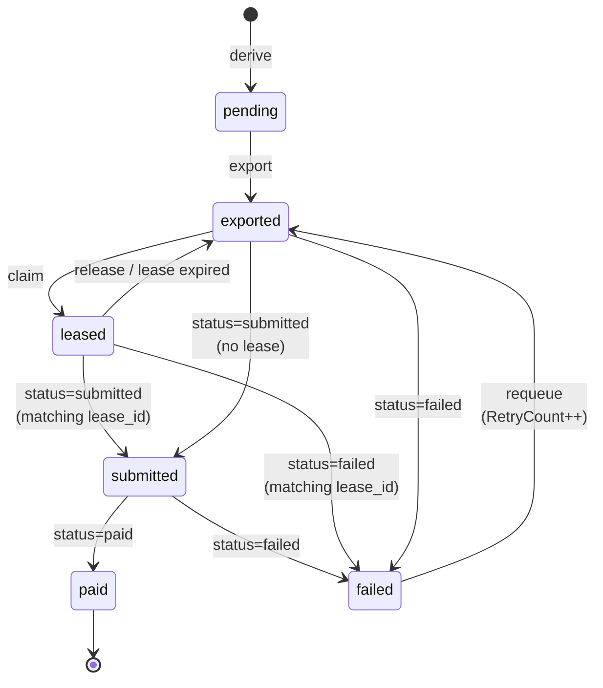
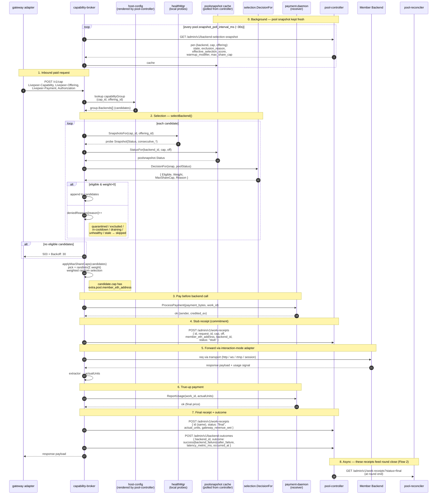
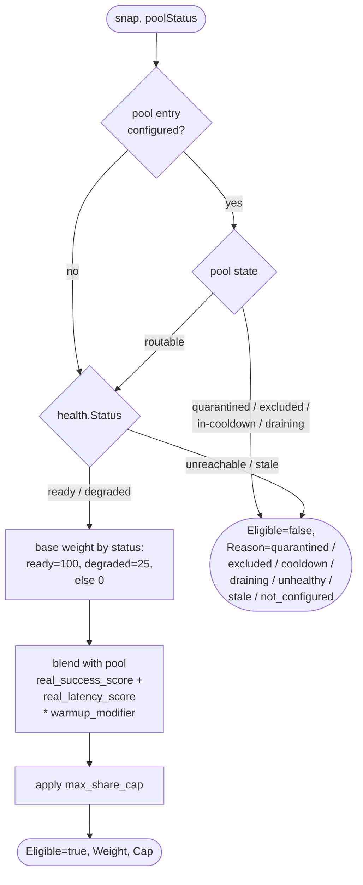

# Pool overlay flows

The pool overlay leaves the base architecture
([`architecture-overview.md`](./architecture-overview.md)) untouched from the
outside: gateways still see one orch identity, one coordinator-published
manifest, and one broker endpoint. This doc collects the three pool-specific
flows that span more than one component — member signup, the payout cycle, and
work routing / worker selection.

For the static picture of which services run and how they wire together, see
[`infra/scenarios/pool-orchestrator/`](../../infra/scenarios/pool-orchestrator/).
For per-component internals, see each component's own `docs/`.

## 1. Pool member signup

Prospective member submits a join request → optional backend verification →
operator (or auto-policy) approves → pool-controller materializes member +
member backends → operator assigns offers to backends → broker config is
re-rendered and applied → orch-coordinator re-scrapes and the signed manifest
is republished. Only after the sign cycle is the new member backend reachable
through the orch's published serviceURI.



JoinRequest status set: `pending`, `approved`, `rejected`, `withdrawn`
(`pool-controller/internal/types/join_requests.go`).

Code anchors:
- Validation + materialization: `pool-controller/cmd/livepeer-pool-controller/main.go:1993` (`validateJoinRequest`) and `:2021` (`memberAndBackendsFromJoinRequest`)
- Auto-approve worker: `pool-controller/internal/service/autoapprove/`, wired at `cmd/.../main.go:1813`
- Admission review + backend verification: `pool-controller/internal/service/{admissionreview,backendverify}/`
- Broker render: `pool-controller/internal/service/brokerrender/render.go` (pool extras at `:96-110`)
- Broker apply protocol: `pool-controller/README.md:190-226`

## 2. Payout cycle

`protocol-daemon` round event → `pool-reconciler` assembles revenue (from
`payment-daemon`) and final receipts (from `pool-controller`) → submits
round-close → `pool-controller` derives per-member payout intents →
`pool-payout-executor` claims with a lease, submits native ETH on Arbitrum,
and writes back `submitted` / `paid` / `failed`.



PayoutIntent status set (`pool-controller/cmd/livepeer-pool-controller/main.go:3456` `applyPayoutIntentStatus`):



Code anchors:
- Round event stream: `pool-reconciler/internal/protocoldaemon/client.go:79-107`
- Revenue fetch: `pool-reconciler/internal/paymentdaemon/client.go:44-63`
- Payout intent endpoints: `pool-controller/cmd/livepeer-pool-controller/main.go:1292-1627`
- Status transitions: `:3456-3540` (`applyPayoutIntentStatus`, `requeuePayoutIntent`, `releaseExpiredLease`)
- Executor commands: `pool-payout-executor/` (`list-intents`, `send-native-batch`, `confirm-submitted`, `reconcile-loop`)

> Pool v1 ships native ETH on Arbitrum only; multi-asset payout is future
> work. See [`pool-node-production-readiness.md`](./pool-node-production-readiness.md).

## 3. Work routing & worker selection

Single inbound request from gateway → broker picks one pool member backend
using local probe health blended with a polled pool snapshot → records a stub
receipt → forwards via the interaction-mode adapter → records the final
receipt and a backend-outcome data point for future scoring.



Selection decision shape (`capability-broker/internal/selection/decision.go`):



Code anchors:
- Dispatch entry: `capability-broker/internal/server/dispatch.go`
- Selection: `capability-broker/internal/server/capability_group.go:82-160` (`selectBackend`)
- Decision blend: `capability-broker/internal/selection/decision.go`
- Pool snapshot cache: `capability-broker/internal/poolsnapshot/cache.go`
- Backend overrides (operator escapes): `pool-controller` `/admin/v1/backend-overrides/{quarantine,drain,warmup,max-share-cap}`

## How the three flows hand off

```
[Signup] ──provisions──► broker host-config (per-cap backends w/ member_eth)
                              │
                              ▼
                    [Work Routing] ──emits──► work receipts (stub→final)
                                              backend outcomes
                                                    │
                                                    ▼
                                              [Payout] ── round close →
                                              per-member intents → ETH
```

Signup feeds the routing config. Routing emits the data structures payout
consumes. Payout state never feeds back into routing — operator overrides on
`pool-controller` are the only path that re-shapes selection.
