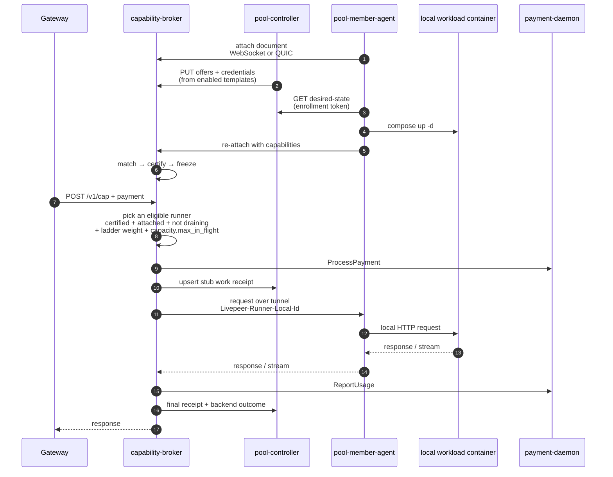

# Pool overlay flows

The pool overlay keeps the external Livepeer shape simple: gateways still see
one orch identity, one coordinator-published manifest, and one broker endpoint.
Internally, the Pool is a connected-worker system. Pool members do not run a
broker or `payment-daemon`; they run a bundle that contains **only**
`pool-member-agent`, and the agent starts whatever workload containers the Pool
has placed on that host.

Three plans stack to make the current design:

- [`0040`](../exec-plans/active/0040-pool-template-connected-worker-reset.md) —
  the connected-worker reset. Superseded for §3–§10 by the two below; its GPU
  uniqueness rule (§4.2), stacking stances (§4.4), and settlement (§11) stand.
- [`0043`](../exec-plans/active/0043-connected-runners-and-offer-manifest.md) —
  runners declare themselves at attach; the controller stopped rendering the
  broker's config file and pushes offers over the broker admin API instead.
- [`0044`](../exec-plans/active/0044-zero-touch-pool-onboarding.md) — the
  onboarding path is zero-touch. Workload templates became files, placement
  became policy, the agent pulls its own desired state, and the trust ladder
  advances on its own.

The organising idea of 0044 is worth stating on its own, because most of what
follows is a consequence of it: **an operator sets policy once and then acts
only on exceptions.** Every gesture that used to sit on the member's path —
approving a join, assigning a template, starting a certification run, handing
out a new bundle after a reassignment — was either deleted or automated. What
is left for an operator is the set of decisions a machine should not make:
lifting a suspension, overriding a duplicate GPU claim, banning a member, and
(until payouts graduate, §5) approving money leaving the pool.

> **Status caveat.** The five templates in the repo-root `templates/` catalog
> deliberately carry no `runner_compose` block: the v1 runner images and model
> ids are still open (`lnm-v12`). Everything below the placement decision is
> built and tested, but a pool running today's catalog renders a compose
> service with no `image`, so **no runner actually starts from the shipped
> catalog yet.** A pool that wants a working end-to-end path must add
> `runner_compose.image` to a template of its own.

## 1. Member signup and activation

Member signup is wallet-first and outbound-only. There is no join request and
no admission review: the pool never dials a member-supplied endpoint, so there
is nothing to verify before admission. Trust is established afterwards, by the
broker, from what the member's runners prove under certification.

1. The member requests a nonce from `POST /member/v1/auth/nonce`.
2. The member signs the nonce with EIP-191 `personal_sign` and verifies it with
   `POST /member/v1/auth/verify`.
3. The member creates a host enrollment with `POST /member/v1/enrollments`.
4. The controller returns a downloadable bundle from
   `GET /member/v1/enrollments/{id}/bundle`. The bundle is a *bootstrap*, not a
   deployment: agent image, `.env`, enrollment token, and a `docker-compose.yaml`
   that includes `runners.compose.yaml` if it exists. It ships no workload
   service, so it cannot go stale when the pool places something new.
5. The member runs `docker compose up -d`; no DNS, TLS, broker, or
   `payment-daemon` setup is required on the member host.
6. `pool-member-agent` attaches outbound to the broker and sends its
   attach document — GPU inventory and what each local runner is
   ([`runner-attach.md`](../../livepeer-network-protocol/protocols/runner-attach.md)).
   The first attach is hardware-only: the host has nothing to serve yet.
7. The controller matches those GPUs to enabled templates by policy (§2), and
   the agent pulls the resulting desired state and starts the runners.
8. The host re-attaches, now declaring capabilities. The broker matches each
   runner to the pool's offers, runs the certification steps the offer carries,
   and the first pass freezes the runner-declared shape into that offer.
9. A passing *placement* — one template on one GPU — enters the ladder and
   climbs it without an operator (§4).

GPU UUID uniqueness is enforced per ETH address boundary in the controller:
the same self-reported NVIDIA GPU UUID cannot be enrolled under multiple ETH
addresses without operator intervention. This is a deterrent and audit signal,
not a hardware-attestation guarantee.

## 2. Templates, placement, and desired state

### 2.1 A template is the pool's offer

The workload catalog is a directory of YAML files at repo root `templates/`,
loaded at boot by `pool-controller` (`config.template_catalog_dir`). One file
is one workload: its capability and offering id, its price default, its
capacity, the certification steps the broker will run, the GPU classes it may
run on, its priority and stacking stance, its ladder economics, and — when the
image exists — the compose fragment that starts it.

The catalog is in files rather than the database because a template is a
*decision*, and the way a pool records a decision is a diff that goes through
review. The only per-pool state the controller stores is
`template_overrides[id] = {enabled, price, extra}`.

Nothing stores an offer. An offer is **derived**: every enabled template with a
price becomes an `offers[]` entry, and the full set is pushed to every broker
in the fleet (`bootstrap.brokers`), idempotently, as a full replacement. The
separate offer catalog that used to exist alongside templates is gone — one
object now carries both the thing sold and the policy for placing it.

### 2.2 Placement is policy over declared facts

`pool-controller/internal/placement` decides which template runs on which GPU.
Its inputs are all facts the pool already holds — the hardware the agent
declared at attach, the templates this pool enabled, and what members opted out
of — so no operator gesture appears anywhere in the decision.

- A GPU's driver marketing string normalises to a **pool class**
  (`rtx-4090`, `a100`, …). Laptop and Max-Q parts get no class rather than the
  wrong one: an "RTX 4090 Laptop GPU" shares a name with the desktop part and
  about a third of its memory.
- Among templates whose `requirements` the GPU satisfies and the member has not
  opted out of, the **highest `priority` claims the primary slot**.
- A second template stacks on the same card only where that template names this
  GPU's class in `stacking.secondary_on` *and* the class's stance allows a
  rider (0040 §4.4).
- Members may opt **out** of a template, never in. Opting in would be a member
  choosing what the pool sells.

Every decision carries a reason code, so "why is that card idle" has a real
answer — not eligible, opted out, lost the primary slot, template not enabled —
and the same sentence reaches the operator console and the member's portal.

`GET /admin/v1/placement-plan` shows what the policy would do;
`POST /admin/v1/placement-plan/apply` commits it. A template that should stop
running is **drained**, not deleted: the record stays while the container
finishes its work.

### 2.3 The agent pulls its desired state

`GET /member/v1/enrollments/{id}/desired-state` (enrollment-token auth, ETag)
returns `{revision, services[]}`. Each service carries a compose fragment with
the GPU pinned by **UUID** — not `gpus: all`, because two workloads on a
two-card host must not both claim both devices — plus the models that must be
on disk, the capability and identity this runner must declare at attach, and a
`draining` flag.

The agent's half is mechanical and holds no policy: fetch, write one
`runners.compose.yaml`, pull, `docker compose up -d --remove-orphans`, report
`{revision, services[]{name, status, detail}}`. A controller that is
unreachable leaves the host running exactly what it was running — the last
desired state is still the pool's most recent instruction, and tearing
containers down over a control-plane outage would turn it into a data-plane
one.

Withdrawal is sequenced by the agent, and the order matters. The service is
marked `draining` in the **attach document first**, so the broker stops
dispatching to it while it is still able to serve; only then does the container
stop. `runner-attach` 1.1.0-draft added that flag (§7.1): draining is live
state, not shape, so it is excluded from the frozen projection and setting or
clearing it never re-triggers certification or flickers the manifest. The agent
also wakes a live attach session on change rather than waiting for the next
refresh tick, because the width of that tick is exactly the window in which the
broker would keep sending work to a runner the pool has already withdrawn.

The agent additionally rotates its own enrollment credential on a cadence well
inside the token's lifetime (default 24h). A host that waits for expiry has
already stopped earning by the time anyone can act on it.

## 3. Connected-worker routing

The broker remains the paid Livepeer edge. Pool workers connect outbound to
the broker, declare their local runners in the attach document, and receive
dispatched work back down that same connection — routed by
`Livepeer-Runner-Local-Id`, never by a URL the controller rendered.



QUIC is the preferred worker tunnel because it gives independent streams,
per-stream flow control, cancellation, and avoids TCP head-of-line blocking.
The WebSocket transport remains as an egress-friendly fallback. HTTP
request/response, HTTP streaming, and HTTP multipart workloads use the same
virtual backend path. WebRTC media-plane workloads are a separate carve-out:
UDP/SRTP cannot be solved by the TCP/QUIC byte-stream tunnel alone and needs
ICE/TURN decisions before pool worker support.

Capacity is operator-controlled and stays that way: it rides the offer
derived from the template (`capacity.max_in_flight`), never anything the
runner declares. The broker enforces the cap before dispatch and holds
it through long-lived remote-runner sessions. A runner declaring its own
capacity is deliberately out of scope — it would let a member set what
the pool sells.

## 4. Certification and the trust ladder

Certification runs IN the broker, over the runner's own attach
connection — the controller cannot reach an outbound-only member at all.
The steps are authored as data on the template, pushed to the broker as part of
the offer, and read back as results
([`certification-steps.md`](../../livepeer-network-protocol/protocols/certification-steps.md)).
Because they are data, adding a workload means adding a template file, not
cutting a controller release. Certification traffic is never paid, settled, or
receipted. A first pass is also what freezes the offer's shape, so an offer
with no certified runner is never advertised.

Passing certification is where the ladder begins, not where trust ends. A
runner that has passed a smoke test has proved it *can* serve the workload
once; the ladder is what turns that into "the pool routes meaningful money
through it", and it runs on a timer inside the controller
(`pool-controller/internal/ladder`, default every 60s):

```
certified ─▶ probationary ─(closed settlement round ∧ ≥N jobs, no serious failure)─▶ active
active ─(score below floor)─▶ throttled ─(recovers)─▶ active
any ─(K consecutive failures)─▶ recertify
any ─(serious failure)─▶ suspended ─(operator lifts)─▶ probationary
```

Promotion deliberately requires **both** halves. A job count alone can be
accumulated in minutes by a host that is about to fail; a closed round alone
proves only that time passed. Requiring both means promotion is evidence the
pool actually billed for. The defaults come from 0040 §8.3 — roughly two
percent of an offering's traffic at concurrency one, and twenty accepted jobs —
and a pool tunes them under `ladder:` in its config.

Every transition writes `{state, reason_code, evidence, at}`. The reason codes
are a closed set (`probation_started`, `promoted_to_active`,
`throttled_score_below_floor`, `recovered_to_active`,
`recertify_consecutive_failures`, `suspended_repeated_certification_failure`),
which is what lets an operator reading an audit trail and a member reading
their own status page see the same sentence. Resulting weights and caps reach
the broker through the selection snapshot it already polls, so the ladder needs
no new broker-facing channel.

An exploration allowance (`exploration_ppm`) deliberately spends traffic on
runners the pool is less sure of, so scoring cannot starve a recovering runner
of the very traffic it needs to recover.

Share caps, per-placement capacity (`max_in_flight` / `queue_limit`), warmup,
cooldowns, and score-weighted selection remain the control surfaces that stop
any one member dominating pool work as adoption grows.

## 5. Settlement and payouts

Receipts are still idempotent and deterministic. The broker emits a stub receipt
before dispatch and a final receipt after usage is known. Final receipts include
member, host enrollment, hardware unit, GPU UUID, placement metadata,
accepted work units, and attributed revenue.

Payouts are based on attributed revenue from accepted final receipts, not raw
unit share. At window close, the controller reconciles receipt-attributed
revenue against `payment-daemon` confirmed revenue; confirmed revenue bounds the
distributable pot so the Pool cannot pay more than it actually earned.

Settlement remains round-aware:

1. The reconciler keeps closing individual Livepeer rounds as intermediate
   artifacts.
2. A payout window aggregates 14 Livepeer rounds.
3. `POST /admin/v1/settlement-windows/close` creates an auditable pending
   settlement window and payout batch.
4. The batch is approved — by a person via
   `POST /admin/v1/payout-batches/{id}/approve`, or by policy (below).
5. Approval materializes executor-facing payout intents.
6. `pool-payout-executor` submits and confirms native ETH payouts using the
   existing intent lifecycle.

Approved payout batches are financially immutable: amount or recipient changes
must be represented as later adjustment rows. Technical retries of the same
amount and destination remain part of the payout intent/executor lifecycle.

**Closing on a schedule, and holding when it should not.**
`settlement.EvaluateClose` decides whether a window may close on its own, and
holds it when the scale is short (`scale < 1 − tolerance`) or attribution
anomalies exist. A short scale means the pool would be paying out more than it
took in, which is exactly the case a machine must not wave through.

**`payout-policy.json`** (`pool-controller/internal/payoutpolicy`) is how a pool
earns the right to skip the human. It mirrors `sign-policy.json` on purpose:
strict, fail-closed, hashed into the audit record, with a `pause` file as a kill
switch. A missing file is not an error — it simply means no automatic approval,
which is the state every pool starts in.

- `shadow: true` records what the policy *would* have approved without
  approving anything.
- `auto_approve` bounds a single mistake: `max_batch_wei`,
  `max_per_member_wei`, `require_scale_gte`, `max_batches_per_day`.
- Every decision carries the hash of the exact policy that made it, so an audit
  can prove which rules were in force at the time.

The four-phase graduation plan from shadow mode to automatic payouts — with the
exit criterion and kill switch for each phase — is written up in
[`pool-controller/RUNBOOK.md`](../../pool-controller/RUNBOOK.md) under
"Graduating to automatic payouts". It is not repeated here.

*Not yet wired:* `EvaluateClose` and the payout policy are implemented and
tested, but no background loop calls the automatic closer — closing a window is
still the `POST /admin/v1/settlement-windows/close` gesture.

## 6. Operator and member surfaces

The two audiences are separated **by listener address, not by an auth check**.
`listen.member` is the public surface: the member portal and `/member/v1/*`,
and nothing else. `listen.paid` carries the operator console, `/admin/*` and
the read-only `/public/v1/*` shop window. Leaving `listen.member` empty keeps
both on one address, which is the supported single-address deployment.

The reason for the split is narrow and worth keeping: an operator console
reachable from the same address members use is one misconfigured proxy away
from being reachable *by* them. An address boundary survives a proxy mistake
that an `if isAdmin` check does not.

The member API gives a member everything about their own participation and
nothing about anyone else's:

| Route | What it is for |
|---|---|
| `GET /member/v1/enrollments/{id}/status` | Hosts, GPUs, placements, ladder state **with reason code and evidence** |
| `GET /member/v1/enrollments/{id}/earnings` | This member's own amounts and payout history |
| `GET /member/v1/enrollments/{id}/desired-state` | What the agent should be running here |
| `POST /member/v1/enrollments/{id}/status` | The agent's report of what it achieved |
| `GET`/`POST`/`DELETE .../opt-outs` | Per-template opt-out |
| `POST /member/v1/enrollments/{id}/rotate` | New enrollment credential (the agent calls this itself) |
| `POST /member/v1/enrollments/{id}/retire` | Retire a host: placements drain first |

Privacy is the rule that shapes the whole contract. Earnings are reported as
this member's own amounts and never as a share of a pool total — a share plus a
public total is another member's income by subtraction.

Operator surfaces: the console pages (`/admin`, `/admin/pool`, `/admin/offers`,
`/admin/audit`) plus `/admin/v1/*` for templates and overrides
(`GET /admin/v1/template-catalog`, `PUT`/`DELETE /admin/v1/template-overrides/{id}`),
the placement plan, the ladder (`POST /admin/v1/ladder/run`), the exception
queue (`GET /admin/v1/exceptions`), settlement, payouts and the payout policy,
and the audit log (`GET /admin/v1/audit-events`).

*In flight:* the member portal's HTML/CSS/JS exist in
`pool-controller/internal/ui/web/`, but the routes that serve those pages and
their assets have not landed (`lnm-6at.12`); the console rebuild is
`lnm-6at.16`. The member **API** above is complete and tested.

Code anchors:

- Workload catalog (files → templates): repo-root `templates/`,
  `pool-controller/internal/templates/`
- Placement policy: `pool-controller/internal/placement/`
- Desired state (render): `pool-controller/internal/desiredstate/`
- Desired state (apply): `pool-member-agent/internal/desiredstate/`,
  `pool-member-agent/cmd/pool-member-agent/desiredloop.go`
- Trust ladder: `pool-controller/internal/ladder/`
- Payout policy: `pool-controller/internal/payoutpolicy/`
- Automatic window close: `pool-controller/internal/service/settlement/autoclose.go`
- Member API + portal listener: `pool-controller/internal/server/member/`
- Operator console + admin API: `pool-controller/internal/server/admin/`
- Enrollment and bundle generation:
  `pool-controller/internal/service/memberenrollment/`
- Offer + credential push: `pool-controller/internal/service/brokerpush/`
- Runner attach: `capability-broker/internal/runnerattach/`, `internal/runners/`
- Offer engine (match/freeze/eligibility): `capability-broker/internal/offers/`
- Worker tunnel: `capability-broker/internal/workerconn/`
- QUIC listener: `capability-broker/internal/server/worker_quic.go`
- Certification engine: `capability-broker/internal/certification/`
- Settlement: `pool-controller/internal/service/settlement/`
