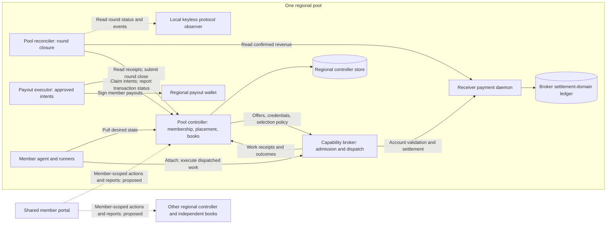
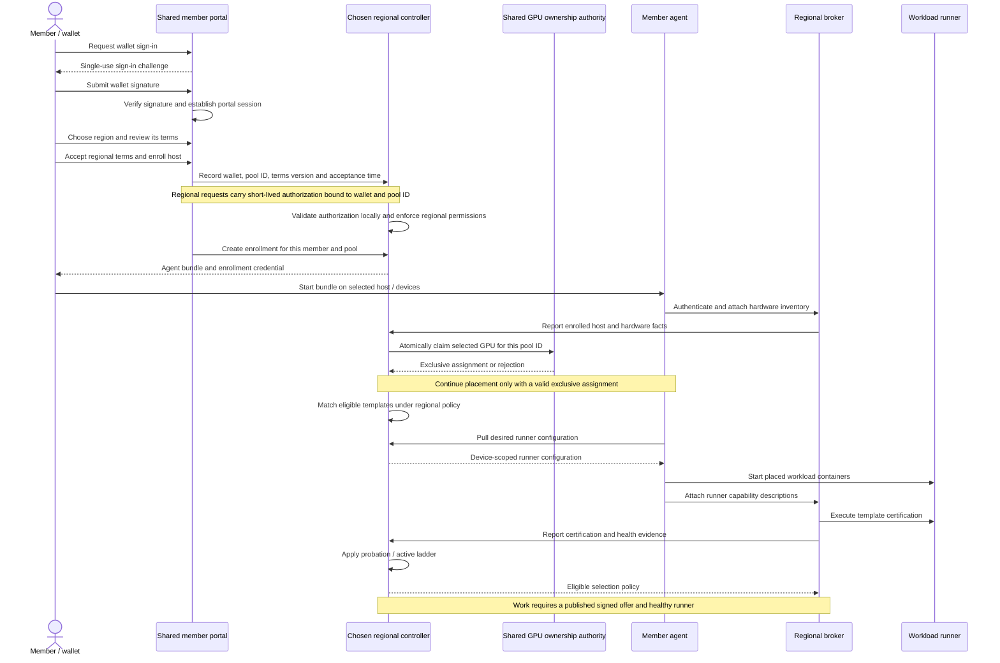
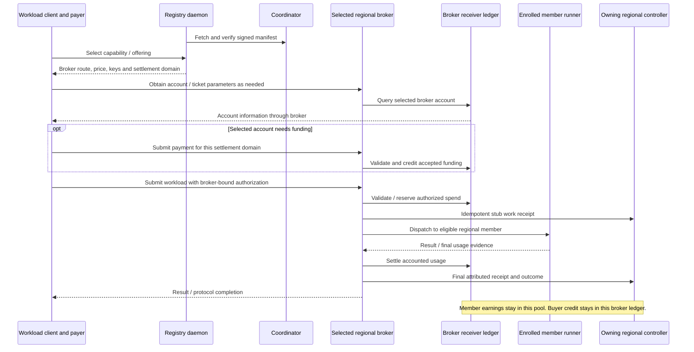
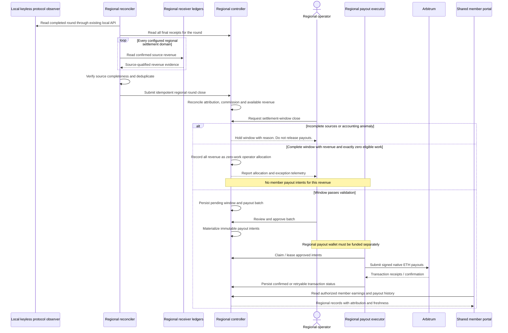
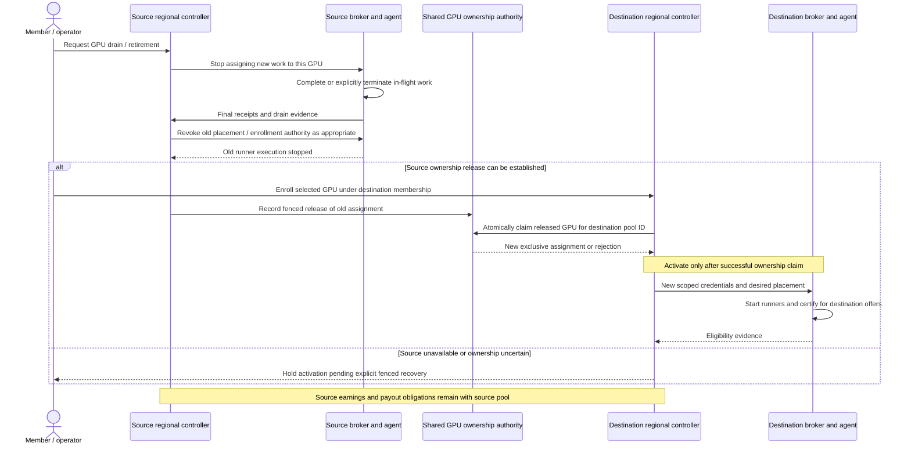

# Independent regional pools under Pool Orchestrator

Status: accepted design scope, 2026-09-16. Decisions below are locked; detailed
API, storage and deployment choices remain implementation work. Work and dependencies live in
beads epic `lnm-l17`; design decisions are tracked in `lnm-l17.1`. This document
does not claim that regional federation is implemented or deployed.

## Accepted starting point

Pool Orchestrator presents one brand and member portal over independent US Central and
EU Central pools. Each pool owns its memberships, policies, accounting, payout
obligations and payout execution. The same wallet can join both. Aggregate
earnings are reporting; they do not create a shared balance or transfer a debt
between regions.

One physical GPU has one active regional owner at a time. A host with multiple
GPUs may divide devices between regions if agents, runner projects and device
access are isolated. Moving a GPU requires draining old work and revoking old
placement authority before enabling its destination. Earned balances and payout
history remain with the original pool.

Decision 6 (locked): a shared, durable GPU ownership record assigns each GPU
exclusively to one `pool_id`. Claims must be atomic so concurrent regional
enrollments cannot both succeed. Regional controllers consult this authority
for enrollment and migration; normal execution on already assigned devices
does not require a request to it for each workload. An ownership-service outage
blocks new assignments and transfers while existing assignments continue.

Transfer requires draining work and revoking old assignment authority before
activating the destination. An unavailable source requires explicit fenced
recovery: a timeout alone cannot authorize takeover. Restored controllers and
agents must not revive obsolete assignments. This coordinates managed device
assignments, not regional books, and does not authenticate physical hardware
identity. Placement of the ownership service, record schema, assignment fencing
and recovery mechanics remain implementation details to specify. The accepted
mechanism is not yet implemented.

Capabilities retain their existing identifiers. Regions can enable different
templates, models, prices and membership terms. Pool affiliation alone does not
prove physical execution location; a geographical promise needs a separate
admission and verification policy.

## Initial broker assignment (locked)

Decision 1: EU owns transcoding. US owns transcoding, audio transcription /
text-to-speech, and LLM chat completion. All four brokers are in the first
release. Each broker retains its own receiver ledger and settlement domain.
Regional management placement below remains the proposed deployment layout.

| Host | Role |
|---|---|
| secure-orch | Existing secure orchestrator, protocol daemon and coordinator; shared orchestrator/payee identity and manifest publication |
| eu-transcode-broker | EU controller, reconciler, keyless protocol observer and payout executor; EU broker, receiver ledger and enrolled transcode runner |
| us-transcode-broker | US controller, reconciler, keyless protocol observer and payout executor; US broker, receiver ledger and enrolled transcode runner |
| audio-broker | US-owned broker, independent receiver ledger and audio transcription / text-to-speech runners |
| llm-broker | US-owned broker, independent receiver ledger and chat-completion runner |
| member-portal | Shared member UI and reporting; physical deployment location remains undecided |

Each region has separate databases, credentials and backups. Decision 4
(locked): each regional pool has a dedicated payout wallet and executor.
EU member payouts use the EU wallet; US member payouts use the US wallet.
Funding balances, transaction nonces and payout execution records are separate.
The shared orchestrator/payee address is unchanged. Two independent regional
executors must not share a payout wallet: current nonce coordination and durable
transaction recovery are local to each executor.

Initial funding remains operator-managed. Both wallets may receive funds from
one operator treasury, but insufficient funds hold the affected region's
payouts without automatically drawing from another region. Automatic treasury
transfers are outside the starting scope. Wallet provisioning, key storage and
rotation procedures remain deployment details to specify.

Shared orchestrator identity, chain access, coordinator publication and any
shared funding source remain common dependencies. Independence of pool books
does not imply independence from those services.

The portal's deployment host is undecided. It must not become necessary for
already-enrolled runners, round closure or payout execution. Each broker has
one owning controller for pool policy, credentials and receipts. Coordinator
publication must preserve those owners' offers without becoming a competing
writer of pool policy.

## Regional round observation (locked)

Decision 7: add a keyless, read-only mode to `protocol-daemon`, running locally
alongside each regional reconciler. It observes public chain data through chain
RPC and serves the existing round-status and round-event APIs over a local Unix
socket. The reconciler continues consuming those APIs rather than implementing
its own chain reader. The exact CLI mode spelling remains an implementation
detail. This mode is not yet implemented; work is tracked in `lnm-l17.7`.

Read-only startup requires no signing keystore, password or funded signer
wallet. It must not initialize signing dependencies, resume transaction intents,
run write automation or permit mutation RPCs. Round initialization, orchestrator
rewards and other orchestrator transactions remain on the signing protocol daemon
on `secure-orch`. The orchestrator private key never moves to regional hosts.
Regional payout and receiver services retain their separate purpose-specific
keys; keyless observation does not make those services keyless.

Regional reconciliation needs no inbound connection to `secure-orch` for round
information. The coordinator still polls brokers and serves the signed public
manifest. There is no required direct coordinator-to-pool-controller connection.
Cross-host revenue collection remains necessary within the US pool, with its
transport and permission details still to be finalized independently of round
observation. A VPN is not a prerequisite for the observer mode.

## Network topology

Decision 10 (locked): cross-host service APIs use HTTPS with server identity
verification and separate, rotatable service credentials. Permissions are
limited to the caller's role and owning pool. Revenue reporting is read-only;
the US reconciler may read its three configured sources but cannot mutate buyer
accounts, sign payments or administer brokers with that credential. Receiver
mutation and signing sockets remain local. Existing authenticated broker work
submission continues to invoke local payment operations through its normal
protocol; this rule does not disable that flow.

A VPN is optional, not a deployment requirement. In the diagrams, private
service access means operator-only access, not a mandated private-address
network. Deployments may use private networking or protected public HTTPS
endpoints with appropriate ingress and firewall controls. Network placement
does not replace application authentication or authorization. Exact credential
format, issuance/rotation and API placement remain implementation details.
Current broad bearer-token access must not be mistaken for already implemented
role-scoped permissions.

Host names below describe roles, not real machines or DNS records. EU and US
are example regions. Colocating regional management with a broker is a starting
layout, not a requirement. The US pool includes three separate broker hosts;
its controller owns their pool policy and its reconciler collects their revenue.

Solid arrows show the intended connectivity using existing component surfaces.
Dashed arrows are unimplemented portal, GPU ownership, revenue or timing interfaces whose
contracts still need design. Arrows indicate request direction, not all return
traffic. This is a deployment proposal, not evidence of a running installation.

```mermaid
flowchart TB
    Member["Member browser / wallet"]
    Client["Workload client / registry daemon"]
    Agent["Member host: agent and runners"]
    Portal["member-portal: shared UI and reporting"]
    Chain["Arbitrum RPC"]
    Ownership["Shared durable GPU ownership authority"]
    subgraph Secure["secure-orch: protected operator host"]
        Coord["Coordinator: public manifest and private admin"]
        Protocol["Protocol daemon: local control socket"]
        Cold["Secure console and cold key"]
    end
    subgraph EU["eu-transcode-broker: EU pool"]
        EC["EU controller"]
        EB["EU broker and receiver ledger"]
        ER["EU reconciler and payout executor"]
        EP["Keyless protocol observer: not yet implemented"]
    end
    subgraph US["US pool: three broker hosts"]
        UC["US controller on us-transcode-broker"]
        UB["us-transcode-broker and receiver ledger"]
        AB["audio-broker and independent receiver ledger"]
        LB["llm-broker and independent receiver ledger"]
        UR["US reconciler and payout executor"]
        UP["Keyless protocol observer: not yet implemented"]
    end
    UC -->|"Private broker admin"| AB
    UC -->|"Private broker admin"| LB
    AB -->|"Private receipts and snapshot requests"| UC
    LB -->|"Private receipts and snapshot requests"| UC
    UR -.->|"Private read-only revenue: proposed"| AB
    UR -.->|"Private read-only revenue: proposed"| LB
    Coord -->|"Private authenticated broker admin"| AB
    Coord -->|"Private authenticated broker admin"| LB
    Client -->|"HTTPS 443: funded workloads"| AB
    Client -->|"HTTPS 443: funded workloads"| LB
    AB -->|"HTTPS: receiver chain operations"| Chain
    LB -->|"HTTPS: receiver chain operations"| Chain
    EC -.->|"Private atomic GPU claims and transfers"| Ownership
    UC -.->|"Private atomic GPU claims and transfers"| Ownership
    Member -->|"HTTPS 443"| Portal
    Portal -.->|"Scoped member API: proposed"| EC
    Portal -.->|"Scoped member API: proposed"| UC
    Client -->|"HTTPS 443: signed manifest"| Coord
    Client -->|"HTTPS 443: funded workloads"| EB
    Client -->|"HTTPS 443: funded workloads"| UB
    Agent -->|"HTTPS: desired state in chosen region"| EC
    Agent -->|"WSS 443 or QUIC UDP 8443: attach"| EB
    EC -->|"Private broker admin"| EB
    UC -->|"Private broker admin"| UB
    EB -->|"Private receipts and pool snapshot requests"| EC
    UB -->|"Private receipts and pool snapshot requests"| UC
    ER -->|"Local controller API"| EC
    ER -->|"Local revenue query"| EB
    UR -->|"Local controller API"| UC
    UR -->|"Local revenue query"| UB
    ER -.->|"Existing round API over local Unix socket"| EP
    UR -.->|"Existing round API over local Unix socket"| UP
    EP -.->|"HTTPS: chain reads only"| Chain
    UP -.->|"HTTPS: chain reads only"| Chain
    Coord -->|"Private authenticated broker admin"| EB
    Coord -->|"Private authenticated broker admin"| UB
    Cold -->|"Operator-mediated manifest sign cycle"| Coord
    Protocol -->|"HTTPS"| Chain
    EB -->|"HTTPS: receiver chain operations"| Chain
    UB -->|"HTTPS: receiver chain operations"| Chain
    ER -->|"HTTPS: regional payout transactions"| Chain
    UR -->|"HTTPS: regional payout transactions"| Chain
```

The member-host example joins EU; US enrollment uses the equivalent US
endpoints. A colocated transcode runner follows the same agent/broker flow.
Public manifest access reaches only the coordinator's publication listener
through ingress; it does not expose the secure console or protocol control.

| Connection | Proposed exposure and existing stack mapping |
|---|---|
| Browser to portal / regional member API | Public HTTPS 443; regional member listener is container 8084, host 8084 by default |
| Client or agent to broker | Public HTTPS/WSS 443 through ingress to host 8082 / container 8080; optional attach QUIC uses UDP 8443 |
| Registry to coordinator manifest | Public HTTPS 443 through ingress to publication listener 8081; coordinator admin 8080 remains private |
| Controller or coordinator to broker admin | Authenticated private access to broker listener; ingress must exclude admin paths from public routing |
| Broker to controller receipts / snapshots | Authenticated private access to host 8083 / container 8080; distinct from the public member listener |
| Reconciler / executor to local services | Internal controller API and local receiver Unix socket as applicable; executor uses its own payout wallet |
| Regional reconciler to local protocol observer | Existing round API over Unix socket; new keyless read-only mode required, no secure-orch connection |

These host ports are current example-stack defaults, not requirements for the
new topology. Cross-host service connections require explicit ingress/bindings
and firewall rules; localhost defaults are not remotely reachable. External
session runners may additionally need public HTTPS/WSS or RTMPS endpoints, as
specified by their templates. The diagram does not imply that all workload
media passes through a broker. DNS and certificates remain operator-managed.

## Architectural components and ownership

The controller, reconciler and payout executor repeat once per independent
pool. The broker/receiver pair repeats per broker: one in EU and three in US. Shared
reporting can read both pools, but each controller remains authoritative for
its own membership, receipts and payout obligations.

The receiver ledger contains buyer wholesale credit and settlement records.
The controller store contains member earnings and payout obligations. Those are
different accounts, even if amounts ultimately derive from the same work.
Treasury funding of the payout wallet is an explicit operational dependency;
receiver redemption does not automatically transfer funds into that wallet.

## Identity and member experience

Decision 2 (locked): the controller generates an immutable `pool_id` when
initializing a new pool and persists it with the controller database. A pool's
display name, regional label and domains remain configurable; changing them
does not change its identity or detach its membership and payout history.
Restoring the database preserves `pool_id` and requires fencing the old writer.
Initializing a fresh pool creates a new identity; reusing a name or domain does
not make it the old pool.

The pool ID is distinct from the member wallet, enrollment ID and each broker's
settlement-domain ID. Cross-region references must qualify controller-local
identifiers by pool identity. Exact encoding, API propagation and upgrade of
existing controller stores remain implementation details to audit; no new
network protocol field is assumed necessary. The identity decision is accepted,
not yet implemented.

Decision 3 (locked): each pool owns separate, versioned membership terms, even
when regional settings initially match. Terms describe commission, payout
schedule and participation rules. A wallet explicitly joins each pool and
accepts its terms; the acceptance record identifies the wallet, `pool_id`,
terms version and timestamp. The shared portal presents each regional join
action with its applicable terms.

Material changes require acceptance before the member takes new work under the
changed terms. Existing work and earned amounts retain their original terms.
Implementation must preserve the applicable terms version for work and its
resulting obligations, including in-flight work across a terms change. The
exact version representation and admission enforcement remain implementation
details; regional terms and acceptance are not yet implemented.

The signup flow is wallet sign-in, region selection and acceptance of that
region's terms, regional enrollment, then its one-command agent bundle. Joining
the other region creates a separate membership. Existing controller sessions
are local (`pool-controller/internal/server/member/session.go`); a unified
sign-in is additional work, not a shared-cookie configuration change.

Decision 5 (locked): members sign in once with their wallet to the shared portal.
Sign-in proves wallet ownership without automatically joining either pool.
Joining EU, US or both remains explicit, with separate terms acceptance.
Portal requests carry short-lived, member-scoped authorization bound to the
intended `pool_id`. Each controller validates that authorization locally and
remains authoritative for regional membership and permissions; it does not
contact the portal for every request.

The implementation must preserve nonce/CSRF protection and keep admin
credentials out of the browser. Private member earnings require member-scoped
access. Public regional health and available-offering descriptions must not
disclose member data. A portal outage makes portal access unavailable but does
not interrupt enrolled runners, accounting or payouts. Token format, issuer
trust, key rotation, expiry and revocation behavior remain implementation
details to specify. Federated sign-in is accepted, not yet implemented.

Names such as `members.<domain>`, `eu.members.<domain>` and
`us.members.<domain>` are examples, not assigned domains. Separate domains are
optional. Pool identity must survive a domain change.

## Accounting and reporting boundaries

Each regional reconciler closes its own controller's books. Current code reads
one receiver socket, requests up to 500 final receipts, and uses
`round-close-<round>` as the close ID
(`pool-reconciler/cmd/livepeer-pool-reconciler/main.go`,
`prepareRoundCloseRequest`). Identical IDs in separate controller stores are
acceptable; combined reports must qualify them by pool identity.

EU starts with one broker/receiver. US starts with three independent receiver
ledgers, so multi-ledger reconciliation (`lnm-608`) is required for the first
release. Both regions also require complete receipt collection, late settlement, revenue
attribution and treasury funding. Their semantics and failure handling need
validation before enabling automatic payouts. Round information comes from the
new local keyless protocol-daemon mode, with chain observation and recovery
behavior validated before rollout.

The US reconciler must collect all three required sources, deduplicate them
and close one complete US round. Missing-source handling must prevent a
partial revenue total from appearing complete. EU closes its own round using
its own source. UI aggregation never merges the regions' payout obligations.

Decision 8 (locked): close a regional round only when every expected receiver
source has reported. Missing data is unknown, never zero; an explicit report
of zero revenue is valid. Retry missing sources automatically and show the
blocking source and round to the operator. Workload processing and previously
approved payouts can continue, but payouts depending on the incomplete round
wait. The other region reconciles and pays independently.

Broker retirement follows drain → settle → retire. Stop admitting work, finish
or explicitly terminate in-flight work, and collect final receipts. Keep the
receiver and its reporting available for outstanding settlement, redemption and
confirmation processing. Reconcile the broker's contribution before retiring
its accounting source, and preserve its ledger and historical reports.

Persist each source's participation interval, including when it joined and
stopped accepting work. Removing a broker from the active configuration must
not erase earlier reporting obligations. Late confirmations must remain
accounted for; a shutdown-time snapshot alone does not establish finality.
If a host disappears before required data is collected, hold affected closure
until reporting is restored or an explicit audited recovery resolves the gap.
Stopping a whole region likewise preserves accounting and payout services long
enough to discharge outstanding obligations. Exact late-settlement and recovery
mechanics remain to be decided; this lifecycle is accepted, not implemented.

Decision 9, payout model and grouping (locked): use Model B, full realized
revenue sharing, with one member revenue pot per regional pool. US combines
revenue from its transcode, audio and LLM broker sources; EU has its own pot.
Members share their region's distributable revenue according to value-weighted
eligible work. Broker settlement domains remain independent buyer accounts and
reporting sources, not separate member payout pots. Revenue never crosses
regions through aggregation in the portal.

Unlike the current settlement calculation, Model B does not cap total member
distribution at attributed billed-work value. Members participate in both
upside and downside of realized regional revenue after the agreed deductions;
billed work value is a contribution weight, not a guaranteed payout amount.
This requires replacing the current capped scaling behavior in
`pool-controller/internal/service/settlement/service.go`. A difference between
realized revenue and billed-work value is not, by itself, proof of an accounting
error under this model. Source completeness and receipt integrity still apply.

Decision 9, accounting window (locked): each regional pool has a configurable
accounting window, initially 14 Livepeer rounds. Track work and revenue per
round, then calculate member shares across the whole window. Close only after
the window ends and all required source reports are complete, and create a
payout batch for approval. Regions close independently. This fixes the
accounting interval, not the policy for attributing delayed redemptions, and
does not imply scheduled closure is already implemented. Window alignment and
configuration-change validation remain implementation details to specify.

Decision 9, contribution weighting (locked): each member's share is their
finalized, accepted billed-work value divided by the pool's total eligible
billed-work value across the accounting window. Broker offering prices under
pool policy determine the billed amounts; there is no member-specific pricing
mechanism in this decision. A member's contributions across offerings are
summed in the same monetary denomination. For the same offering and price,
equal billable usage produces equal contribution weight.

Count each receipt once. Partially billed work contributes only its finalized
billed amount. Idle capacity, advertised capabilities and unbilled work add no
weight. Preserve the price applicable to the work; subsequent price changes
do not rewrite its contribution. Receipt validation must bind the billed amount
to the member, offering and eligible work. Contribution measures economic value,
not hardware cost or effort, and does not guarantee a payout of that value.

Work receipts determine member percentages; confirmed receiver redemptions
determine the regional revenue pot. There is no ticket-to-job or
ticket-to-capability matching. A pool may restrict its offerings to one
capability, with exclusive broker/receiver sources, without changing this rule.
The initial US pool remains mixed-capability.

Decision 9, redemption attribution (locked): assign confirmed revenue to the
Livepeer round containing the successful on-chain redemption transaction's
inclusion block, after sufficient confirmation. That round determines the
revenue's payout window. Ticket creation, account funding, workload execution
and the daemon's observation time do not determine its revenue window. For
example, a ticket accepted in round 100 and redeemed on-chain in round 103
belongs to round 103's window even if the daemon observes confirmation in 104.
Members' eligible work shares for that window divide the revenue.

Replace the current receiver behavior that stamps `LastInitializedRound()`
when recording redemption with inclusion-block-derived attribution. Persist
the chain evidence needed to verify the assignment, handle reorgs and resume
after outages without assigning old transactions to new windows. Each source
report must establish processing completeness through the window's relevant
chain history; responding with a current total alone is insufficient to close.
The confirmation threshold, chain completeness evidence and recovery mechanics
remain implementation details to specify and validate. No ticket-to-work
mapping is introduced.

Decision 9, commission and costs (locked): one configurable commission rate
per pool applies uniformly across its offerings. EU and US may have different
rates under their respective versioned terms. The member pot is realized
regional revenue multiplied by one minus the applicable pool commission; each
member receives their contribution share of that pot. There are no separate
operating-cost deductions from member shares.

The operator allocation covers redemption gas, payout transaction fees and
infrastructure costs. The operator funds any expense shortfall rather than
reducing member shares further. Commission allocation is an accounting rule,
not an automatic transfer of on-chain proceeds to an operator or payout wallet.
Preserve accepted terms and existing work when implementing commission changes;
do not apply a later rate retroactively. The current per-offering commission
override path must be reconciled with this pool-wide rule.

Decision 9, zero-work windows (locked): if a completed payout window has
confirmed revenue and exactly zero eligible member work, allocate that window's
revenue entirely to the operator. Before applying this rule, establish that
all required source reports and work receipts have been collected and processed.
Missing, stale or incomplete receipts cannot be interpreted as zero work.

Record an explicit zero-work operator allocation, create no member payout for
that revenue and prevent duplicate allocation on retries or recovery. This is
an exception to the normal commission split and must be disclosed in versioned
membership terms. It is not automatic carry-forward or a discretionary review
queue. The allocation does not extinguish outstanding buyer credit or cause an
automatic treasury transfer; operator revenue is not necessarily net profit.

Telemetry must show the frequency and monetary impact of this exception:
completed-window count, zero-work revenue-window count, confirmed revenue and
amount allocated under this rule, scoped by pool. Reports should expose both
the fraction of completed windows affected and the fraction of confirmed
revenue allocated this way. Preserve exact integer monetary values and the
window, source evidence, terms version and allocation identity in auditable
records. Metrics are operational summaries; the ledger remains authoritative.
Window IDs and transaction hashes belong in audit records rather than unbounded
metric labels. Recovery must not inflate allocation counts or amounts.

Decision 9, rounding (locked): aggregate each member's eligible contribution
across offerings before calculating their payout. Round each member's final
allocation down once to whole wei. Allocate the remaining wei from the member
pot to the operator, recording this rounding remainder separately from ordinary
commission. Do not distribute by largest fractional remainder or carry dust
into later windows. Disclose this rule in membership terms.

Use exact integer arithmetic with the full contribution ratio, rather than
rounding contribution percentages to a fixed precision first. For an integer
member pot and one final allocation per eligible member, the remainder is less
than the number of eligible members in wei. Accounting must conserve the
window's revenue: member payouts plus commission plus rounding remainder equal
the revenue allocated for the window. The zero-work exception instead allocates
the whole amount directly to the operator.

The main payout rules are now accepted. Later-window member adjustments were
discussed but have not been accepted as a policy. Safe term transitions and
exceptional post-close chain corrections still require implementation design
consistent with immutable approved payouts.

The portal reports regional and combined earnings, pending obligations and
paid amounts separately. It sums only compatible denominations and periods,
retains source pool attribution and marks data freshness. Missing data is
unavailable, not zero. Reading a payout record never authorizes a payment.

Broker wholesale credit remains scoped by the
[settlement-domain contract](settlement-domain-identity.md). Regional pool
membership does not merge payer credit. A change of broker route requires the
appropriate new authorization and a funding decision for that account.

## High-level sequences

These sequences specify the intended regional behavior. Existing local flows
are reused; cross-region authentication, ownership enforcement and remote round
timing remain proposed. They do not define new RPC names or imply that the
shared portal is already implemented.

### Member signup and first workload eligibility

The portal authenticates the wallet once and uses scoped federation for regional
actions. Region selection and terms precede enrollment. Joining another region
repeats the membership step without requiring a separate regional sign-in.

Certification and policy eligibility do not bypass the existing coordinator
candidate / secure-orch signing cycle. A newly introduced offer must be in the
published signed manifest before clients can discover and use it.

### Discovery, paid work and regional attribution

This is a generic completed-work path, not the message-by-message definition
of a specific job or session protocol. Streaming settlement and external media
follow their existing protocol contracts.

Selecting a different broker does not move buyer credit or earned member
balances. The client must use an authorization valid for the selected broker
and independently decide whether that account needs funding.

### Round reconciliation, payout approval and execution

The starting policy is human batch approval. The diagram deliberately shows
window closure as an explicit request: existing close/policy functions do not
by themselves prove a scheduled automatic closer is wired. Automatic closure
and bounded approval must be validated separately before rollout.

Both regions run this flow independently. The portal combines compatible
reports, never payout instructions. An unavailable region is shown as stale or
unavailable rather than silently omitted from a purported complete total.
Retries preserve the approved recipient and amount and must not pay twice.

### Moving a GPU between regions

This sequence applies the accepted shared ownership decision. Its cross-pool
API and fencing mechanics are not yet implemented. A UI toggle alone cannot
establish that an old controller or runner has stopped using a device.

A multi-GPU host may retain other devices in its source pool; migration must
not revoke unrelated device access indiscriminately. Lost-source recovery needs
an explicit fencing procedure and cannot infer release merely from a timeout.

## Recovery scope (locked)

Decision 11: keep initial recovery support to persistent storage, verified
normal restart behavior, and documented backup/manual restore procedures.
Controller, receiver, payout-intent and GPU-ownership state must survive normal
container restarts and server reboots. Verify retries cannot duplicate payouts.
Before activating a replacement for a restored store, stop or otherwise fence
the old instance. Restoring durable state preserves its pool/settlement-domain
identity; missing financial records produce explicit errors, not guessed balances.

Document which stores and credentials must be backed up, consistent backup
methods, and validation before restoring financial or ownership operations.
No automatic failover, server replacement, discretionary recovery UI or elaborate
disaster-recovery orchestration is included in the first release. This narrows
the earlier recovery discussion without weakening identity, accounting or
single-writer requirements.

## Implementation boundary

Initial broker assignment, immutable pool identity, versioned regional terms,
dedicated regional payout wallets, federated portal sign-in, shared GPU
ownership, keyless regional protocol observation and complete-source accounting
with orderly broker retirement, plus Model B with one revenue pot per region,
along with its detailed allocation rules and scoped HTTPS service access are
locked above, together with the limited recovery scope. Product-level scoping
is complete. Detailed API and persistence choices must
implement the accepted boundaries without introducing per-workload dependence
on the portal or shared ownership authority.

A concrete service/port/trust map must distinguish public member and broker
endpoints from private controller-to-broker administration, receipt ingestion,
local round observation and remote revenue collection. Document backup restoration
and writer fencing before moving live stores. No automatic cross-region workload failover,
credit transfer, shared accounting database, global scheduler or DNS/certificate
automation is part of this starting scope.

Acceptance should demonstrate one wallet earning independently in both regions,
complete accounting beyond 500 receipts, isolated payout retries, a drained GPU
move, unavailable-region reporting and continued operation of the healthy
region. The shared portal must not double-count earnings or turn stale data
into a financial action. Deployment also depends on applicable settlement
release gates and verified runner images; the regional design does not waive
those existing requirements.
