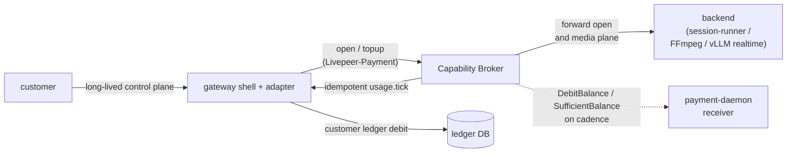
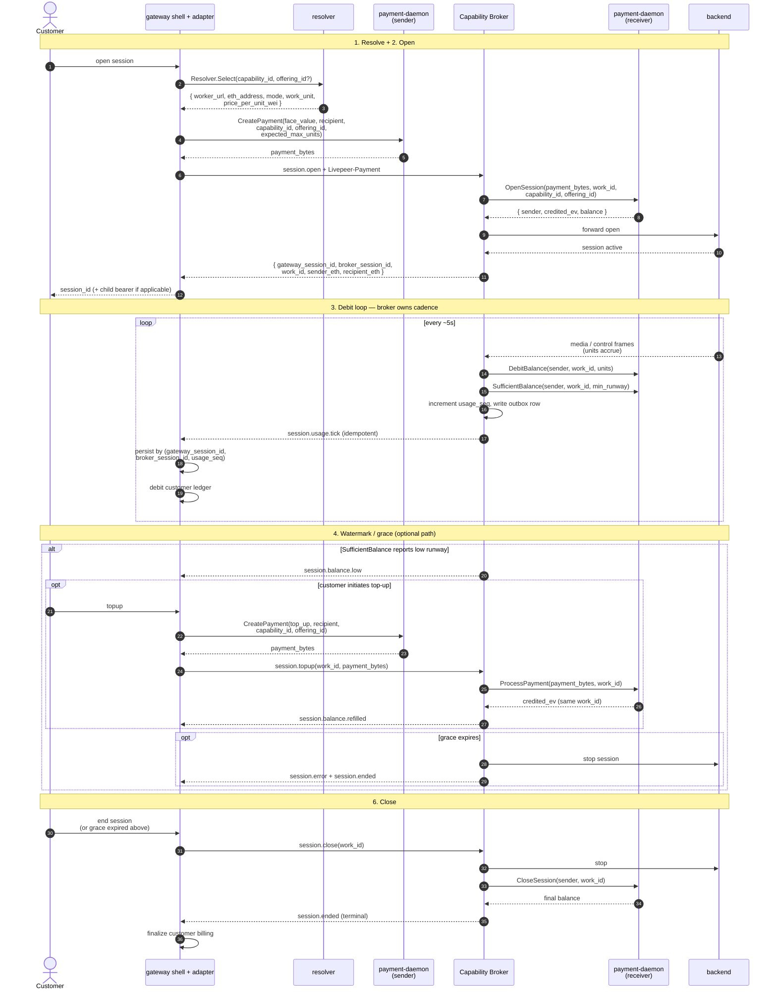
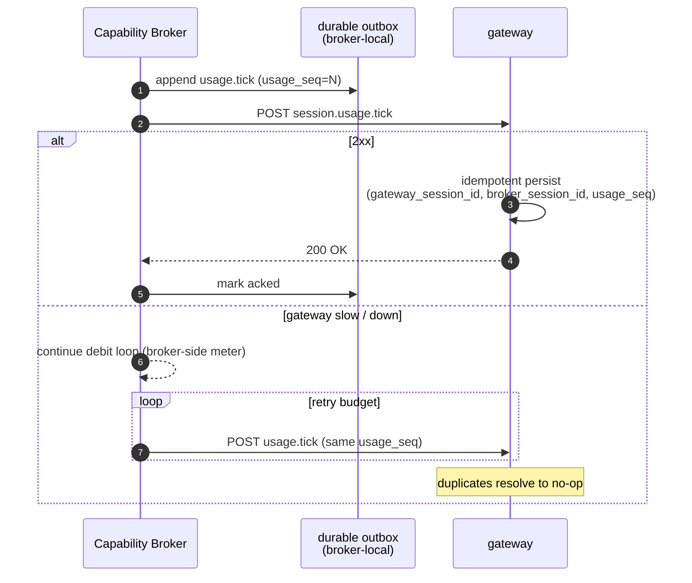

# Streaming workload pattern

Cross-cutting blueprint for long-lived, continuously-metered capabilities on
the Livepeer network. This is the pattern new streaming capabilities should
adopt unless they have a strong, explicit reason to do something else.

Examples mapped to interaction modes:

- `ws-realtime` — realtime voice / agent sessions, vtuber `/control`
- `session-control-plus-media` — vtuber sessions with a separate media plane,
  realtime AI pipelines
- `rtmp-ingress-hls-egress` — live video sessions

This doc is intentionally cross-cutting. It binds the gateway shell, the
capability broker, the per-mode adapter, and both `payment-daemon` roles.

## Scope

This pattern is for **streaming** modes, not the request/response modes.

Request/response shape (`http-reqresp` / `http-stream` / `http-multipart`):

- one request
- one routing decision
- one payment envelope
- one backend response
- one customer-ledger commit

Streaming shape (`ws-realtime` / `session-control-plus-media` /
`rtmp-ingress-hls-egress`):

- one session open
- one or more customer-initiated topups
- many broker-side debit ticks
- many broker-to-gateway usage events
- one terminal close

## Canonical summary



The canonical streaming pattern is:

- gateway resolves worker + offering and mints credit
- broker credits a receiver-side session balance via `payment-daemon`
- **broker debits that balance locally on cadence**
- broker emits idempotent usage events to the gateway
- gateway updates the customer-facing billing ledger from accepted events

Short version:

- **broker-side meter** for runtime enforcement
- **gateway-side ledger** for customer accounting

This split is deliberate. The runtime-critical balance check lives next to
the actual session runtime, while the customer ledger remains centralized and
auditable.

## Why this is the default

Advantages:

- the broker can keep enforcing runway even if the gateway is briefly slow or
  unavailable
- the debit loop does not depend on a broker-to-gateway round trip
- low-balance and grace handling live beside the actual session runtime
- customer billing remains centralized and auditable at the gateway
- the same shape applies across all streaming modes

Tradeoffs:

- broker / gateway reconciliation is more complex than a purely gateway-owned
  meter
- the broker and gateway need a durable idempotent event contract
- topup correlation and final reconciliation must be explicit

## Roles

### Gateway

The gateway is the customer-facing commercial system.

Responsibilities:

- authenticate the customer
- create and persist the commercial session row
- resolve a worker and offering
- compute initial credit and topup credit in wei
- mint payment blobs via the sender-side `payment-daemon`
- forward session-open and topup requests to the broker
- ingest broker usage and control-plane events
- update the customer billing ledger from accepted events
- surface low-balance, refilled, error, and ended states to the customer

The gateway is **not** the runtime-critical debit loop owner.

### Sender-side `payment-daemon`

Co-located with the gateway.

Responsibilities:

- mint wire-format payment blobs
- encapsulate payee ticket-params lookup and ticket signing
- expose `CreatePayment(face_value, recipient, capability_id, offering_id, expected_max_units)`

It does **not** own the long-lived session meter.

### Capability broker (the worker side)

The broker is the runtime owner of the streaming session, regardless of
backend.

Responsibilities:

- accept session-open and topup requests from the gateway
- validate incoming payment blobs via the co-located receiver daemon
- forward open + topup + close to the declared backend
- own the runtime session state machine (debit loop, watermark, grace)
- debit usage locally on cadence via the receiver daemon
- check runway locally
- emit idempotent usage and control-plane events to the gateway
- close receiver-side payment state when the session ends

> The broker carries no per-capability semantics — the debit cadence and units
> come from the `host-config.yaml` declaration. The same broker code runs the
> vtuber session, the RTMP live ingest, and any future streaming capability.

### Receiver-side `payment-daemon`

Co-located with the broker on the worker-orch host.

Responsibilities:

- validate incoming payments with `ProcessPayment`
- hold per-session balance keyed by `(sender, work_id)`
- debit balance with `DebitBalance`
- report headroom with `SufficientBalance`
- release per-session state with `CloseSession`

It is the authoritative runtime allowance store for the session.

## Core identifiers

Every conforming streaming capability must define and persist:

- `gateway_session_id`
- `broker_session_id` (was `worker_session_id` in suite-era docs)
- `work_id`
- `usage_seq`
- `capability_id`
- `offering_id`
- `recipient_eth_address`
- `sender_eth_address`

Recommended meaning:

- `gateway_session_id` = customer-facing commercial session identity
- `broker_session_id` = broker runtime identity (handed to the backend)
- `work_id` = receiver-daemon balance key for this live session

The mapping between them must be explicit and durable on both sides.

## Canonical lifecycle



### 1. Resolve

The gateway resolves a worker and offering. Required resolved data:

- `worker_url`
- `recipient_eth_address`
- `capability_id`
- `offering_id`
- `interaction_mode`
- `price_per_work_unit_wei`
- `work_unit` (opaque string)

### 2. Open

The gateway computes an initial pre-credit amount in wei and calls
`CreatePayment(face_value, recipient, capability_id, offering_id,
expected_max_units)`, then calls the broker's session-open endpoint with the
returned payment blob in the `Livepeer-Payment` header.

The broker:

- chooses or derives `work_id`
- calls `OpenSession(payment_bytes, work_id, capability_id, offering_id)`
- creates `broker_session_id`
- persists `gateway_session_id ↔ broker_session_id ↔ work_id`
- forwards the open to the declared backend
- returns an accepted response

The open response must include at least:

- `gateway_session_id`
- `broker_session_id`
- `work_id`
- `sender_eth_address`
- `recipient_eth_address`
- any child bearer / session token needed for the long-lived control plane

Without that contract the gateway cannot safely top up, audit, or close the
session later.

### 3. Debit loop

The broker runs a local debit loop on a fixed cadence.

Recommended default: **cadence = 5 seconds**.

At each tick the broker:

1. computes units consumed since the previous tick (from the configured
   extractor — `seconds-elapsed`, `bytes-counted`, `ffmpeg-progress`, etc.)
2. increments `usage_seq`
3. calls `DebitBalance(sender, work_id, units)`
4. calls `SufficientBalance(sender, work_id, min_runway_units)`
5. writes the corresponding usage event to a durable local outbox
6. delivers or retries delivery of that event to the gateway

The broker must treat negative post-debit balance as fatal.

### 4. Watermark and grace

If `SufficientBalance` reports insufficient runway:

- broker enters low-balance state
- broker emits `session.balance.low`
- broker starts a grace timer

If balance recovers before grace expiry:

- broker clears low-balance state
- broker emits `session.balance.refilled`

If grace expires without recovery:

- broker emits terminal error and ended events
- broker stops the workload
- broker closes the payment session

Recommended defaults: **min runway = 30 seconds**, **grace = 60 seconds**.

### 5. Topup

Topup is customer-initiated at the gateway. The gateway:

1. verifies the commercial session is still eligible for topup
2. computes topup `face_value`
3. calls `CreatePayment(face_value, recipient, capability_id, offering_id, expected_max_units)`
4. forwards the resulting payment blob to the broker topup endpoint

The broker:

1. resolves the request to the existing live session
2. **reuses the existing `work_id`**
3. calls `ProcessPayment(payment_bytes, work_id)`
4. emits `session.balance.refilled` if the session exits low-balance state

Topup must credit the **same** receiver-side `work_id` already associated with
the live session.

### 6. Close

On graceful or fatal termination, the broker:

- stops the runtime
- emits terminal events
- calls `CloseSession(sender, work_id)`

The gateway:

- marks the commercial session ended
- finalizes customer billing state
- persists terminal reason and final usage

## Face-value sizing

This blueprint requires a single gateway-side pricing rule across modes:

```
requested_spend_wei = target_credit_units * price_per_work_unit_wei
```

Where:

- `target_credit_units` is the amount of future runway the gateway wants to
  buy up front or via topup
- `price_per_work_unit_wei` comes from the resolved offering

Modes may choose different target runway policies, but they must do so
explicitly. For example:

- initial credit sized to 60 seconds
- topup credit sized to 60 seconds
- low-balance watermark at 30 seconds

In the current quote-free flow, the sender-side field is still named
`face_value` but semantically it is a **requested spend / target expected
value** request. See
[`payment-daemon-interactions.md`](./payment-daemon-interactions.md) for the
full sender / receiver economic model.

## Required broker-to-gateway event contract

Each streaming capability must produce an idempotent usage event shape.

Recommended canonical event:

```json
{
  "type": "session.usage.tick",
  "gateway_session_id": "ses_123",
  "broker_session_id": "brk_456",
  "work_id": "wid_789",
  "usage_seq": 12,
  "units": 5,
  "unit_type": "second",
  "remaining_runway_units": 25,
  "low_balance": true,
  "occurred_at": "2026-05-11T10:00:00Z"
}
```



Gateway requirements:

- persist idempotently by `(gateway_session_id, broker_session_id, usage_seq)`
- reject duplicates as no-ops
- bill customer usage only from accepted unique ticks

Broker requirements:

- `usage_seq` must be monotonic within a live session
- retries must preserve the same `usage_seq` and payload semantics
- delivered events must come from a durable outbox, not only process memory

## Reconciliation requirements

The broker and gateway must behave as an **at-least-once** event pipeline:

- the broker may deliver a usage tick more than once
- the gateway must treat duplicates as no-ops
- the broker must be able to replay not-yet-acknowledged events after restart

Every session must also emit a terminal reconciliation record. At minimum, the
terminal event or terminal read-model must include:

- final `usage_seq`
- cumulative consumed units
- terminal reason
- final observed runway / balance state if available

Without this contract, "broker-side enforcement + gateway-side audit" is not
actually durable under crash / retry conditions.

## Separation of concerns

Streaming capabilities require a strict split between:

- runtime allowance enforcement → **broker + receiver-side daemon**
- customer billing ledger → **gateway DB + gateway billing services**

The gateway must **not** be required on the runtime-critical path of every
debit.

The broker must **not** be the sole keeper of the customer-commercial ledger.

## Failure handling

### Sender-side mint failure

If `CreatePayment` fails:

- gateway must fail closed
- no workload request is sent without payment

### Broker cannot process payment

If `ProcessPayment` fails on open:

- broker rejects session-open
- gateway marks the commercial session failed

If `ProcessPayment` fails on topup:

- broker leaves the existing session running if it still has runway
- gateway surfaces topup failure to the customer

### Gateway temporarily unavailable during usage delivery

Broker behavior:

- local debit loop continues
- usage events are retried from durable storage
- retries preserve `usage_seq`

Gateway behavior:

- accepted events are idempotent
- duplicates are safe

### Receiver-side daemon unavailable mid-session

Broker behavior:

- treat as payment-path degradation
- retry on a bounded budget
- after grace, terminate the session if balance enforcement cannot continue
  safely

## Conformance rules

Any capability claiming conformance with the streaming pattern must satisfy:

1. Payment credit is minted by sender-side `CreatePayment(...)`.
2. Runtime allowance is held receiver-side and credited by `ProcessPayment`.
3. Broker debits locally on cadence with `DebitBalance`.
4. Broker checks runway locally with `SufficientBalance`.
5. Topup credits the same live `work_id`.
6. Broker emits idempotent usage ticks to the gateway.
7. Broker persists unacknowledged usage ticks durably for replay.
8. Gateway persists customer billing from accepted usage ticks.
9. Broker and gateway both persist the correlation identifiers.
10. The debit loop does not require a broker-to-gateway round trip to continue
    safely.
11. Terminal session state closes receiver-side payment state exactly once.
12. Terminal session state includes enough data for broker / gateway
    reconciliation.

## Recommended logical API surface

This doc does not mandate exact paths, but recommends these logical
operations:

Gateway → broker:

- session open
- session topup
- session end

Broker → gateway:

- session ready
- session usage tick
- session balance low
- session balance refilled
- session error
- session ended

Broker → receiver-side daemon:

- `OpenSession` / `ProcessPayment`
- `DebitBalance`
- `SufficientBalance`
- `CloseSession`

Gateway → sender-side daemon:

- `CreatePayment`

## Relationship to existing repo work

- `http-reqresp`, `http-stream`, and `http-multipart` modes use the
  request/response pattern (one payment per request, no debit loop).
- `ws-realtime`, `session-control-plus-media`, and `rtmp-ingress-hls-egress`
  use this streaming pattern.
- Older suite-era notes that mention `GET /quote`, `StartSession`, or custom
  `OpenStreamingSession` / `TopUpStreamingSession` RPCs are historical and
  should be treated as superseded by this document.

## See also

- [`payment-daemon-interactions.md`](./payment-daemon-interactions.md) — the
  sender / receiver economic model
- [`payment-decoupling.md`](./payment-decoupling.md) — what the rewrite
  changed in `payment-daemon` to support opaque capability / work-unit names
- [`../../livepeer-network-protocol/modes/session-control-plus-media.md`](../../livepeer-network-protocol/modes/session-control-plus-media.md)
- [`../../livepeer-network-protocol/modes/ws-realtime.md`](../../livepeer-network-protocol/modes/ws-realtime.md)
- [`../../livepeer-network-protocol/modes/rtmp-ingress-hls-egress.md`](../../livepeer-network-protocol/modes/rtmp-ingress-hls-egress.md)
