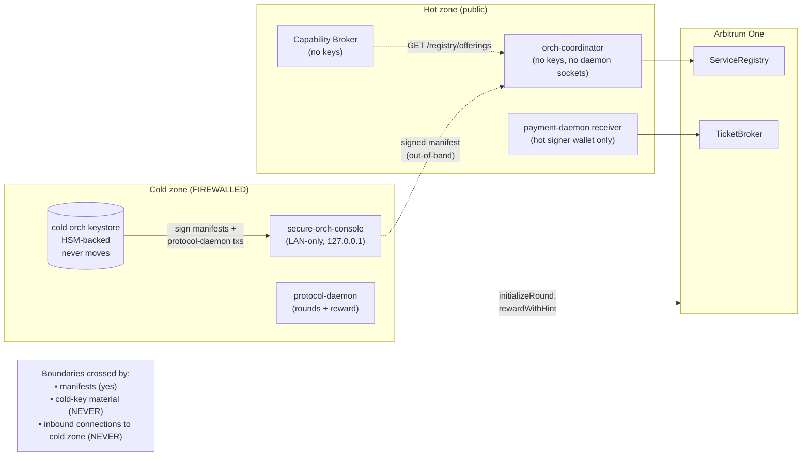
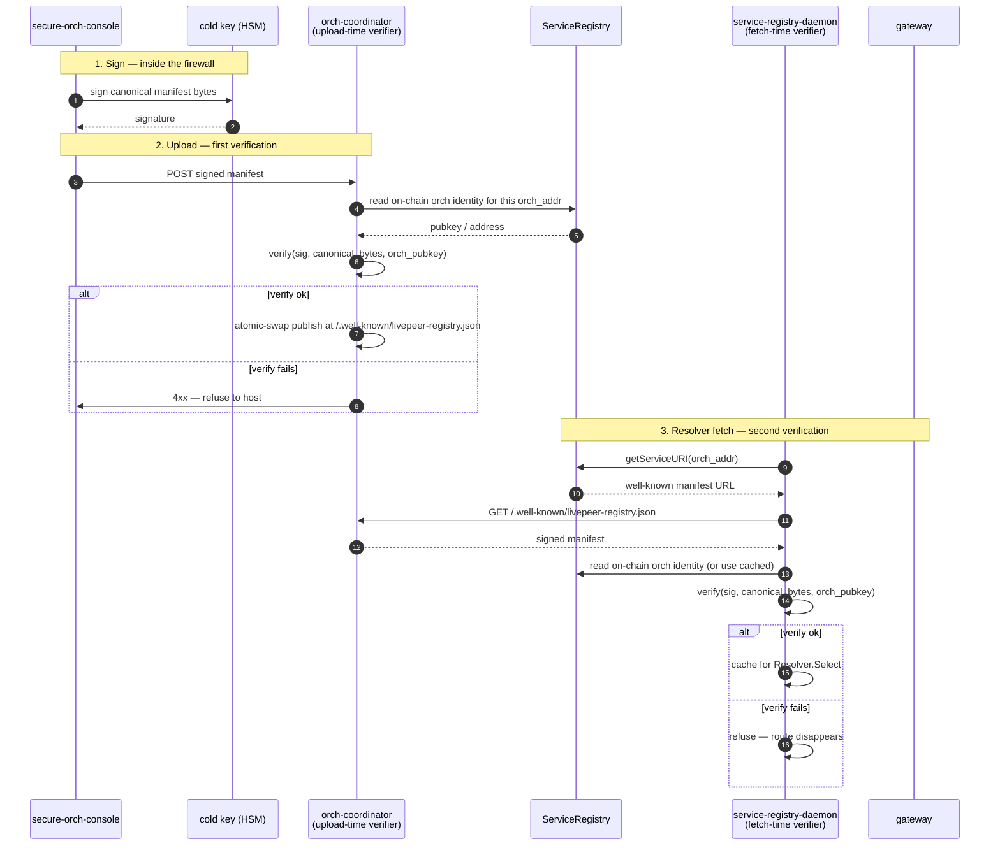

# Trust model

Deep zoom on the trust spine. The architecture-overview's Layer 5 covers the
operator-driven sign cycle; this doc covers the **why** behind each
boundary — what threat each invariant defends against, and what gets verified
where.

The hard rules from the architecture-overview:

- `secure-orch` never accepts inbound connections.
- The cold orch keystore never leaves the firewalled host.
- Every signed manifest is verified twice (once on upload, once on every
  resolver fetch).
- On-chain orch identity (`ServiceRegistry` / `AIServiceRegistry`) is the
  root of trust for "is this signature really from this orch?"

## Key boundaries

Three identity-bearing keys in the system, each with a tightly-scoped role:

| Key | Where it lives | What it signs | What it must never sign |
|---|---|---|---|
| **Cold orch key** | HSM, firewalled `secure-orch` | manifest canonical bytes; protocol-daemon txs (`initializeRound`, `rewardWithHint`) | naked transactions; tickets |
| **Hot signer wallet** | receiver `payment-daemon` on worker-orch | ticket-redemption gas txs | manifests; protocol-daemon txs |
| **Operator console bearer** | secure-orch-console (LAN auth) | nothing on-chain — gates access to the sign UI | anything cryptographic |

The cold key never moves. The hot wallet is operationally expendable —
compromise costs the value of in-flight tickets only, because:

- the orch's on-chain identity (recipient of `TicketBroker.faceValue`) is
  the **cold** key's address
- the hot wallet only pays gas; it is not the recipient

This is the "hot / cold identity split" — see
[`payment-daemon-interactions.md`](./payment-daemon-interactions.md) §
*Hot / cold identity split*.

## What signatures attest to

A cold-key signature over a manifest is a binding statement of the form:

> "I, the orch identified by this on-chain address, declare that the
> capabilities listed in this manifest are the ones my hosts will serve,
> at the prices listed, until I supersede this manifest with a newer
> cold-signed one."

That's a strong claim, and the protocol leans on it heavily:

- it gates Layer-1 manifest health (see
  [`backend-health.md`](./backend-health.md))
- it determines which payments `payment-daemon` (receiver) will validate
- it determines what gateways will route to

That's why the signature payload is the manifest's **canonical bytes** —
deterministic serialization — not the raw HTTP body. Any change anywhere in
the canonical bytes invalidates the signature, including changes to the
declared price, the declared backend URL, or the declared interaction mode.

## Double verification

The signature is verified twice, against the same on-chain orch identity,
by two independent parties:

**Why two verifications?** The orch-coordinator host is public-internet
exposed. If it's ever compromised, the attacker could try to serve a
tampered manifest claiming false capabilities or false prices. The
gateway-side resolver verification means a compromised coordinator can't
poison downstream routing — the signature won't validate against on-chain
identity.

The coordinator's upload-time check is defense-in-depth — it prevents
serving manifests that wouldn't survive resolver verification anyway, so
the bad case is caught at the boundary rather than at every resolver.

## What is *not* trusted

Layer 1 (signed manifest) is trusted. Layers 2 and 3 (live + failure-rate
health) are **not**.

- `/healthz` and `/registry/health` are convenience surfaces; they don't
  bind the operator to anything. Anyone can serve "green" indefinitely.
- Prometheus metrics on both sides are inputs to third-party aggregators;
  they are not authoritative. The architecture's job is to expose
  comparable surfaces, not to vouch for what they say.
- The orch-coordinator's `/admin` upload endpoint is gated by an operator
  bearer — but compromise of that bearer at worst causes the coordinator
  to attempt to host bad manifests, which the resolver rejects.

The trust model is deliberately concentrated. Anything that isn't
cold-signed is treated as observation, not attestation.

## Sign-cycle invariants

These hold for every published manifest, by construction:

1. **The cold key signed it.** The receiver-side `payment-daemon` and every
   resolver re-check this; the chain anchors the identity.
2. **The operator saw the diff.** secure-orch-console renders candidate-vs-
   current-published diff before exposing the Sign action; the operator
   confirms intent on the changes, not on the whole manifest.
3. **The orch-coordinator did not author the content.** It can only host
   what the operator signs. A compromised coordinator can drop manifests
   or serve stale ones, but cannot insert new capabilities, new prices, or
   new backend URLs.
4. **There is no automated sign path.** Every manifest publication is a
   discrete operator action. Automation lives in console UX (diffing,
   one-click sign, clear status), not in the trust boundary.
5. **Revocation is supersession.** There is no separate revoke step — the
   operator signs a new manifest that omits the no-longer-offered
   capability, and resolvers pick it up on the next round refresh.

## Threat model and what each invariant defends against

| Attack | Defended by | Notes |
|---|---|---|
| Attacker steals hot signer wallet | hot / cold identity split | At worst they pay gas for someone else's ticket redemptions; recipient address is cold-key-controlled, so payouts still go to the orch. |
| Attacker compromises orch-coordinator host | double verification | Tampered manifests fail resolver-side signature check. Worst-case attack is denial-of-service (stop hosting), not impersonation. |
| Attacker compromises a worker-orch broker | manifest gating + receiver-side checks | The broker has no cold key. It can't add itself to a manifest; resolvers won't see it. It can degrade or refuse traffic, but it can't impersonate offerings the orch hasn't signed for. |
| Attacker MITMs manifest fetch | double verification + canonical bytes | Modified bytes invalidate the signature. |
| Operator signs the wrong thing | diff UI on secure-orch-console | Friction-reduction work goes into diffing and clear presentation, never into removing the sign step. |
| Cold key compromise | OPERATIONAL — outside the system | Cold-key compromise means the orch is compromised. The protocol can't prevent this; the operator's job is to make it not happen (HSM, physical access controls, etc.). |

## What's deferred

- **Automated transport** of manifests from secure-orch to coordinator.
  Hand-carry (scp / USB / console upload) is fine for v1 — the bottleneck
  is signing, not transport.
- **Manifest versioning beyond supersession.** No timestamps, no nonces.
  The latest signed manifest wins. If versioned histories become valuable
  for audit, they belong in the coordinator's storage layer, not in the
  signed payload.
- **Anonymous third-party verification.** Resolvers verify per-fetch;
  no public attestation service exists yet. If the market wants one, it
  belongs in third-party tooling (Layer 8), not in the trust spine.

## See also

- [`./architecture-overview.md`](./architecture-overview.md) §
  *Layer 5 — Trust spine: operator-driven sign cycle*
- [`./backend-health.md`](./backend-health.md) § *Layer 1 — Manifest health*
- [`./payment-daemon-interactions.md`](./payment-daemon-interactions.md) §
  *Hot / cold identity split*
- [`../../secure-orch-console/`](../../secure-orch-console/) — the LAN-only
  signing UI
- [`../../orch-coordinator/`](../../orch-coordinator/) — the public host
  that serves the signed manifest
