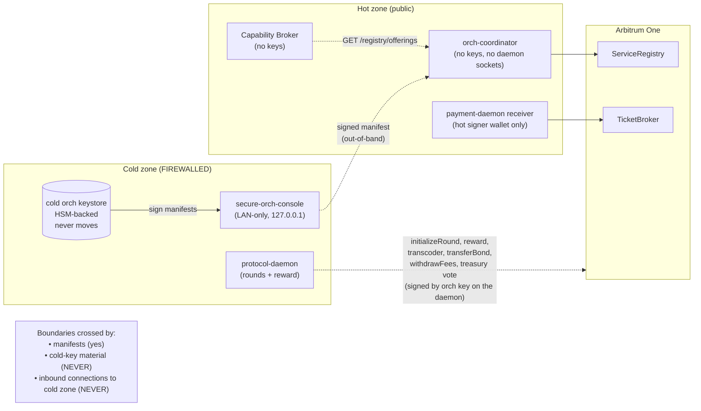
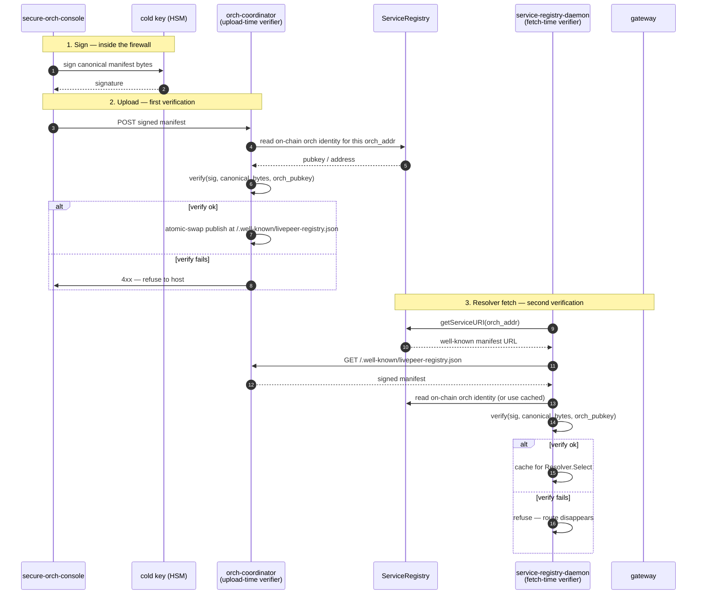

# Trust model

Deep zoom on the trust spine. The architecture-overview's Layer 5 covers the
operator-driven sign cycle; this doc covers the **why** behind each
boundary — what threat each invariant defends against, and what gets verified
where.

The hard rules from the architecture-overview:

- `secure-orch` never accepts inbound connections.
- The cold orch keystore never leaves the firewalled host.
- Every signed manifest is verified twice (once on upload, once on every
  resolver fetch).
- On-chain orch identity (`ServiceRegistry` / `AIServiceRegistry`) is the
  root of trust for "is this signature really from this orch?"

## Key boundaries

```mermaid
flowchart LR
    subgraph cold["Cold zone (FIREWALLED)"]
        direction TB
        COLD[("cold orch keystore<br/>HSM-backed<br/>never moves")]
        SOC["secure-orch-console<br/>(LAN-only, 127.0.0.1)"]
        PRD["protocol-daemon<br/>(rounds + reward)"]
    end

    subgraph hot["Hot zone (public)"]
        direction TB
        OC["orch-coordinator<br/>(no keys, no daemon sockets)"]
        Broker["Capability Broker<br/>(no keys)"]
        WPD["payment-daemon receiver<br/>(hot signer wallet only)"]
    end

    subgraph chain["Arbitrum One"]
        direction LR
        SREG["ServiceRegistry"]
        TB["TicketBroker"]
    end

    COLD -- "sign manifests" --> SOC
    SOC -.->|"signed manifest<br/>(out-of-band)"| OC
    PRD -.->|"initializeRound, reward,<br/>transcoder, transferBond,<br/>withdrawFees, treasury vote<br/>(signed by orch key on the daemon)"| chain

    Broker -.->|"GET /registry/offerings"| OC
    OC --> SREG
    WPD --> TB

    Note1["Boundaries crossed by:<br/>• manifests (yes)<br/>• cold-key material (NEVER)<br/>• inbound connections to cold zone (NEVER)"]
```

Identity-bearing keys in the system, each with a tightly-scoped role:

| Key | Where it lives | What it signs | What it must never sign |
|---|---|---|---|
| **Cold manifest key** | HSM / firewalled `secure-orch`, held by `secure-orch-console` | manifest canonical bytes only | any on-chain transaction |
| **Orchestrator signing key** | `protocol-daemon` keystore (`--keystore-path`) | protocol-daemon txs: `initializeRound`, `reward`/`rewardWithHint`, `transcoder` (reward/fee cut), `transferBond`, `withdrawFees`, treasury `castVote` | manifests |
| **Ticket signer wallet** | receiver `payment-daemon` on worker-orch | ticket-redemption gas txs | manifests; protocol-daemon txs |
| **Operator console bearer** | secure-orch-console (LAN auth) | nothing on-chain — gates access to the sign UI and issues session-authenticated gRPC requests to the daemon | anything cryptographic |

**Why the orchestrator key is daemon-controlled, not cold.** The
BondingManager / RoundsManager / treasury calls act on `msg.sender`, so the
signer of `reward` / `transcoder` / `transferBond` / `withdrawFees` /
`castVote` **must be the registered orchestrator address itself** — there is
no delegation path. And these actions are *automated* (per-round reward,
round-locked transfer/withdraw), so the key must be available to the daemon
**without a human in the loop**. A manual cold/HSM-tap-per-tx key cannot do
that. Therefore the orchestrator key is an operationally-hot signer the
daemon owns: today a V3 JSON keystore opened from `--keystore-path` and used
by `chain-commons.services.txintent`'s processor (`processor.go`
`keystore.SignTx`). The `chain-commons.providers.keystore.Keystore`
interface (`Address`/`Sign`/`SignTx`) is the abstraction, so a
non-interactive cloud-KMS or auto-signing-HSM backend can replace the file
later **without changing any service code** — but it must still sign
unattended. The cold manifest key is a *different* key for a *different*
job (capability publication) and never signs chain transactions.

The orchestrator key is operationally hot. Compromise of the daemon host
exposes it — scope it to a wallet whose only privilege is orchestrator
operation (round-init/reward/cut-share/transfer/withdraw/vote), keep it on
the firewalled secure-orch host, and rotate via the on-chain transcoder
identity if breached. The cold manifest key never moves. The ticket signer
wallet is operationally expendable —
compromise costs the value of in-flight tickets only, because:

- the orch's on-chain identity (recipient of `TicketBroker.faceValue` and
  rewards) is the **orchestrator** key's address
- the ticket signer wallet only pays redemption gas; it is not the recipient

This is the "hot / cold identity split" — see
[`payment-daemon-interactions.md`](./payment-daemon-interactions.md) §
*Hot / cold identity split*.

## What signatures attest to

A cold-key signature over a manifest is a binding statement of the form:

> "I, the orch identified by this on-chain address, declare that the
> capabilities listed in this manifest are the ones my hosts will serve,
> at the prices listed, until I supersede this manifest with a newer
> cold-signed one."

That's a strong claim, and the protocol leans on it heavily:

- it gates Layer-1 manifest health (see
  [`backend-health.md`](./backend-health.md))
- it determines which payments `payment-daemon` (receiver) will validate
- it determines what gateways will route to

That's why the signature payload is the manifest's **canonical bytes** —
deterministic serialization — not the raw HTTP body. Any change anywhere in
the canonical bytes invalidates the signature, including changes to the
declared price, the declared backend URL, or the declared interaction mode.

## Double verification

The signature is verified twice, against the same on-chain orch identity,
by two independent parties:

```mermaid
sequenceDiagram
    autonumber
    participant SOC as secure-orch-console
    participant Cold as cold key (HSM)
    participant OC as orch-coordinator<br/>(upload-time verifier)
    participant Chain as ServiceRegistry
    participant SRD as service-registry-daemon<br/>(fetch-time verifier)
    participant GW as gateway

    Note over SOC,Cold: 1. Sign — inside the firewall
    SOC->>Cold: sign canonical manifest bytes
    Cold-->>SOC: signature

    Note over SOC,OC: 2. Upload — first verification
    SOC->>OC: POST signed manifest
    OC->>Chain: read on-chain orch identity for this orch_addr
    Chain-->>OC: pubkey / address
    OC->>OC: verify(sig, canonical_bytes, orch_pubkey)
    alt verify ok
        OC->>OC: atomic-swap publish at /.well-known/livepeer-registry.json
    else verify fails
        OC->>SOC: 4xx — refuse to host
    end

    Note over GW,Chain: 3. Resolver fetch — second verification
    SRD->>Chain: getServiceURI(orch_addr)
    Chain-->>SRD: well-known manifest URL
    SRD->>OC: GET /.well-known/livepeer-registry.json
    OC-->>SRD: signed manifest
    SRD->>Chain: read on-chain orch identity (or use cached)
    SRD->>SRD: verify(sig, canonical_bytes, orch_pubkey)
    alt verify ok
        SRD->>SRD: cache for Resolver.Select
    else verify fails
        SRD->>SRD: refuse — route disappears
    end
```

**Why two verifications?** The orch-coordinator host is public-internet
exposed. If it's ever compromised, the attacker could try to serve a
tampered manifest claiming false capabilities or false prices. The
gateway-side resolver verification means a compromised coordinator can't
poison downstream routing — the signature won't validate against on-chain
identity.

The coordinator's upload-time check is defense-in-depth — it prevents
serving manifests that wouldn't survive resolver verification anyway, so
the bad case is caught at the boundary rather than at every resolver.

## What is *not* trusted

Layer 1 (signed manifest) is trusted. Layers 2 and 3 (live + failure-rate
health) are **not**.

- `/healthz` and `/registry/health` are convenience surfaces; they don't
  bind the operator to anything. Anyone can serve "green" indefinitely.
- Prometheus metrics on both sides are inputs to third-party aggregators;
  they are not authoritative. The architecture's job is to expose
  comparable surfaces, not to vouch for what they say.
- The orch-coordinator's `/admin` upload endpoint is gated by an operator
  bearer — but compromise of that bearer at worst causes the coordinator
  to attempt to host bad manifests, which the resolver rejects.

The trust model is deliberately concentrated. Anything that isn't
cold-signed is treated as observation, not attestation.

## Sign-cycle invariants

These hold for every published manifest, by construction:

1. **The cold key signed it.** The receiver-side `payment-daemon` and every
   resolver re-check this; the chain anchors the identity.
2. **The operator saw the diff — or authored the policy that graded it.**
   For every critical change, secure-orch-console renders the
   candidate-vs-current-published diff before exposing the Sign action;
   the operator confirms intent on the changes, not on the whole
   manifest. For the auto-signed classes (plan 0042), this invariant is
   class-scoped: the operator saw and authored the sign policy, and sees
   the audit trail of every decision the agent took inside it.
3. **The orch-coordinator did not author the content.** It can only host
   what the cold key signs. A compromised coordinator can drop manifests
   or serve stale ones, but cannot insert new capabilities or new backend
   URLs. With the plan 0042 agent enabled this weakens only to the
   bounded extent of the policy envelope: content-identical renewals
   (zero new content), and — when the operator flips the phase-2 dial —
   benign changes within explicit operator-authored bounds (price delta
   percentage, worker-URL domain allowlist, tuple removal), rate-limited
   per hour.
4. **There is no unbounded automated sign path.** The cold key signs
   without an operator only inside a policy envelope the operator
   authored and the audit log records: content-identical renewals
   always; benign content changes only within explicit bounds (price
   delta, domain allowlist, rate limit); everything else is held for a
   discrete operator action. Identity (`eth_address`) and `spec_version`
   changes are never auto-signed — that dial does not exist in the
   policy schema. (Amended by plan 0042; the original invariant read
   "there is no automated sign path".)
5. **Revocation is supersession.** There is no separate revoke step — the
   operator signs a new manifest that omits the no-longer-offered
   capability, and resolvers pick it up on the next round refresh.

## Threat model and what each invariant defends against

| Attack | Defended by | Notes |
|---|---|---|
| Attacker steals ticket signer wallet | hot / cold identity split | At worst they pay gas for someone else's ticket redemptions; the recipient address is the orchestrator key's, so payouts still go to the orch. |
| Attacker steals the orchestrator signing key (protocol-daemon host) | least-privilege scoping of that key + firewalled secure-orch host | They can call orchestrator ops (round-init/reward/cut-share/transferBond/withdrawFees/vote) as the orch — including transferring bond/fees to the configured receivers. Mitigation: the key's only privilege is orchestrator operation, the daemon binds a loopback/LAN unix socket, and the on-chain transcoder identity can be rotated. This is the cost of unattended automation; it is NOT the manifest cold key, which remains uncompromised. |
| Attacker compromises orch-coordinator host | double verification | Tampered manifests fail resolver-side signature check. Worst-case attack is denial-of-service (stop hosting), not impersonation. |
| Attacker compromises a worker-orch broker | manifest gating + receiver-side checks | The broker has no cold key. It can't add itself to a manifest; resolvers won't see it. It can degrade or refuse traffic, but it can't impersonate offerings the orch hasn't signed for. |
| Attacker MITMs manifest fetch | double verification + canonical bytes | Modified bytes invalidate the signature. |
| Operator signs the wrong thing | diff UI on secure-orch-console | Friction-reduction work goes into diffing and clear presentation, never into removing the sign step. |
| Attacker compromises the coordinator and feeds the sign agent | policy envelope + rate limit + audit (plan 0042) | Worst case per auto-signed class: renewals keep the operator's own already-approved content alive (zero new capability, price, or URL); phase-2 benign signs drift price within the configured % bound or move worker URLs within the domain allowlist, capped per hour. Critical and forbidden classes always hold or refuse. A sign burst trips the rate-limit pause — the loudest available compromise signal. |
| Cold key compromise | OPERATIONAL — outside the system | Cold-key compromise means the orch is compromised. The protocol can't prevent this; the operator's job is to make it not happen (HSM, physical access controls, etc.). |

## What's deferred

- ~~**Automated transport** of manifests from secure-orch to
  coordinator.~~ Shipped by plan 0042: an outbound-only agent on the
  secure host pulls candidates, classifies them against the operator's
  sign policy, auto-signs within the envelope (invariant #4), and pushes
  signed manifests back. Hand-carry remains available as the fallback
  path.
- **Manifest versioning beyond supersession.** No timestamps, no nonces.
  The latest signed manifest wins. If versioned histories become valuable
  for audit, they belong in the coordinator's storage layer, not in the
  signed payload.
- **Anonymous third-party verification.** Resolvers verify per-fetch;
  no public attestation service exists yet. If the market wants one, it
  belongs in third-party tooling (Layer 8), not in the trust spine.

## See also

- [`./architecture-overview.md`](./architecture-overview.md) §
  *Layer 5 — Trust spine: operator-driven sign cycle*
- [`./backend-health.md`](./backend-health.md) § *Layer 1 — Manifest health*
- [`./payment-daemon-interactions.md`](./payment-daemon-interactions.md) §
  *Hot / cold identity split*
- [`../../secure-orch-console/`](../../secure-orch-console/) — the LAN-only
  signing UI
- [`../../orch-coordinator/`](../../orch-coordinator/) — the public host
  that serves the signed manifest
