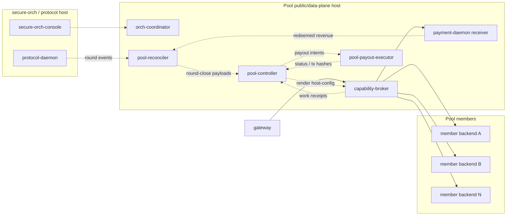

> **Superseded by plan 0044** ([0044-zero-touch-pool-onboarding.md](../active/0044-zero-touch-pool-onboarding.md)).
> The pool node architecture landed, but the member and assignment model described here was replaced by templates, placement and the trust ladder.
>
> Kept as provenance: this is what was decided and shipped at the time,
> and the reasoning is still worth reading. It is not a description of
> the system today. Nothing below has been edited.

# Plan 0029 — Pool node design

**Status:** completed — the Pool node architecture from this plan is now
implemented across `capability-broker/`, `pool-controller/`,
`pool-reconciler/`, and `pool-payout-executor/`
**Opened:** 2026-05-16
**Owner:** harness
**Branch:** `feature/pool-node-design`

**Related references:**
- Kickoff conversation:
  [`../../references/2026-05-16-pool-node-conversation.md`](../../references/2026-05-16-pool-node-conversation.md)
- Architecture overview:
  [`../../design-docs/architecture-overview.md`](../../design-docs/architecture-overview.md)
- Core beliefs:
  [`../../design-docs/core-beliefs.md`](../../design-docs/core-beliefs.md)

## Completion summary

This plan shipped.

Delivered outcomes:

- Pool-specific control plane in `pool-controller/`
- Pool runtime rendering and broker-runtime apply workflow
- broker multi-backend grouping and selection foundations
- receipt ingestion, round-close derivation, and reconciler checkpointing
- payout-intent derivation, export, lease/claim, retry, and alert flows
- native-ETH Arbitrum executor path in `pool-payout-executor/`
- operator/public summaries, runbooks, compose manifests, and soak coverage

Follow-up slices remain tracked elsewhere, especially in:

- `0030-pool-backend-scoring-and-selection.md`
- `0031-pool-follow-up-backlog.md`
- `0033-pool-control-plane-onboarding-and-assignment.md`

## 1. Problem statement

Introduce a "Pool" node into the existing four-archetype paradigm
(secure-orch / orch-coordinator / worker-orch + capability-broker / gateway)
that **resells capacity from third-party orchs under its own on-chain
identity**.

The Pool is a regular orch from the outside: one `eth_address`, one signed
manifest at one well-known URL, one bond in `BondingManager`, one
secure-orch with its own cold key. The novelty is internal — its "backends"
are **remote workload runtimes operated by third-party members** (vLLM,
Ollama, FFmpeg, runners), not local containers co-located with the broker.

## 2. Goals

- Define a Pool topology that requires **no protocol change** at the
  gateway, manifest schema, or chain-facing layers (core belief #1 —
  workload-agnostic). Pool-specific machinery stays inside the Pool's
  component set.
- Define the Pool↔member surface: registration, trust binding, health,
  payment ticket flow, settlement, and operational failure modes.
- Stay within the existing component vocabulary where possible. Introduce
  a new top-level component only if the forks below force it.

## 3. Non-goals (v1)

- The other three "pool" framings from the kickoff (multi-orch federation,
  intra-broker pool, coordinator HA cluster) — see
  [`../../references/2026-05-16-pool-node-conversation.md`](../../references/2026-05-16-pool-node-conversation.md)
  §1. Each may become its own plan later.
- Slashing of members on-chain.
- A public "pool membership registry" smart contract.
- Verifiable usage receipts from members. Core belief #7 (trust the orch's
  reported usage in v1) applies recursively to members in v1; the
  attestation slot is reserved for v2.

## 4. Initial scope — forks to resolve

| Fork | Question | Status |
|---|---|---|
| 1 | Front-proxy vs. publish-only | **DECIDED** — front-proxy (see §5) |
| 2 | Member-side node type | **DECIDED** — backend provider only, no broker / no payment-daemon (see §5) |
| 3 | Pool↔member trust binding | **DECIDED** — standard backend security; no PKI (see §5) |
| 4 | Settlement model | **DECIDED** — round-share, rolling-avg realized, 7-round window (see §5) |
| 5 | Manifest attribution per member | DROPPED — members are invisible to gateways and chain under decided Fork 2 |

Full statement of each fork lives in the kickoff reference doc §3.

## 5. Decision log

### 2026-05-16 — Fork 1: Front-proxy

**Decision:** Pool sits in the data path. Gateway tickets are payable to
the Pool's `eth_address`; the Pool's edge-broker validates and forwards to
member brokers. The `worker_url ↔ eth_address` 1:1 in the manifest is
preserved.

**Rationale:**
- Zero protocol change at the manifest, payment-daemon, gateway, or chain
  layer. The Pool's edge-broker is a regular `capability-broker` whose
  backends happen to be remote member brokers.
- Preserves the invariant "the entity that gets paid is the entity doing
  the work" at the public layer.
- One-way migration: front-proxy → publish-only later is achievable if
  member-signed attestations and payment-redirect modes are added. The
  reverse migration is awkward, so we lock in the cleaner shape first.

**Operational refinement (not a re-decision):** for streaming modes
(`rtmp-ingress-hls-egress`, `ws-realtime`,
`session-control-plus-media`) where Pool-edge bandwidth is significant,
revisit a per-mode passthrough analogous to
`live-session-remote-runner` (architecture-overview.md:180) once
traffic profiles are known. Not v1 scope.

### 2026-05-16 — Fork 2: Member is a backend provider, no broker / no payment-daemon

**Decision:** A Pool member runs only the workload runtime they already
operate (vLLM, Ollama, FFmpeg, video-runner, etc.) exposed at a URL the
Pool's broker can reach. Members do **not** run `capability-broker`, do
**not** run `payment-daemon`, and never see a Livepeer ticket. The Pool's
`capability-broker` treats member runtimes as remote backends via the
existing `backend.transport` / `backend.url` / `backend.auth` mechanism in
`host-config.yaml`.

**Member identity** is the member's `eth_address`. At sign-up the member
signs a registration nonce with the address's private key (e.g., via
MetaMask) to prove ownership. After registration, the address is the
Pool-internal tracking ID and the payout destination — it is **not** used
as a Livepeer-protocol participant identity. Members are invisible to
gateways and to the chain.

**Member data model** is a 1:N:N hierarchy:

```
Member { eth_address, display_name, contact, commercial_terms,
         backends: [ Backend { id, url, auth,
                               capability_offerings: [ ... ] } ] }
```

Each member registers N backends; each backend declares N capability
offerings. **Pricing is Pool-set per published tuple** (not member-set):
members declare what they can do, the Pool declares the gateway-facing
price. Pool's payout rate to each member is a separate internal config
that drives settlement (Fork 4).

**Rationale:**
- The existing `capability-broker` already supports remote backends. A
  Pool member's runtime is, from the broker's perspective, "just another
  backend." No new protocol surface needed on the member side.
- Members keep their existing operational stack. Onboarding friction
  reduces to "give the Pool your backend URL + prove ownership of an
  `eth_address` with a one-time signature." No hot wallet, no
  `payment-daemon`, no Livepeer-protocol knowledge required.
- Pool runs the standard four-archetype orch stack unchanged. Gateway-,
  manifest-, and chain-facing protocol surfaces are unchanged.
- The β/γ split from the earlier working position is eliminated. The
  original framing was overcomplicating the member side. See the kickoff
  reference doc §3 for the superseded framing.

**Carry-forward design surface (lands in design-docs when
`pool-controller/` implementation begins):**
- `capability-broker/` gains **multiple backends per capability** with a
  selection algorithm (see Fork 3 / Component-shape decision below).
- `host-config.yaml` gains a `members:` block (or equivalent) carrying the
  N:N hierarchy. Concrete schema lands later.

### 2026-05-16 — Fork 3: Standard backend security; no Pool PKI

**Decision:** Pool↔member protocol-level "trust binding" collapses to
**standard backend security** — the same shape any orch uses to protect
its own backend endpoints today. Concretely:

- Bearer tokens, mTLS, or IP allowlists on the Pool→member backend HTTP
  channel. Per-deployment operational choice, not a protocol concern.
- Backend auth configured in the Pool's `host-config.yaml` per backend
  entry, reusing the existing `backend.auth` mechanism (extended as needed
  for Bearer-token-reference and similar).
- One-time `eth_address` ownership challenge at member sign-up (sign a
  nonce). Not used at runtime; only for registration integrity.

**No Pool-issued PKI. No Pool-managed CA. No mTLS rotation infrastructure.
No PII collection beyond what the Pool's product (contracts, payouts)
needs operationally.**

**Rationale:**
- With Fork 2 settled, the Pool→member channel reduces to standard
  backend HTTP. The earlier framing (mTLS / signed membership manifest /
  on-chain registry) was scoped against a more complex member model that
  no longer exists.
- Reuses primitives the broker already has; nothing new to design at the
  protocol layer.

### 2026-05-16 — Component shape: hybrid (Option C)

**Decision:** Selection algorithm + multi-backend support land in
`capability-broker/` as general-purpose orch features. Member registry,
accounting, payout, and trust-score computation land in a **new top-level
`pool-controller/` component**. Round-close payload production lands in a
separate **new top-level `pool-reconciler/` component**. `orch-coordinator/`
is unchanged.

**Component layout:**

| Component | Status | Role |
|---|---|---|
| `capability-broker/` | modified | Adds multi-backend-per-capability, per-request backend selection, per-backend metrics, synthetic-probe recipes. Reusable beyond Pool. |
| `orch-coordinator/` | unchanged | Scrapes broker, signs manifest cycle, publishes at the well-known URL. Pool uses it identically to any other orch. |
| `pool-controller/` | **new** | Admin UI + persisted control-plane state (BoltDB) for offers, onboarding, backends, assignments, and desired broker runtime; also scrapes broker metrics for trust scoring and runs the payout job. **Not in the data path** — if down, gateway traffic continues. |
| `pool-reconciler/` | **new** | Consumes round timing from `protocol-daemon`, prepares canonical round-close payloads, and submits them to `pool-controller`. Starts manual/file-driven, grows into the protocol-triggered reconciliation loop later. |

**Implemented deployment topology at a glance:**



**Rationale:**
- Single-responsibility carves cleanly: broker routes, coordinator
  publishes, pool-controller persists money state, pool-reconciler assembles
  round-close calls.
- Broker improvements (multi-backend, selection) benefit any orch with
  redundant capacity, not just Pools.
- Pool-controller can grow operationally (heavier admin UI, accounting
  features) without polluting the coordinator's intentionally minimal
  code-of-conduct (`orch-coordinator/AGENTS.md` lines 93–105).
- Protocol-daemon stays protocol-scoped. It remains the round clock source
  without becoming a payout client.
- Clean extraction path: `pool-controller/` can be lifted into its own
  repo once the Pool product matures, and `pool-reconciler/` can do the same
  if reconciliation grows into its own operational service.

**Carry-forward selection-algorithm spec (v1 target):**

1. **Filter** — keep backend if probe ready, no Layer-3 cooldown, no
   operator drain, `trust_score ≥ floor` (default `0.10`).
2. **Weight** — `weight = trust_score × success_rate_last_5min ×
   (1 / max(latency_p95_ms, 1))`.
3. **Pick** — weighted random over eligible backends. If zero pass the
   filter, 503 + `Livepeer-Backoff` per core belief #8.

**Carry-forward member-validation spec (v1 target):**

- Synthetic probes per interaction mode (one-token completion for
  `openai:chat-completions`, an embedding on a fixed string for
  `openai:embeddings`, a 1-second test stream for `video:live.rtmp`,
  etc.). Cadence configurable.
- Trust score: `0.0`–`1.0` EMA over a 24h window of synthetic + real
  success rates. Floor `0.05`. Drifts toward `0.5` for inactive members.
- Online sampling / shadow-backend response diffing deferred to v1.1.

These specs graduate to `docs/design-docs/` when `pool-controller/`
implementation begins.

### 2026-05-16 — Fork 4: Round-share settlement, rolling-average realized

**Decision:** Settlement is round-based revenue-share. The Pool earns from
gateway-side winning tickets redeemed to its `eth_address` and distributes
proportionally to members based on each member's contribution to total
Pool-side gateway revenue.

**Core formula (per round R, per member M):**

```
pool_revenue_R        = Σ winning tickets redeemed to Pool eth_address in R
pool_cut_R            = pool_revenue_R × commission_rate
distributable_R       = pool_revenue_R − pool_cut_R

member_contribution_R = Σ gateway_revenue_wei
                           (= actual_units × gateway_price_per_unit_wei)
                           across requests served by M's backends in R
total_contribution_R  = Σ across all members

member_share_R   = member_contribution_R / total_contribution_R
member_payout_R  = distributable_R × member_share_R
```

Cross-capability normalization collapses to "gateway-side wei produced" —
tokens, pixel-seconds, embeddings, audio-seconds all reduce to wei.

**Sub-decisions:**

- **Payout basis** — rolling-average realized winnings over a **7-round
  window** (~5.5 days on Arbitrum One). Smooths member income; modest
  Pool reserve requirement; converges to true revenue over time.
- **Accounting cadence** — per Livepeer round (~19h). One round receipt
  per round.
- **Payout cadence** — **weekly** (configurable). Claims accumulate
  across 7 rounds; payout fires at the weekly boundary. Lower gas
  overhead vs per-round payouts, especially for small members.
- **Receipt issuance** — two-phase per request: receipt-stub at
  request-start (with `expected_max_units`), receipt-final at
  response-end (with `actual_units` and `gateway_revenue_wei`).
- **Receipt signing key** — pool-controller-resident **warm operations
  key**, distinct from the Pool's cold orch key (manifest only) and
  `payment-daemon` keys (ticket redemption). Rotatable; low-stakes
  (forged receipts caught by aggregation mismatch).

**Work receipt schema (carry-forward to design-docs):**

```
WorkReceipt {
  receipt_id, round_id, request_id
  member_eth_addr, backend_id
  capability_id, offering_id
  expected_max_units                # phase 1
  actual_units                      # phase 2
  gateway_price_per_unit_wei
  gateway_revenue_wei
  timestamp_in, timestamp_out
  pool_signature                    # warm operations key
}
```

**Round receipt schema (canonical bytes, merkle-tree-shaped for v2):**

```
RoundReceipt {
  round_id, pool_eth_addr
  round_start_block, round_end_block
  pool_revenue_wei_realized
  commission_rate_bps
  distributable_wei
  member_contributions: [
    { member_eth_addr, contribution_wei, share_bps, payout_wei }
    ...
  ]
  receipt_root: bytes32             # merkle root of work receipts
  pool_signature
}
```

**v2 smart-contract direction (not v1 scope):** `PoolPayout` contract
holds distributable funds; Pool submits a finalized round receipt with
merkle root; members claim individually via merkle proof. Pool cannot
withhold once finalized. Dishonest *accounting* (under-reported
contributions) is still caught only by member-side off-chain audit +
community pressure — the contract eliminates withholding risk, not
accounting risk.

**v1 design choices that pay off in v2:**
- Round receipts already merkle-tree-shaped.
- Canonical deterministic byte format for receipts.
- Pool revenue computed only from chain-readable `TicketBroker` events.

**Rationale:**
- Round-share is the legible commercial story ("you contributed X%, you
  got X% of the pot") — members can model income trivially.
- Rolling-average realized (vs pay-from-EV-credit) keeps the Pool out of
  market-maker risk; rolling window smooths the variance.
- Weekly payout cadence reduces per-transfer gas overhead; per-round
  accounting still happens so the audit trail is fine-grained.
- Settlement cadence aligns with the Livepeer-protocol heartbeat
  (`RoundsManager` ~19h on Arbitrum One).

### 2026-05-16 — Pool-controller v1 scope

**Decision:** New top-level `pool-controller/` component owns Pool member
records, broker-config generation, receipt persistence, round-close
accounting, payout-intent state, and operator/public read surfaces. It is not
in the data path.

**Current implemented server shape:**

- one primary HTTP listener (`listen.paid`, default `:8080`) carrying both:
  - `/admin/v1/*` endpoints behind optional bearer auth
  - `/public/v1/*` endpoints with safe derived data only
- one metrics listener (`listen.metrics`, default `:9090`)

**Current implemented public endpoints:**

- `GET /public/v1/summary`
- `GET /public/v1/rounds`
- `GET /public/v1/offerings`
- `GET /public/v1/member-payouts?member_eth_address=0x...`

**Current implemented admin/accounting endpoints:**

- receipt persistence:
  - `POST /admin/v1/work-receipts`
  - `POST /admin/v1/round-receipts`
  - `POST /admin/v1/round-close`
- payout lifecycle:
  - `POST /admin/v1/payout-intents/derive`
  - `POST /admin/v1/payout-intents/export`
  - `POST /admin/v1/payout-intents/claim`
  - `POST /admin/v1/payout-intents/renew`
  - `POST /admin/v1/payout-intents/release`
  - `POST /admin/v1/payout-intents/requeue`
  - `POST /admin/v1/payout-intents/status`
- operator summaries:
  - `GET /admin/v1/payout-intents`
  - `GET /admin/v1/member-payouts`
  - `GET /admin/v1/payout-rounds`
  - `GET /admin/v1/payout-alerts`

**Current payout model:**

- deterministic payout intents are derived from a closed round receipt
- intents start `pending`
- `export` marks them `exported` and supports JSON or CSV
- executor lease semantics prevent duplicate pickup across multiple workers
- executor writes back `submitted`, `paid`, or `failed`
- controller persists canonical retry history:
  - `failed_at`
  - `retry_count`
  - `last_requeued_at`

**Current execution split:**

- `pool-controller` is the accounting sink and payout-intent source of truth
- `pool-reconciler` produces canonical round-close payloads
- `pool-payout-executor` executes native-`ETH` payouts on Arbitrum

**What is explicitly not implemented yet in `pool-controller`:**

- member self-service portal / wallet sign-in UX
- multi-listener split between admin/member/public binaries
- automated member approval workflow
- policy-driven auto-drain / auto-suspend orchestration

**Manifest integration — pool-controller remains a *client* of the existing
operator-driven sign cycle. No new signing path. No automation past cold
key.** Operational events flow as today:

1. pool-controller updates persisted control-plane state.
2. pool-controller applies desired broker runtime and confirms broker reload.
3. Coordinator scrapes (existing flow).
4. Coordinator builds candidate manifest.
5. Operator hand-carries to secure-orch (existing).
6. Cold-key signs (existing — core belief #4 preserved).
7. Operator uploads signed manifest back to coordinator.

UX improvements over this workflow (no protocol changes):

- Admin UI "Pending publish" panel: N member additions, M capability
  changes, K price changes ready for next sign cycle, with per-item diff.
- "Prepare candidate" button triggers coordinator's existing
  candidate-build flow and returns the download link.
- Sign-cycle status indicator (candidate ready / signed / published).
- Member portal surfaces "your offerings are pending publish — ETA based
  on operator's sign cadence."
- Batching guidance ("12 pending changes; sign cycle would be efficient
  now" / "next scheduled cycle in 3h").

**"Warm-up" property carried forward:** members are operational in the
broker config (under synthetic probes, trust score building, ready for
traffic) BEFORE their offerings appear in the signed manifest. The
publish step gates real gateway traffic, giving operators a confidence
window before exposing new capacity.

**v1 affordances for v2 fully-automatic self-service:**

The cold-key sign cycle is the only structural automation limit
(unchanged in v2). v1 reserves these data-model slots so v2 self-service
(policy-engine approval in place of operator approval) doesn't need
migrations:

- `Member.terms_accepted_version` — string referencing the standard
  contract version member accepted at registration.
- `Member.application_synthetic_probe_results` — pre-approval validation
  pass results.
- `Member.approval_path` — enum (`operator_manual`, `policy_engine`);
  v1 always `operator_manual`.
- `Member.approved_at_policy_version` — version of approval policy at
  approval time (for audit).

**Member self-service flow is deferred.** The shipped control-plane is now
persisted-state-first: operators manage offers, members, backends, and
assignments through API/UI, and `pool-controller` derives broker runtime and
accounting state from that persisted state.

**Module layout (carry-forward to component scaffolding):**

```
pool-controller/
  cmd/livepeer-pool-controller/
  internal/
    config/                      bootstrap-only pool-controller config grammar
    types/                       Offer, JoinRequest, MemberRecord, MemberBackend, Assignment, RoundReceipt, WorkReceipt, ...
    repo/                        BoltDB persistence
      members/, backends/, offers/, assignments/, join_requests/, pricing/, rates/,
      receipts/, rounds/, payouts/, audit/
    service/
      registry/                  member registration + nonce challenge
      brokerrender/              desired broker runtime derivation from persisted state
      scrape/                    Prometheus + /registry/health scrape
      trust/                     per-member trust score (EMA)
      accounting/                per-round contribution aggregation
      payout/                    revenue → distribution → on-chain transfers
      receipt/                   work-receipt signer + round-receipt builder
      health/                    per-backend health surface
      sla/                       automated SLA policy engine
    keys/
      warm/                      warm operations key (receipt signing)
      payout/                    payout wallet keystore
    server/
      adminapi/                  operator UX (HTTP+JSON + embedded web UI)
      memberapi/                 member self-service UX
      publicapi/                 public member directory + round transparency
      metrics/                   Prometheus
      health/                    /healthz, /readyz
```

## 6. Open questions

*(All previously-open questions resolved by Fork 2/3/4 decisions and
pool-controller scope decision. Heterogeneous capability composition is
now handled by the N:N member→backend→offerings data model. Economic
model is settled by Fork 4. Component shape is settled.)*

New questions surface as implementation begins; they land in the
component's own docs once `pool-controller/` is scaffolded.

## 7. Out of scope

### Deferred to v1.1

- **Auto-reinstate after suspend cooldown** — v1 requires operator
  manual reinstate after Tier-3 suspend.
- **Online sampling / shadow-backend response diff** — Pool catches
  fraudulent response quality via duplication. v1 ships synthetic probes
  only.

### Deferred to v2

- **Fully-automatic member self-service approval** — policy-engine
  replaces the operator-approval step. v1 reserves data-model slots
  (`terms_accepted_version`, `application_synthetic_probe_results`,
  `approval_path`, `approved_at_policy_version`) so v2 doesn't require
  migrations.
- **`PoolPayout` smart contract** — chain-enforced payout via merkle
  proofs; eliminates withholding risk. v1 round receipts are already
  merkle-tree-shaped to make migration cheap.
- **Member-set pricing** — v1 Pool sets all gateway-facing prices; v2
  could let members propose prices Pool then aggregates.
- **HA / clustered pool-controller** — single instance per Pool in v1.

### Out of scope indefinitely (unless circumstances change)

- Cross-pool peering / pool federations.
- On-chain proof-of-membership registry.
- Verifiable usage proofs from members (core belief #7 — trust the orch's
  reported usage in v1 — applies recursively).
