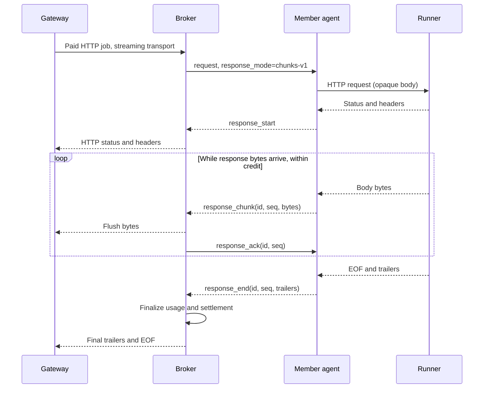

# Incremental WebSocket runner responses

Tracking: `lnm-pd8`. The existing WebSocket tunnel reads the complete HTTP
response before returning it, defeating paid-job streaming despite correct
HTTP negotiation. Replace that response path with opt-in `chunks-v1` framing
for arbitrary bytes. Requests and paid-session/QUIC framing remain unchanged.

The broker requests the framing explicitly. Updated agents send start, ordered
chunks, and end (trailers) or error. Eight 32-KiB chunks may be outstanding per
request; consumption acknowledgements return credit. Cancellation terminates
local HTTP work. Bounded per-request queues keep a stalled consumer from
blocking the connection's reader and other jobs. Invalid framing fails closed.

Old brokers omit the option and receive the legacy response. Old agents may
answer an updated broker with a legacy response, which remains supported but
buffered. Both sides must be upgraded for incremental WebSocket delivery.
No workload names or JSON/SSE parsing enter transport code. Signed accounting
remains in existing broker middleware; partial output retains existing usage
extraction and settlement semantics.

Validation covers first-chunk delivery before upstream completion, arbitrary
bytes, trailers, cancellation, failures/disconnection, bounded credit, concurrent
requests and compatibility, plus paid-path conformance. Live rollout and real
BlueClaw/model validation require separate operator deployment authorization.



### Local validation (2026-09-17)

- Full broker and member-agent `go test -race ./...` passed inside Go 1.25.7
  containers. The broker suite included the actual built member-agent acceptance
  test using `LNM_STREAM_AGENT_BINARY`, not only a simulated WebSocket peer.
- The real-agent test sends a JSON `stream:true` body through authenticated paid
  HTTP dispatch to a synthetic runner, gates that runner's completion until the
  first event reaches the client, and checks final usage trailers.
- Interrupted paid streams produce a client read error while preserving the
  accounted usage for idempotent replay. Credit exhaustion, concurrency,
  cancellation, malformed sequence, trailers, arbitrary bytes, legacy peers,
  and completion followed by disconnect have regression coverage.
- The full protocol conformance suite passed 58 scenarios, with no failures or
  skips. Agent attach-document schema goldens passed. `git diff --check` passed.

Reproduce the real-agent gate inside a Go container with the repository at `/src`:

```sh
cd /src/pool-member-agent
go build -o /tmp/member-agent ./cmd/pool-member-agent
cd /src/capability-broker
LNM_STREAM_AGENT_BINARY=/tmp/member-agent go test -race ./internal/server \
  -run 'TestRealMemberAgentWebSocketStreaming|TestPaidWebSocketStreamIsIncrementalAndSettles'
```

Evidence logs for this session are `/tmp/lnm-pd8-final.log`,
`/tmp/lnm-pd8-real-agent.log`, `/tmp/lnm-pd8-conformance.log`, and
`/tmp/lnm-pd8-schema.log`. No live BlueClaw endpoint, real model/GPU, funds,
image publication or remote rollout was exercised. Both broker and agent need
updated runtime builds; existing images retain their old behavior. A pre-existing
staged deletion of `infra/scenarios/t.yaml` was left untouched.
