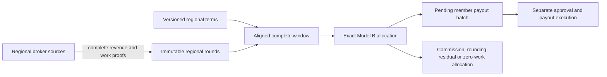

# Regional Model B accounting

Each controller keeps independent books under its persisted pool ID. Reconciled
rounds freeze complete source-qualified revenue and finalized billed-work
receipts. `CloseRegionalWindow` consumes only these snapshots. The close API is
`POST /admin/v1/settlement-windows/close` with `{"start_round_id":"100"}`;
regional callers cannot supply a revenue total, commission override, receipt
subset or custom window identity.

Terms establish the first round and interval (14 rounds by default). A successor
terms version starts at an existing interval boundary. Reconciled history cannot
be reassigned to new terms. A window requires every constituent round, including
explicit complete zero reports. Completion of its last round establishes that
the window has ended. The regional controller checks ended windows at startup
and every 30 seconds. Missing rounds hold that interval with a persisted reason;
other complete intervals can progress. Approval remains a separate action.

For nonzero eligible billed weight A and realized revenue R:

- Sum each member's finalized billed amounts across all offerings before division.
- Commission is `floor(R * commission_bps / 10000)` whole wei, once per window.
- The integer member pot is R minus commission.
- Each member gets `floor(member_pot * member_weight / A)`, once per member.
- The member pot less the sum of these payments is operator rounding residual.

All monetary operations use arbitrary-precision integers. Contribution shares
are never truncated to PPM. Revenue above billed value is distributed using the
same formula. No member gas or operating fee is deducted. Commission quantization
is separate from member-allocation rounding; the latter is less than the number
of positive-weight members in wei. If complete evidence proves A is zero, all R
is recorded as the zero-work operator allocation, with no member line items and
no second commission allocation.

The canonical window, allocation, approval batch and interval index commit in
one database transaction. Retries return the existing batch, including its
approval status. Stored regional economics cannot be overwritten by ordinary
window or batch update APIs. No allocation triggers a treasury transfer.

`GET /admin/v1/regional-accounting` exposes exact totals and unresolved window
holds to authorized pool administrators and reconcilers. Completed-window and
zero-work counts plus revenue and zero-work wei totals provide exact operands
for the frequency and revenue fractions. The Prometheus gauge
`livepeer_pool_regional_accounting{pool_id,measure}` presents approximate
operational values and fractions, rebuilt from durable allocations on restart.
No window IDs or transaction hashes appear as metric labels. Individual window
records preserve terms version and constituent round evidence.

Regional approval commits the batch and window approval, all positive member
intents and the approval audit in one transaction. It derives the payout chain
from the reconciled source evidence and rejects mixed-chain windows. Replaying
approval preserves the original approver and any later executor status. Intent
economics are immutable, and revision checks reject stale competing lease writes.
Zero-value allocations never create transfer intents. The executor's existing
lease and status APIs remain the supported mutation path.

Bounded policy review skips the legacy billed-value scale threshold for Model B;
realized revenue differs legitimately from contribution weight. Anomalies,
pause/shadow mode, amount bounds and daily approval limits still apply. The daily
limit is checked again inside the approval transaction to serialize concurrent
approvals. Human approval remains the starting policy.

Work-to-terms admission enforcement and safe publication are described in
[regional terms](regional-terms.md). Local validation is not evidence of a live rollout.

## Exceptional post-close corrections

A repeated source-qualified round close compares the accounting commitments,
including source inclusion and work digests, with the accepted snapshot.
Advancing observation timestamps and chain heads alone do not change those
commitments. Conflicting evidence is durably appended to `corrections` in
`GET /admin/v1/regional-accounting`; the close returns an error. Both accepted
and conflicting evidence remain available. The original round and allocations
are never overwritten. New approval of an affected window is held. Previously
approved obligations retain their original amounts and execution state; a later
incomplete round does not block their execution. Independent windows continue.

For an incident review, retain the original controller backup and re-collect
historical evidence using the regional reconciler's `prepare-round-close
--config CONFIG --round-id ROUND --output evidence.json`, then
`submit-round-close --config CONFIG --request evidence.json`. Use the original
regional source credentials and identities, including retired sources for their
historical rounds. These commands query source evidence and submit an accounting
comparison; they do not transfer funds. Missing or unavailable historical proof
is an investigation blocker, never a zero-valued correction. The watch loop's
durable close replay is for restart recovery and does not automatically audit
all past chain history.

There is deliberately no hold-clear or automatic member-adjustment operation.
An operator must review the chain evidence, accepted terms and existing payment
transactions, record the incident and obtain an explicit correction decision.
Do not edit the database, requeue paid intents or invent a later-window deduction
to resolve a correction. Preserve approved payouts while that decision is pending.
