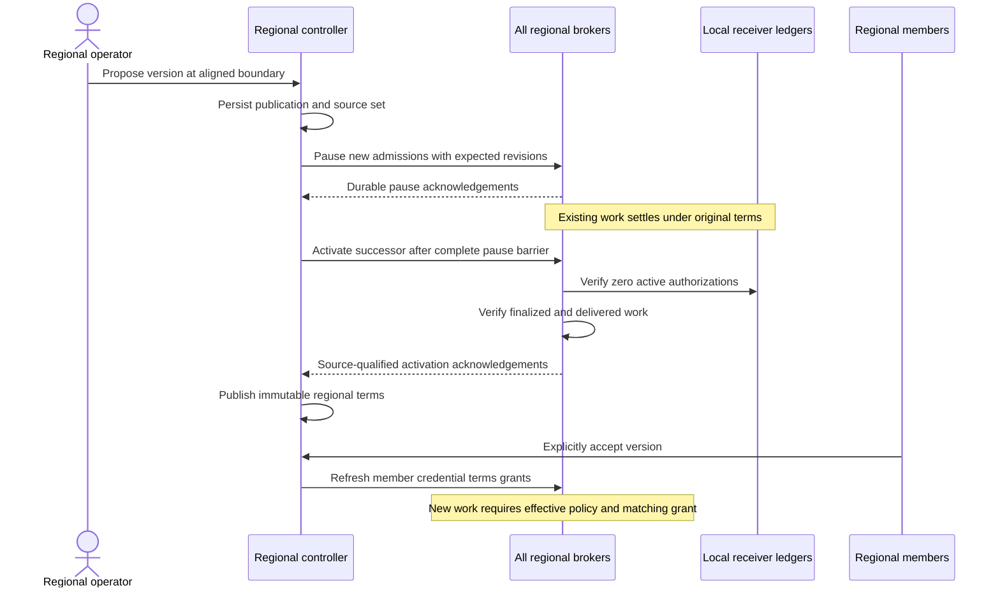

# Regional terms and admission

The controller stores immutable, pool-qualified terms versions and separate
wallet acceptance records. Enrollment requires acceptance of the latest published
version. Accepting it refreshes that wallet's existing enrollment grants and
pushes credential hashes with `terms_version` to the regional brokers. Accepting
an archived version cannot roll those grants back. Acceptance does not expose
service credentials or automatically join another region.

A regional broker needs an effective, unpaused terms policy before advertising
or admitting work. Candidate selection and binding also require the host's
credential to name that version. The broker uses its receiver-derived round
observation, refreshed by the durable accounting loop; a stale observation holds
new admission. Already admitted work keeps its immutable terms binding. Receiver
billing deltas and final receipts carry that version, and the source work digest
commits to it. Window closure verifies the receipt's policy and prior wallet
acceptance against the window's immutable terms.

## Publishing a version

Configure every registered, non-retired source in the controller's broker fleet
using the source's broker resource name, registered HTTPS origin and a scoped
controller credential. The controller must reach every such source to change
terms. Revenue-reader credentials cannot change broker admission policy.

A pool administrator submits `POST /admin/v1/regional-terms`:

```json
{
  "terms": {
    "pool_id": "pool_<persisted-identity>",
    "version": "terms-v2",
    "effective_round": 128,
    "window_rounds": 14,
    "commission_bps": 1000,
    "participation_rules": "The regional participation policy and Model B disclosures",
    "zero_work_to_operator": true,
    "rounding_to_operator": true
  },
  "reason": "Scheduled regional policy change"
}
```

Submitting a version pauses new regional admissions immediately. Existing work
can finish under its accepted terms. Choose the maintenance timing and future
window boundary accordingly. The controller records each source and transition
phase before external effects, then:

1. Reads the source-qualified broker policy and records its revision.
2. Pauses every broker and waits for every acknowledgement.
3. Requests successor activation only after that complete admission barrier.
4. Each broker requires zero active receiver authorizations and all work finalized
   and delivered, with no receipt at or after the proposed boundary.
5. The controller publishes terms only after all brokers confirm activation.

Brokers admit new work only once the version becomes effective and the chosen
member has accepted it. This preserves a single commission per regional window
without applying a later rate to in-flight work. Pausing does not freeze receiver
redemptions or cancel existing work. Pending redemptions retain their actual
inclusion-round revenue attribution.

The first version starts at the earliest regional source start round. An empty
broker can finish initial bootstrap after that round following an outage: no
member work could have been admitted without a policy. Later versions must start
at a future boundary of the existing window schedule. Initialize sources and
begin the initial publication before starting round reconciliation.

## Interrupted publication

`GET /admin/v1/terms-publications` shows per-source progress and the exact hold
reason. The controller retries pending publication at startup and every 30
seconds. Lost acknowledgements replay the original revision; they do not create
another policy mutation. Round closure at or beyond the pending boundary waits
for publication to finish, preserving the intended accounting schedule. This is
normal restart recovery of a durable operation, not automatic failover.

If a later-version proposal misses its boundary while waiting for old work or an
unavailable source, submit a **new version** with a later aligned effective round
and `"supersedes_version":"terms-v2"` alongside `terms` and `reason`. This can
supersede only an unresolved, unpublished proposal. The prior attempt remains in
history, its broker fences remain effective, and the new version repeats the full
barrier. No member could have accepted the unpublished version. Published terms
and financial records are never rewritten by supersession. Initial bootstrap can
resume its original proposal once the empty sources are reachable.



Enrollment secret rotation uses a dedicated atomic compare-and-swap. Ordinary
heartbeat/status writes preserve the current secret pair, accepted terms and GPU
grants. The monotonically increasing `credential_generation` travels in broker
syncs; a delayed older snapshot cannot restore a previous secret or revive a
revoked versioned enrollment. Changing device selection requires a new enrollment.
