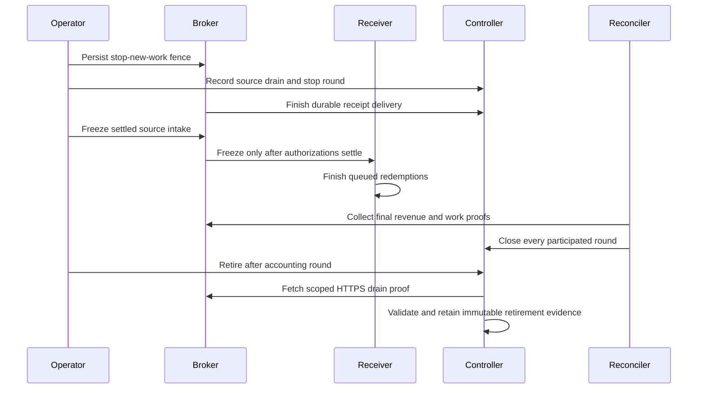

# Complete regional collection

Regional mode uses `pool_controller.pool_id`, scoped HTTPS controller credentials
and an explicit `revenue_sources` array. Each source declares its immutable
receiver settlement domain (`source_id`), broker resource (`broker_id`), chain,
payee, HTTPS origin, token file and optional CA file. Sources sharing a payee
remain independent when their receiver ledgers differ. Repeated receiver or
broker resources are configuration errors.

The controller's durable registry determines participation. Register sources
with `POST /admin/v1/revenue-sources`, containing `source`, `start_round` and an
audit `reason`. Identity, origin and starting round are immutable. Registration
cannot add a source retroactively to an already frozen round. Transitions retain
the credential actor, action, round, reason and timestamp. Local credential paths
are never returned in registry responses.

For each completed round, the reconciler resolves every expected registry entry
against local credentials and collects both revenue and work proofs over scoped
HTTPS. Removing configuration produces a missing-source hold. Revenue totals
include all independent sources, without ticket-to-offering matching or
redemption-gas deductions.

Receipt pagination filters round and final status before applying page limits.
Every page must belong to one stable snapshot. The collector rejects changed
snapshots, duplicate IDs, incomplete totals, foreign identities and per-source
count/digest differences. More than 500 receipts is ordinary input. Complete
empty source digests prove zero work; unavailable sources cannot.

The exact prepared request, source proofs and receipt IDs are persisted before
submission. Preparation failures enter the retry queue. The controller validates
the entire expected source and receipt set atomically before freezing a regional
round. Identical submissions are idempotent. Different economic results, another
ID for the round, receipt rewrites and late receipt insertion are rejected.
Regional rounds allocate no payouts or commission: allocation belongs to the
agreed regional accounting window.

`POST /admin/v1/revenue-sources/{source}/drain` records intended cessation while
retaining the source in every future expected set. It does not itself stop a
broker or prove settlement. Exclusion from future sets requires separate source
fencing and settled-retirement proof. Until then continued collection is
required. Configuration reload cannot delete historical entries or evidence.

Local TLS tests cover the three-source US and independent one-source EU shapes,
601 receipts, stale/missing/foreign reports, delayed receipt delivery, changed
snapshots and restart persistence. Real-chain collection and deployment rollout
require separate acceptance evidence.

## Settled retirement

After broker drain and receiver freeze, continue ordinary collection until every
participating round through the intended retirement round is closed. Configure
the controller's `revenue_sources` reader entry with the same public identity and
origin as its registry, plus local `token_file` and optional `ca_file` for a
scoped `revenue-reader` credential. Then an operator submits
`POST /admin/v1/revenue-sources/{source}/retire` with `after_round` and `reason`.

The controller fetches the proof itself over pinned, verified HTTPS. Caller-made
proof JSON is not accepted. The transaction checks fresh exact-source fencing,
zero outstanding obligations, coverage of the last work/redemption rounds and
closure of every participation round. It stores the proof and audit transition,
retains the source for historical rounds and excludes it only after that round.
Neither source retirement nor restart can silently reactivate it.

A persisted prepared close is replayed to the controller before recollection.
Thus a lost close acknowledgement can recover after source retirement without
requiring the retired service to be live. A new or changed close still requires
complete current evidence; retries cannot rewrite a frozen round.

