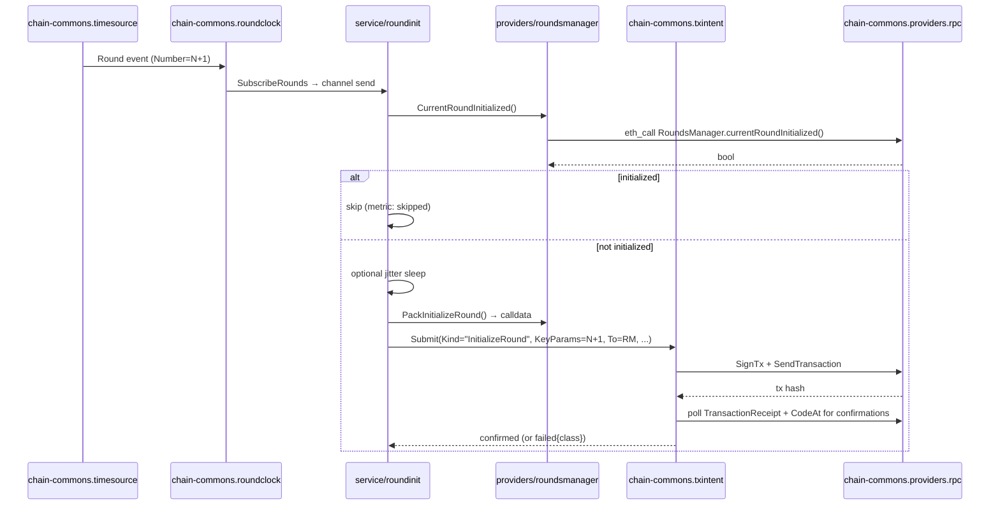
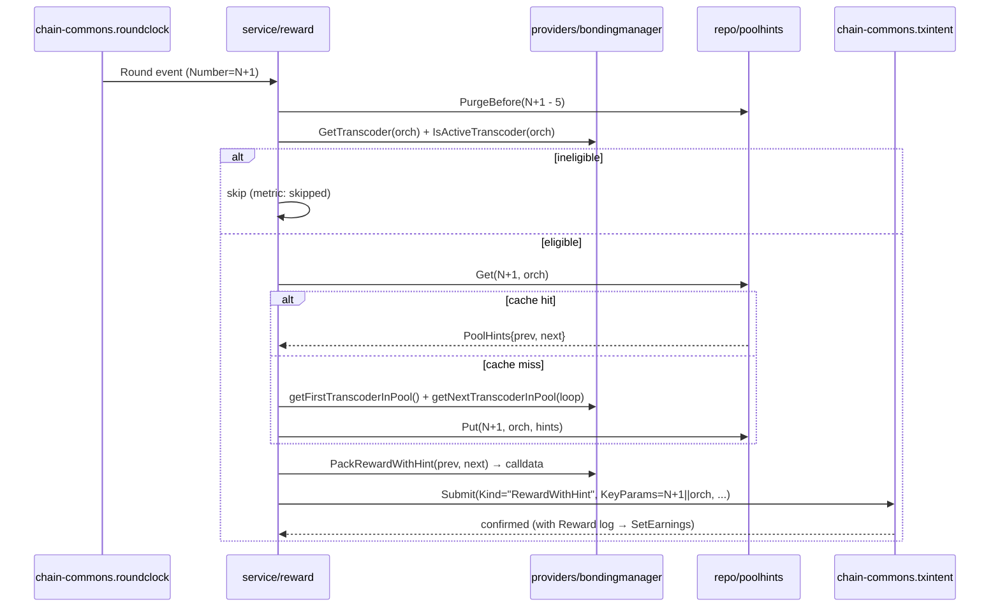

# Architecture

protocol-daemon is built on `chain-commons` end-to-end. Round-init is ~30 lines of
business logic; reward is ~50 lines including positional hints. Everything else
(idempotent durable transactions, multi-RPC, reorg recovery, restart resume, gas
pricing, controller resolution) lives in the library.

In the rewrite stack, protocol-daemon is the chain-side companion to the
off-chain manifest flow:

- `orch-coordinator` builds and publishes the signed registry manifest
- `secure-orch-console` signs the candidate manifest
- `protocol-daemon` updates the on-chain service URI to the public coordinator URL

## Layer stack

```
              cmd/livepeer-protocol-daemon
                       │
                       ▼
                runtime/{grpc, metrics, lifecycle}
                       │
                       ▼
                service/{roundinit, reward, preflight}
                       │
            ┌──────────┴──────────┐
            ▼                     ▼
        repo/poolhints     providers/{roundsmanager, bondingmanager, minter}
                                   │
                                   ▼
                        chain-commons.providers.* / services.*
```

Layer rule (enforced by `lint/layer-check/`):

- `cmd/` may import anything below.
- `internal/runtime/` may import service / repo / providers / config / types and `chain-commons.*`.
- `internal/service/` may import repo / providers / config / types and `chain-commons.*`.
- `internal/providers/` may import its own ABI bindings and `chain-commons.providers.*`. **No `github.com/ethereum/*` outside `internal/providers/`.**
- `internal/repo/` may import `chain-commons.providers.store`. **No raw `bbolt`.**
- `internal/types/` is pure data — no internal-package imports.

## Information flow

### Round initialization (`--mode=round-init`)



### Reward call (`--mode=reward`)



## Process model

One binary, three modes (`--mode=round-init|reward|both`). Mode-specific RPCs return `Unimplemented` if called on the wrong mode (matches `payment-daemon` and `service-registry-daemon` patterns).

Single OS process; no internal goroutine pooling — each service is one Run goroutine + whatever the chain-commons libraries spawn (timesource poller, txintent processor, multi-RPC health probe, controller refresh).

## Trust boundaries

- gRPC over unix socket — local-only, unauthenticated, trust the local user.
- Prometheus listener — TCP, unauthenticated, off by default. Operators reverse-proxy or bind to a private interface.
- Chain RPC — outbound; the multi-RPC client circuit-breaks per upstream.

## Persistence

One BoltDB file shared with chain-commons:
- `chain_commons_tx_intents` — TxIntent state (idempotency, attempts, status)
- `chain_commons_tx_intents_by_status` — secondary index for `Resume()`
- `chain_commons_roundclock_last_emitted` — per-name round-event dedup
- `protocol_daemon_pool_hints` — round/orch → (prev, next) cache (this module's contribution)

The `--store-path` flag points at one BoltDB file. Two daemons writing the same file is unsafe; operators run one daemon process per file.

## What this is NOT

- Not a wallet manager. Operator funds the wallet; we refuse to start when balance < `--min-balance-wei`.
- Not a payment ticket handler — that's `payment-daemon`.
- Not a manifest builder or signer — those live in `orch-coordinator` and
  `secure-orch-console`.
- Not a workload runtime — transcode, inference, and other workload binaries live outside this monorepo.
- Not aware of go-livepeer's RPC schema — protocol-daemon does not implement Orchestrator gRPC.
