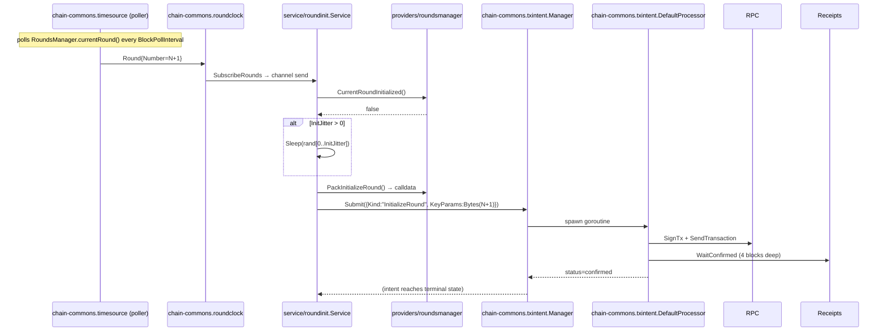

# Round-init loop

How the round-init service decides when to call `RoundsManager.initializeRound()` and how idempotency is enforced.

## Sequence



## Idempotency proof

`KeyParams = round.Number.Bytes()`. Submitting the same `(Kind="InitializeRound", KeyParams=N+1)` twice computes the same `IntentID = sha256("InitializeRound" || 0x00 || N+1)`. The chain-commons `txintent.Manager.Submit` flow:

```
1. Compute id = sha256(Kind || 0x00 || KeyParams).
2. BeginReadWrite BoltDB transaction.
3. If id exists in tx_intents bucket: return (existing.ID, nil) — no work.
4. Else: insert TxIntent{Status: Pending, ...}.
5. Commit.
```

Two daemons running `--mode=round-init` against the same chain see the same Round event, compute the same `IntentID`, and both submit. The chain mempool dedups on `(from, nonce, gasPrice)`; one wins. The other's TxIntent transitions to `failed{NoncePast}` on receipt-poll, but no double-spend occurs.

If both daemons are the same operator (same keystore), the second submitter's TxIntent.Submit is a Bolt-level no-op — they hit the same row.

## Init-jitter rationale

`--init-jitter=30s` introduces a uniform random delay in `[0, 30s)` before `Submit`. Default 0.

With idempotency, jitter is **not** a correctness mechanism — it's a gas-optimization for fleets:

- Without jitter: if 50 orchestrators fire `InitializeRound` simultaneously at the round boundary, 49 get reverted-on-chain (revert from `RoundsManager.initializeRound()` when already-initialized) and waste ~50k gas each.
- With 30s jitter: spread over 30s, the first to land ~mines and initializes; the remaining 49 see `currentRoundInitialized() == true` on their pre-submit check and skip cleanly.

Operators running fleets opt in. Single-daemon operators leave it at 0.

## What can go wrong

| Failure | Detection | Recovery |
|---|---|---|
| RPC returns transient error reading `currentRoundInitialized` | classified as `Transient` | next round triggers a fresh attempt |
| `Submit` returns `Permanent` (e.g., bad calldata; should never happen with the static selector) | structured log + metric | requires code fix |
| Tx mines but reverts (e.g., already initialized by another orchestrator) | `Reverted` from receipt parsing | TxIntent transitions to `failed{Reverted}`; service moves on |
| Tx mines and gets reorged out | `Receipts.WaitConfirmed` returns `Reorged=true` | TxIntent processor resubmits at same nonce |
| Wallet runs out of ETH mid-round | `InsufficientFunds` from `eth_sendTransaction` | TxIntent fails with `failed{InsufficientFunds}`; operator tops up |
| Daemon crashes between sign and broadcast | TxIntent `signed` state persisted | `Resume()` re-broadcasts at startup |

## Test coverage

`internal/service/roundinit/service_test.go` covers:
- already-initialized → no submit
- not initialized → submit reaches confirmed
- read error → recorded on Status
- pack error → recorded on Status
- submit error → recorded on Status
- ctx cancel during run loop
- subscribe error
- channel close
- jitter delay (deterministic via `*rand.Rand` injection)
- jitter ctx-cancel
- idempotent double-submit returns same IntentID

Coverage: 91.9% statement.
