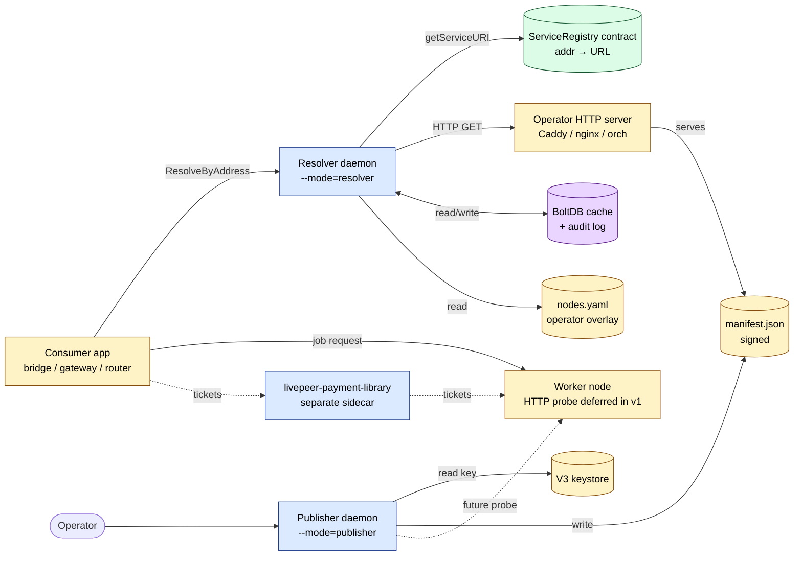
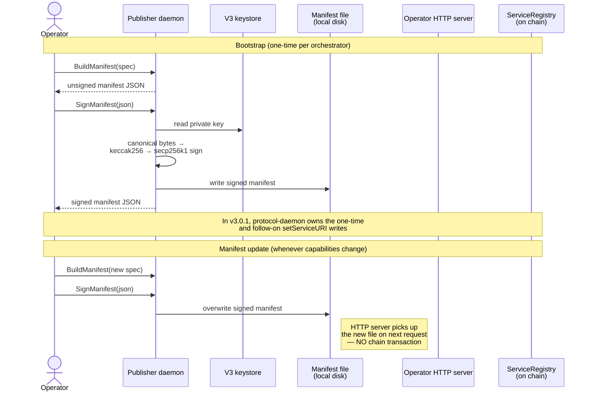
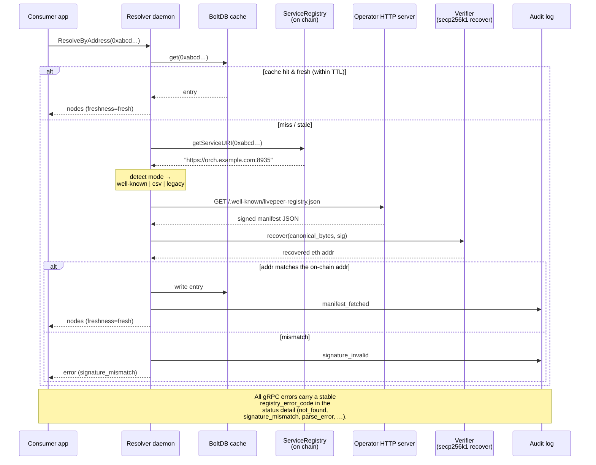
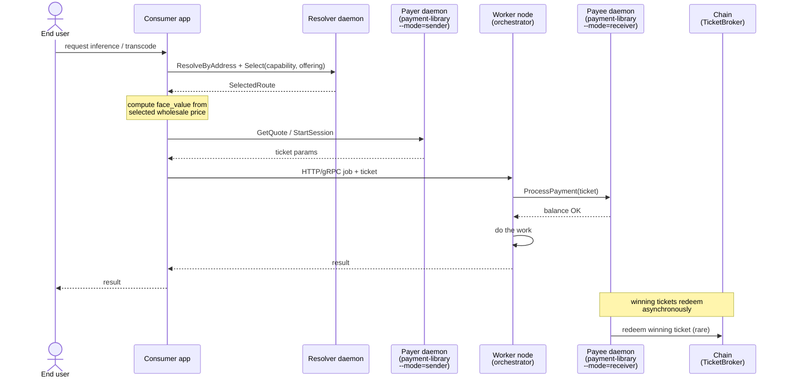
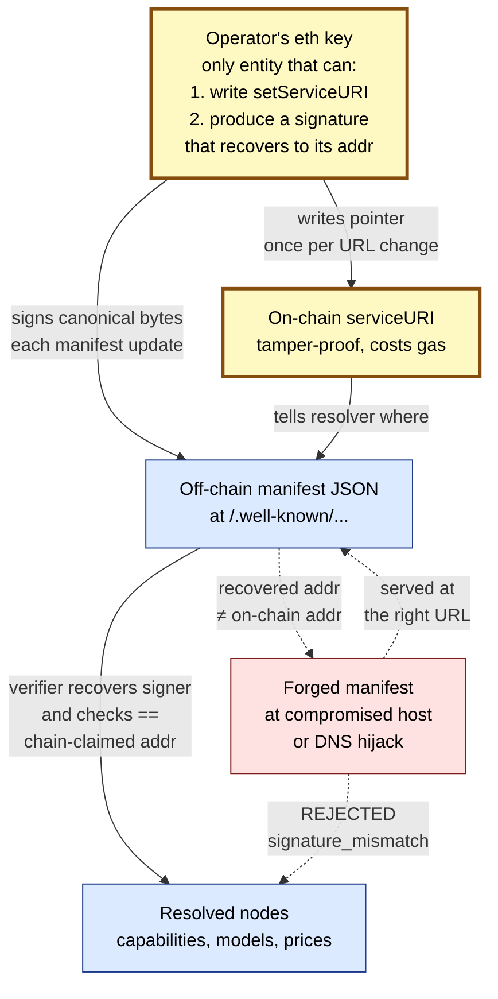

# Architecture

## Deployment archetype

**Archetype A is the only supported deployment** as of v3.0.1 (suite-wide
reset; see `livepeer-network-suite/docs/exec-plans/active/0003-archetype-a-deploy-unblock.md`):

- **Publisher** (this daemon, `--mode=publisher`) runs on a LAN-only
  secure-orch host alongside the cold-key keystore. Operator-mediated
  cadence: operator hand-edits `raw-registry-manifest.json` (or has it pre-filled
  by an orch-coordinator's `/registry/offerings` scrape), runs
  `livepeer-registry-refresh`, hand-carries the signed manifest back
  to the public host that serves it.
- **Resolver** (this daemon, `--mode=resolver`) runs as a sidecar
  alongside any gateway that needs to discover orchestrators. Reads
  on-chain `serviceURI`, fetches the signed manifest, verifies, and
  exposes `Resolver.Select(...)` over a unix socket.
- **Workers** (openai-worker-node, vtuber-worker-node, video-worker-node)
  are **registry-invisible**. They do not dial this daemon directly.
  They expose `/registry/offerings` for an orch-coordinator to scrape
  (operator confirms what publishes); they accept payment validated
  by a co-located `payment-daemon`. See
  [worker-offerings-endpoint.md](worker-offerings-endpoint.md).

The pre-v3.0.0 worker-publisher pattern (workers dialing this daemon's
publisher mode directly) is no longer supported. Worker repos that
implemented it have stripped that path in their own v3.0.1 cuts.

## Layer stack

```
┌─────────────────────────────────────────────────────────┐
│  runtime/           gRPC server, lifecycle, signal loop │  ← may import anything below
├─────────────────────────────────────────────────────────┤
│  service/           business logic                      │  ← may import repo, providers, config, types
│    ├─ resolver/                                         │
│    ├─ publisher/                                        │
│    ├─ selection/                                        │
│    └─ legacy/                                           │
├─────────────────────────────────────────────────────────┤
│  repo/              persistence + cache adapters        │  ← may import providers, config, types
├─────────────────────────────────────────────────────────┤
│  config/            validated structs                   │  ← may import types
├─────────────────────────────────────────────────────────┤
│  types/             pure data                           │  ← imports nothing in internal/
└─────────────────────────────────────────────────────────┘

  providers/          cross-cutting interfaces + defaults
  utils/              shared zero-dependency helpers
```

## Dependency rule

A package at layer N may import only packages at layers < N, plus `providers/` and `utils/`. No exceptions.

Concretely: `service/resolver` may import `repo/manifestcache` and `providers/manifestfetcher`, but may not import `runtime/grpc`, `service/publisher`, or any cross-cutting library directly (e.g. no `go.etcd.io/bbolt`, no `github.com/ethereum/go-ethereum/*`, no `net/http`).

Enforced by:
1. `golangci-lint` `depguard` rules in `.golangci.yml` (mechanical, fast).
2. `lint/layer-check` Go vet analyzer for finer-grained rules (e.g. service-sibling imports).

## Domain inventory

| Path | Purpose |
|---|---|
| `internal/service/resolver/` | Resolve `ethAddress → []Node`. Reads on-chain `serviceURI`, decides mode (well-known manifest URL / CSV-fallback / static-overlay-synth on chain `not_found`), fetches and verifies, merges static overlay. |
| `internal/service/publisher/` | Build manifest from operator-supplied node specs, sign it with the operator's eth key, and expose the reserved probe stub. |
| `internal/service/selection/` | Filter + rank resolved nodes by capability/model/tier/geo/weight. |
| `internal/service/legacy/` | Synthesize a single legacy `Node` from a plain URL `serviceURI`. Isolated so the legacy path is auditable on its own. |
| `internal/runtime/grpc/` | Wire surface: `Publisher` and `Resolver` services from `livepeer.registry.v1`. |
| `internal/runtime/lifecycle/` | Daemon boot/shutdown, mode gating, refresh schedulers. |

## Providers inventory

All cross-cutting concerns enter through `internal/providers/`. One interface per concern; one or more implementations.

| Provider | Interface role | Default impl |
|---|---|---|
| `Chain` | Read `ServiceRegistry.getServiceURI(addr)` | `providers/chain/eth` (go-ethereum; reads only) |
| `ManifestFetcher` | HTTP GET of the exact manifest URL returned on-chain, with size/timeout caps | `providers/manifestfetcher/http` |
| `Signer` | Sign canonical manifest bytes with the operator's keystore key | `providers/signer/chaincommonsadapter` over `chain-commons.providers.keystore.v3json` |
| `Verifier` | Recover the eth address that signed a manifest; compare to chain-claimed address | `providers/verifier/secp256k1` |
| `Clock` | System time, cache-freshness math | `providers/clock/chaincommonsadapter` over `chain-commons.providers.clock.System()` |
| `Store` | Persistent key-value (manifest cache + audit log) | `providers/store/chaincommonsadapter` over `chain-commons.providers.store.bolt` |
| `Logger` | Structured log | `providers/logger/slog` |

Providers are wired in `cmd/livepeer-service-registry-daemon/main.go` and injected into `service/` and `repo/`.

## Mode selection

One binary, two modes. `cmd/livepeer-service-registry-daemon/main.go` reads `--mode=publisher|resolver` at startup and mounts only the relevant gRPC services. All internal packages are compiled into both; runtime guards prevent cross-mode calls.

See [serviceuri-modes.md](serviceuri-modes.md) for the resolver's four modes — three on-chain interpretations (well-known, CSV, legacy) plus a chainless static-overlay synth mode.

## Information flow

This section is the system's mental model. Five diagrams: who the components are, and how a manifest moves through them in each phase. They render on GitHub via Mermaid; CI's doc-gardener does not validate Mermaid syntax — broken syntax shows up as plain text on GitHub.

### Component map



**Roles in plain English:**

| Component | What it owns | What it never does |
|---|---|---|
| Operator | The eth identity and the operational decision to advertise nodes | Run the consumer side |
| Publisher daemon | Build and sign the manifest | Serve the manifest itself, write on-chain pointers, or do payment |
| Operator HTTP server | Serve the JSON file at the well-known path | Sign anything; talk to chain |
| `ServiceRegistry` | One mapping: `addr → URL string` | Hold capability data, prices, or geo |
| Resolver daemon | Translate `addr → []ResolvedNode` for any consumer | Make payment, pick *the* best node, dial workers |
| Static overlay | Operator's allowlist + policy (tier, weight, signed-or-not) | Override what the manifest advertises |
| Consumer app | Decide which resolved node to use; dial it; run the job | Verify signatures, parse on-chain bytes |

### Phase 1 — Publish

Runs on operator hardware. Two distinct flows: bootstrap (one-time) and ongoing manifest updates (no chain transaction).



The on-chain pointer changes rarely (only when the host/port moves). The manifest itself can change as often as the operator wants — every offering metadata or price change — at zero gas cost.

### Phase 2 — Resolve

Runs on consumer hardware. The resolver's job is to make this fast, deterministic, and trustworthy.



If the chain RPC fails or the manifest host is down, the resolver returns the last-good cache entry with `freshness_status = stale_failing` for up to `--max-stale` (default 1h). Past that, it returns `manifest_unavailable`.

In `--discovery=overlay-only` deployments the cache is pre-seeded at startup: the daemon walks every enabled overlay entry and pre-resolves each address (chain → legacy synth, or — if the chain has no entry — the operator overlay's pin nodes via the `static-overlay` synth mode). After seed completes, `ListKnown` and `Select` reflect the operator-curated pool with no consumer-side `Refresh` round-trip. See [serviceuri-modes.md](serviceuri-modes.md) §"Mode D" and [running-the-daemon.md](../operations/running-the-daemon.md) §"Overlay-only seed-on-startup".

### Phase 3 — Job execution

After the resolver hands the consumer a list of nodes, the actual job runs **outside** this daemon. We're shown here so the boundary between this repo and `livepeer-payment-library` is unambiguous.



Three sidecars, three concerns: **registry** (who can do it), **payment-library** (paying for it), **worker / orchestrator** (doing it). Each is independently swappable.

### Trust model

Why off-chain capability data is safe.



The chain is the only thing the resolver trusts unconditionally — because writing it costs gas and only the eth-key holder can do it. Everything else hangs off that pointer via signatures the resolver verifies on every fetch.

### gRPC RPC reference

Which RPCs fire in each phase.

| Phase | Caller | RPC | Mounted in mode |
|---|---|---|---|
| Publish bootstrap | Operator's tooling | `Publisher.BuildManifest` | publisher |
| Publish bootstrap | Operator's tooling | `Publisher.SignManifest` | publisher |
| Publish bootstrap | `protocol-daemon` | on-chain `setServiceURI` | chain write owned outside this repo |
| Publish probe | Operator's tooling | reserved `Publisher.ProbeWorker` RPC | publisher |
| Resolve | Consumer app | `Resolver.ResolveByAddress` | resolver |
| Resolve | Consumer app | `Resolver.Select` | resolver |
| Diagnostics | Consumer app | `Resolver.ListKnown` | resolver |
| Diagnostics | Consumer app | `Resolver.GetAuditLog` | resolver |
| Force re-fetch | Consumer app / operator | `Resolver.Refresh` | resolver |
| Liveness | k8s probes / monitoring | `Resolver.Health` / `Publisher.Health` / standard `grpc.health.v1.Health` | both |
| Reflection | `grpcurl`, generic clients | `grpc.reflection.v1.ServerReflection` | both |

Full method shapes: [docs/product-specs/grpc-surface.md](../product-specs/grpc-surface.md). Stability rules: same.

## Build artifacts

- Single Go binary: `livepeer-service-registry-daemon` (~13 MB built locally; ~21 MB Docker image)
- Generated proto code: `proto/gen/go/livepeer/registry/v1/` (committed; regenerate via `make proto`)
- Docker image: `tztcloud/livepeer-service-registry-daemon:vX.Y.Z` (Docker Hub, pushed via `make docker-push` locally; `.github/workflows/docker.yml` auto-publishes on tagged release)

## What this architecture does NOT solve

- A public manifest mirror or CDN. The publisher writes a JSON file; the operator hosts it themselves.
- Selection beyond the daemon's weight-sorted top match. `Select` returns one selected route; richer multi-candidate routing policy would need a future API.
- Settlement / payment. Use `livepeer-payment-library`. The registry only advertises prices; it does not enforce them.
- Multi-host / clustered resolver state. The cache is per-process. Operators wanting cross-instance coherence run a single resolver and front it with their own load balancer.
