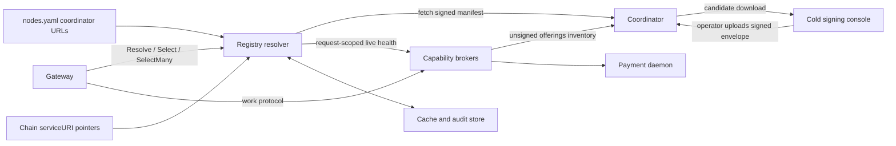

# Architecture

## Information flow

```mermaid
flowchart LR
    B[Capability brokers] -->|unsigned offerings inventory| C[Coordinator]
    C -->|candidate download| S[Cold signing console]
    S -->|operator uploads signed envelope| C
    Y[nodes.yaml coordinator URLs] --> R[Registry resolver]
    CH[Chain serviceURI pointers] --> R
    R -->|fetch signed manifest| C
    R -->|request-scoped live health| B
    R <--> DB[Cache and audit store]
    G[Gateway] -->|Resolve / Select / SelectMany| R
    G -->|work protocol| B
    B --> P[Payment daemon]
```

`manifest_url` points at the coordinator. Signed tuples contain broker
`worker_url` values, capability and offering identifiers, protocol/axes,
wholesale price numerator and denominator, and optional settlement delegation.
The coordinator hosts the signed envelope at
`/.well-known/livepeer-registry.json`; it may be exposed through a reverse
proxy. The registry does not fetch broker `/registry/offerings`.

## Publication and identity

The coordinator builds the candidate; the cold console signs it through an
operator gesture; the coordinator receives and serves the signed bytes.
`protocol-daemon` owns on-chain `setServiceURI`. Overlay discovery can omit that
pointer entirely while retaining signature verification against the configured
orchestrator address. Registry `publisher` mode has only identity and health
RPCs and plays no part in manifest building/signing.

The trusted address comes from the caller/chain discovery or configured YAML.
A pointer identifies a location, not authority to replace the signer. Both the
manifest's claimed address and recovered signer must match the expected address.
The [manifest contract](../product-specs/manifest-contract.md) distinguishes
these implemented checks from outstanding expiry/replay enforcement.

## Resolution

1. Resolve source and overlay policy. In overlay-only mode, reject addresses
   absent from the enabled configuration.
2. Reuse a source-matching cache entry while fresh, unless forced.
3. Use explicit `manifest_url`, otherwise read `serviceURI` in chain mode;
   static pins can synthesize a result when there is no chain pointer.
4. Fetch the manifest and verify its envelope and signature. Chain URLs may
   additionally use CSV compatibility or explicit legacy fallback.
5. Project signed tuples, append static pins, and apply signature policy.
6. Consult broker health and return the result; cache verified publication
   data separately from per-request health/policy pruning.

A stale-cache request refreshes synchronously. The chain seeder is a separate
round-event loop, not a background refresh spawned by each request. Initial
overlay seeding is synchronous and best-effort; failed coordinator addresses
remain candidates for subsequent Select/Refresh retries.

`Select` and `SelectMany` resolve candidates, require matching capability and
offering, enforce enabled/tier/min-weight policy and live health, then sort by
descending weight. Equal weights preserve input order. They return quote
metadata and broker endpoints; they do not reserve capacity or process tickets.

## Boundaries

Source follows `types → config → repo → service → runtime`, with I/O behind
providers. [DESIGN.md](../../DESIGN.md) maps those packages. BoltDB provides
persistent local cache/audit state; dev uses an in-memory store. There is no
shared cache, manifest mirror, public registry HTTP API or streaming update RPC.

The gRPC listener is a local unix socket with no application authentication.
The separate optional TCP metrics listener serves metrics and liveness only.
See [running the daemon](../operations/running-the-daemon.md) and the
[gRPC contract](../product-specs/grpc-surface.md).
